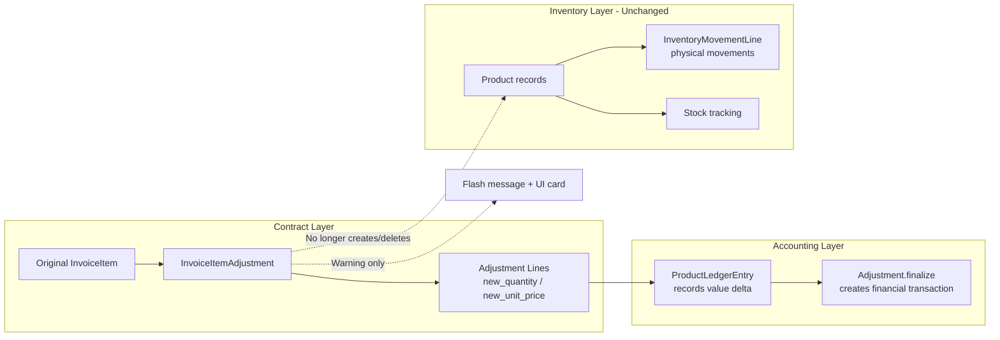

# Plan: Decouple Contract Adjustments From Inventory Product Lifecycle

## Problem Statement

The [`InvoiceItemAdjustmentLine._sync_products()`](apps/app_adjustment/models.py:664) method **completely blocks** decreasing an invoice item's quantity if any product has inventory movements. But more fundamentally, this method conflates two separate domains:

> **The quantity on an InvoiceItem represents a contract between two entities.**
> Changing the contract is NOT the same as changing the physical inventory.

## Domain Insight

The system needs to track these independently:

| Concept | Where It Lives | Purpose |
|---------|---------------|---------|
| **Original contract** | `InvoiceItem.quantity` | What was originally agreed between buyer and seller |
| **Contract changes** | `InvoiceItemAdjustmentLine` | Renegotiations after the original deal |
| **Products in stock** | `Product` with `movement_lines` | Physical items that have been moved into inventory |
| **Products to be moved later** | `Product` without `movement_lines` | Physical items registered but not yet moved |
| **Products not yet received** | `Product` obligated-only | Committed on paper but not physically present |

**The InvoiceItemAdjustment changes the contract — it should NOT automatically create or delete Product records.** Products are physical inventory assets managed through separate processes (movements, returns, etc.).

## Solution

### Part A — [`_sync_products()`](apps/app_adjustment/models.py:664) — Remove Entirely

Delete the `_sync_products()` method and its call in `save()`. The adjustment should:

1. ✅ Record the contractual change (`InvoiceItemAdjustment` + `InvoiceItemAdjustmentLine`)
2. ✅ Record the financial/accounting delta (`ProductLedgerEntry.record_adjustment_line()` — this tracks value changes, not physical inventory)
3. ❌ NOT create/delete `Product` records — those represent physical inventory decisions
4. ❌ NOT block the decrease — contract renegotiation is between the two entities, independent of physical stock

#### In `save()` (line 765), remove the call:

```python
def save(self, *args, **kwargs):
    DebugContext.log(...)
    super().save(*args, **kwargs)
    from apps.app_inventory.models import ProductLedgerEntry
    DebugContext.log("Recording ProductLedgerEntry for adjustment line")
    ProductLedgerEntry.record_adjustment_line(self)
    # REMOVED: self._sync_products()  ← this line is deleted
```

#### Delete the `_sync_products()` method entirely (lines 664-740)

### Part B — [`record_item_adjustment`](apps/app_operation/views/adjustment.py:90) — Add Flash Message

After the adjustment finalizes, check if any changed items have inventory movements. If so, warn the user.

```python
# After item_adj.finalize() succeeds
items_with_movements = []
for changed_item_data in changed_items_data:
    item = changed_item_data["item"]
    if item.products.filter(movement_lines__reversal_of__isnull=True).exists():
        items_with_movements.append(item.product_template.name)

if items_with_movements:
    messages.warning(
        request,
        _(
            "Contract adjusted for item(s) that already have inventory movements: "
            "%(items)s. The physical stock is unchanged — manage it separately."
        )
        % {"items": ", ".join(items_with_movements)},
    )
```

### Part C — Operation Detail: Warning Card

**Backend** — in [`operation_detail_view`](apps/app_operation/views/detail.py:12), add context to detect adjustments touching moved products:

```python
# After fetching item_adjustments (line 62-64)
item_adjustment_touched_moved = False
for item_adj in item_adjustments:
    for line in item_adj.lines.all():
        if line.invoice_item.products.filter(
            movement_lines__reversal_of__isnull=True
        ).exists():
            item_adjustment_touched_moved = True
            break
    if item_adjustment_touched_moved:
        break
```

Add to context dict: `"item_adjustment_touched_moved": item_adjustment_touched_moved`

**New template** — [`snippets/detail/adjusted_with_movements_warning.html`](apps/app_operation/templates/app_operation/snippets/detail/adjusted_with_movements_warning.html):

```django


  <div class="alert alert-warning d-flex align-items-center shadow-sm mb-3" role="alert">
    <i class="bi bi-exclamation-triangle-fill me-2 fs-4"></i>
    <div>
      <strong></strong><br>
      
    </div>
  </div>

```

**Include** in [`operation_detail.html`](apps/app_operation/templates/app_operation/operation_detail.html) after the reversal alert:

```django


```

---

## Files to Modify

| # | File | Change |
|---|------|--------|
| 1 | [`apps/app_adjustment/models.py`](apps/app_adjustment/models.py) — `_sync_products()` (lines 664-740) | **Delete** the entire method |
| 2 | [`apps/app_adjustment/models.py`](apps/app_adjustment/models.py) — `save()` line 765 | Remove `self._sync_products()` call |
| 3 | [`apps/app_operation/views/adjustment.py`](apps/app_operation/views/adjustment.py) — `record_item_adjustment()` after line 236 | Add warning flash when adjusted items have moved products |
| 4 | [`apps/app_operation/views/detail.py`](apps/app_operation/views/detail.py) — `operation_detail_view()` around line 64 | Add `item_adjustment_touched_moved` to context |
| 5 | [`apps/app_operation/templates/app_operation/operation_detail.html`](apps/app_operation/templates/app_operation/operation_detail.html) | Include warning snippet after reversal alert |
| 6 | **NEW**: `apps/app_operation/templates/app_operation/snippets/detail/adjusted_with_movements_warning.html` | Warning card template |
| 7 | [`apps/app_adjustment/tests/test_invoice_item_adjustment_validation.py`](apps/app_adjustment/tests/test_invoice_item_adjustment_validation.py) | Remove/patch tests referencing `_sync_products` |

---

## Data Flow After Change



---

## Test Updates

| Test | Current Expectation | New Expectation |
|------|--------------------|-----------------|
| `test_decrease_with_moved_products` | ❌ Raises ValidationError | ✅ Succeeds (no product deletion) |
| All `_sync_products`-related tests | Tests exist | ❌ Remove or rewrite — method deleted |
| `test_line_saves_ledger_entry` | ✅ Should still pass | ✅ Unchanged — `record_adjustment_line` remains |
