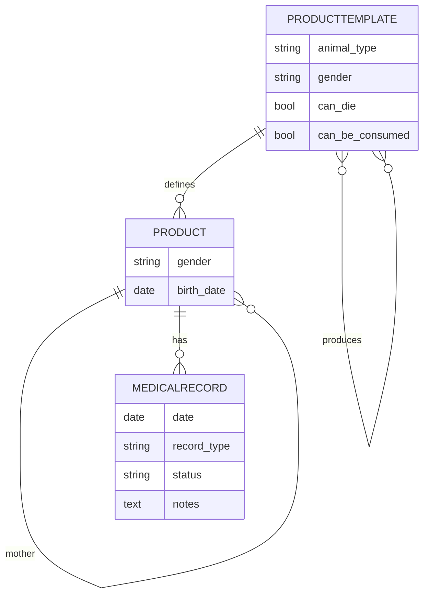
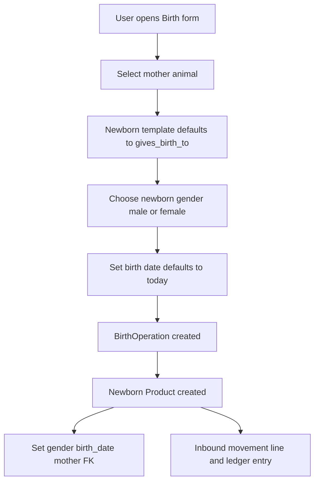

# Plan: Widen Animal Product Templates & Products

Status: Draft for review
Owner: Architect (Zoo)
Implementer: Code mode

## 1. Goal

Extend `ProductTemplate` and `Product` with animal-specific attributes so the system
can model livestock properly:

- Template knows its **type** (cow, buffalo, ...), **gender** (male / female), what it
  **produces** (milk, manure, ...), what it **gives birth to** (e.g. Dairy Cow -> Calf),
  whether it **can die** (all animals can), and whether it **can be consumed** (no animal
  should be consumed).
- A **birth operation** records the newborn's gender (male/female choice), sets a new
  **birth date**, and links the newborn to its **mother**.
- Optional: **medical status** per animal plus a full `MedicalRecord` model.

## 2. Confirmed design decisions

1. **Birth flow = Full**: birth form selects the mother animal, records newborn gender +
   birth date, defaults the newborn template to the mother template's `gives_birth_to`
   (e.g. Dairy Cow -> Calf), and stores a `mother` FK on the newborn.
2. **produces** = M2M to output `ProductTemplate`s (nature FEED/PRODUCT), used purely as
   metadata — no production/collection operation in this plan.
3. **Medical** = full `MedicalRecord` model linked to `Product` (date, type, notes,
   officer) **plus** a `health_status` enum on `Product`. Included in this plan.

## 3. Current state (what already exists)

- [`ProductTemplate`](apps/app_inventory/models.py:508): `name`, `name_ar`, `nature`
  (ANIMAL/FEED/MEDICINE/PRODUCT), `sub_category`, `default_unit`, `has_tag`, `tag_prefix`,
  `minimum_quantity`, `tracking_mode`, `entities` M2M. No animal-specific fields.
  - [`_ALLOWED_OP_TYPES`](apps/app_inventory/models.py:575) is a hard-coded dict; ANIMAL
    already excludes CONSUMPTION.
  - [`accepts_operation()`](apps/app_inventory/models.py:588) reads that dict only.
- [`Product`](apps/app_inventory/models.py:871): `entity`, `product_template`,
  `invoice_items`, `unique_id`, `quantity`, `unit_price`, `notes`; `status` computed from
  linked operations (ACTIVE/SOLD/DEAD/CONSUMED). No gender / birth date / mother / medical.
- Birth: [`BirthOperation`](apps/app_operation/models/proxies/op_birth.py:7) uses
  `InvoiceItemCreateForm` (create-mode); `_auto_create_inventory_movements`
  ([`operation.py`](apps/app_operation/models/operation.py:849)) lazy-creates one tagged
  Product per head via [`create_products_for_item`](apps/app_inventory/models.py:784) called
  from [`InventoryMovementLine.save()`](apps/app_inventory/models.py:1390). No gender/date.
- Death: [`DeathOperation`](apps/app_operation/models/proxies/op_death.py:7) uses select-mode
  (`InvoiceItemSelectForm`); marks product DEAD.
- Consumption: blocked for ANIMAL by nature in `_ALLOWED_OP_TYPES` and in UI
  ([`stock_detail.html`](apps/app_inventory/templates/app_inventory/stock_detail.html:179)
  only shows Consume for FEED/MEDICINE). Covered by
  [`test_quick_consume_rejects_non_consumable_nature`](apps/app_inventory/tests/test_quick_consume_from_stock.py:206).
- Template creation view [`create_product_template`](apps/app_inventory/views.py:469) reads
  only the existing POST fields; form template
  [`product_template_form.html`](apps/app_inventory/templates/app_inventory/product_template_form.html)
  has no animal-specific inputs.
- Base model provides `created_at`, `updated_at`, `deleted_at`, `deletable`
  ([`app_base/models.py`](apps/app_base/models.py:29)).

## 4. Data model changes

### 4.1 `ProductTemplate` — new fields (animal-specific)

| Field | Type | Notes |
|-------|------|-------|
| `animal_type` | `CharField(max_length=50, blank=True, default="")` | e.g. Cow, Buffalo, Sheep, Goat. Only meaningful for ANIMAL. |
| `gender` | `CharField(choices=Gender, max_length=10, default=NA)` | Template-level default gender: MALE / FEMALE / MIXED / NA. |
| `produces` | `ManyToManyField("self", related_name="produced_by", blank=True)` | Output templates (milk, manure). Metadata only. |
| `gives_birth_to` | `ForeignKey("self", related_name="born_from", null=True, blank=True, on_delete=SET_NULL)` | Offspring template (Dairy Cow -> Calf). |
| `can_die` | `BooleanField(default=True)` | All animals can die. |
| `can_be_consumed` | `BooleanField(default=False)` | No animal may be consumed. |

`Gender` `TextChoices` on `ProductTemplate`: `MALE`, `FEMALE`, `MIXED`, `NA` (also reused by
`Product` with a subset).

### 4.2 `Product` — new fields (per-animal)

| Field | Type | Notes |
|-------|------|-------|
| `gender` | `CharField(choices=MALE/FEMALE/UNKNOWN, max_length=10, default=UNKNOWN)` | Individual animal sex; defaults from template when created via purchase/birth. |
| `birth_date` | `DateField(null=True, blank=True)` | Set at birth (defaults to operation date). |
| `mother` | `ForeignKey("self", related_name="offspring", null=True, blank=True, on_delete=SET_NULL)` | Lineage from birth. |

> Note: `health_status` is NOT stored on `Product`. Health state is captured only via
> `MedicalRecord.status` (per-record), per user decision.

### 4.3 New model `MedicalRecord(BaseModel)`

| Field | Type | Notes |
|-------|------|-------|
| `product` | `ForeignKey(Product, related_name="medical_records", on_delete=PROTECT)` | The animal. |
| `date` | `DateField()` | Record date. |
| `record_type` | `CharField(choices=RecordType)` | CHECKUP / VACCINATION / TREATMENT / DIAGNOSIS / OTHER. |
| `status` | `CharField(choices=HealthStatus, default=UNKNOWN)` | Health status at the time of record. |
| `next_due_date` | `DateField(null=True, blank=True)` | e.g. next vaccination. |
| `notes` | `TextField(blank=True)` | Free text. |
| `officer` | `ForeignKey(settings.AUTH_USER_MODEL, null=True, on_delete=SET_NULL)` | Who recorded it. |

`RecordType` `TextChoices` on `MedicalRecord`.

### 4.4 Validation (`ProductTemplate.clean()`)

- ANIMAL nature:
  - `can_be_consumed` is always forced `False`; setting `True` raises `ValidationError`
    ("No animal can be consumed."). This keeps the existing nature rule and makes it
    explicit on the template.
  - `gives_birth_to` must reference an ANIMAL template and is only allowed when `gender`
    is FEMALE or MIXED.
  - `produces` may only reference non-ANIMAL templates (FEED/PRODUCT).
  - `animal_type` optional (derived display only).
- Non-ANIMAL nature: `animal_type`, `gender` (-> NA), `gives_birth_to` (-> None) ignored;
  `can_die` defaults False for non-animals.
- `ProductTemplate.accepts_operation()` updated to also gate by flags:
  - DEATH requires `can_die`.
  - CONSUMPTION requires `can_be_consumed` (belt-and-suspenders alongside the nature rule).
  - `_ALLOWED_OP_TYPES` stays as the base set.

### 4.5 Migration

Single migration `0012_...` in `apps/app_inventory/migrations/`:
- Add the 4 new `Product` fields + `Product.gender`.
- Add the 6 new `ProductTemplate` fields.
- `CreateModel` for `MedicalRecord`.

## 5. Birth flow changes (Full)

### 5.1 Form (`InvoiceItemCreateForm` — [`forms.py`](apps/app_inventory/forms.py:46))

Add non-model fields used only by BIRTH (made conditional via the view/config):

- `mother`: `ModelChoiceField(Product)` filtered to the entity, ANIMAL templates, gender
  FEMALE/MIXED, status ACTIVE. Optional.
- `gender`: `ChoiceField(MALE/FEMALE)` — the newborn sex, applied to every head in the row.
- `birth_date`: `DateField(initial=today)` — birth date.
- `product_template` queryset for birth is restricted to ANIMAL templates that can give
  birth; when the selected template has `gives_birth_to`, the form suggests/uses that as
  the newborn's template (user can override).

Validation:
- If `mother` selected, the newborn template should be compatible with
  `mother.product_template.gives_birth_to` (or fall back to the selected template).

### 5.2 Threading newborn attributes through lazy product creation

- Extend [`create_products_for_item()`](apps/app_inventory/models.py:784) signature to accept
  `gender=None, birth_date=None, mother=None` and set them on created `Product`s
  (`gender` defaults to the template's gender when not provided).
- [`InventoryMovementLine.save()`](apps/app_inventory/models.py:1390) already forwards the
  transient `_lazy_unique_id`; add transient `_lazy_gender`, `_lazy_birth_date`,
  `_lazy_mother` and forward them (mirror the existing pattern).
- In `_auto_create_inventory_movements` ([`operation.py`](apps/app_operation/models/operation.py:898)),
  for BIRTH set these transient attrs on each line from the formset's cleaned data before
  `line.save()`.

### 5.3 Birth form template

- Update the birth rendering (either a `birth_form.html` block or the shared
  [`invoice_formset.html`](apps/app_operation/templates/app_operation/snippets/create-form/invoice_formset.html))
  to show mother / gender / birth-date inputs for birth rows, hidden for other operations.

### 5.4 Newborn template default

- When the selected (mother's) template has `gives_birth_to`, the newborn `product_template`
  defaults to `gives_birth_to`; the form still allows choosing another ANIMAL template.

## 6. Consumption & death gating

- Consumption:
  - Keep `_ALLOWED_OP_TYPES` ANIMAL set unchanged (no CONSUMPTION).
  - Add `can_be_consumed` check to the quick-consume path and consumption operation
    validation so even non-ANIMAL templates with `can_be_consumed=False` are rejected.
  - `ProductTemplate.clean()` guarantees ANIMAL `can_be_consumed` is False.
- Death:
  - Death remains allowed for ANIMAL (all animals `can_die=True`).
  - `accepts_operation(DEATH)` now also requires `can_die`.
  - UI in [`stock_detail.html`](apps/app_inventory/templates/app_inventory/stock_detail.html:176)
    already shows "Record Death" only for ANIMAL; keep as-is.

## 7. Views, forms, templates

### 7.1 Template creation
- Add a `ProductTemplateForm` (`ModelForm`) in [`forms.py`](apps/app_inventory/forms.py) with
  the new fields; use it in [`create_product_template`](apps/app_inventory/views.py:469) so
  M2M (`produces`) and validation are handled cleanly.
- [`product_template_form.html`](apps/app_inventory/templates/app_inventory/product_template_form.html):
  add an "Animal Attributes" section shown only when `nature == ANIMAL`:
  - `animal_type` text input (Cow/Buffalo/...)
  - `gender` select (MALE/FEMALE/MIXED)
  - `produces` multi-select (filtered to FEED/PRODUCT templates)
  - `gives_birth_to` select (filtered to ANIMAL templates)
  - `can_die` / `can_be_consumed` switches (can_be_consumed locked off for ANIMAL)
  - Small JS to toggle the section on nature change.

### 7.2 Display templates
- [`product_template_detail.html`](apps/app_inventory/templates/app_inventory/product_template_detail.html):
  add rows for `animal_type`, `gender`, `produces`, `gives_birth_to`, `can_die`,
  `can_be_consumed`.
- [`product_detail.html`](apps/app_inventory/templates/app_inventory/product_detail.html):
  add gender, birth date, mother (link to `product_detail`), `health_status`, and a
  "Medical Records" list (date/type/status/notes/officer).
- [`stock_detail.html`](apps/app_inventory/templates/app_inventory/stock_detail.html): for
  ANIMAL products show gender and birth date in the row (optional but useful).

### 7.3 Admin
- [`admin.py`](apps/app_inventory/admin.py): register `Product`, `MedicalRecord`; add
  fieldsets/inlines for the new `ProductTemplate` and `Product` fields (M2M for `produces`,
  select for `gives_birth_to`).

## 8. Tests

- `test_product_template.py`: new field defaults; `clean()` rules — ANIMAL cannot set
  `can_be_consumed=True`; `gives_birth_to` must be ANIMAL + FEMALE/MIXED; `produces` only
  non-ANIMAL; `accepts_operation(DEATH)` requires `can_die`; `accepts_operation(CONSUMPTION)`
  requires `can_be_consumed`.
- `test_product.py`: product `gender` defaults from template; `birth_date`/`mother` set on
  creation.
- `test_birth_birth_create.py`: birth creates newborns with chosen gender + birth_date,
  `mother` FK set, and newborn template defaults to `gives_birth_to`.
- `test_quick_consume_from_stock.py`: existing ANIMAL-rejection test still passes; add a case
  that a non-ANIMAL template with `can_be_consumed=False` is rejected.
- New `test_medical_record.py`: CRUD and `product.medical_records` reverse relation.
- Run targeted tests first, then the full suite.

## 9. Verification

- `python manage.py check`
- `python manage.py test --parallel=8` (repo rule: run tests in parallel)
- Manual smoke: create an ANIMAL template with animal attributes; run a BIRTH with a mother
  and confirm newborn gender/birth date/mother; confirm DEATH allowed and CONSUMPTION blocked.

## 10. Out of scope / future

- Production/collection operation for `produces` (e.g. recording daily milk yield).
- Selling/reproduction planning, breeding schedules.
- Medical record UI workflow (record a checkup form) — data model only in this plan; a simple
  admin + display is included.

## Mermaid: model relationships

## Mermaid: birth flow

---

## Implementation Status (updated by Code mode)

**Status: COMPLETE.** All sections of this plan are implemented and verified.
The full suite passes (`manage.py test --parallel=8` → 1250 tests, OK) and
`python manage.py check` reports no issues.

### What was implemented

- **Data model** ([`models.py`](apps/app_inventory/models.py)):
  - [`ProductTemplate`](apps/app_inventory/models.py:508) — added `Gender`
    choices, `animal_type`, `gender`, `produces` (asymmetrical self-M2M),
    `gives_birth_to` (self-FK), `can_die`, `can_be_consumed`.
  - [`Product`](apps/app_inventory/models.py:1012) — added `Gender` choices,
    `gender`, `birth_date`, `mother` (self-FK `related_name="offspring"`).
  - [`MedicalRecord`](apps/app_inventory/models.py:1346) — new model with
    `RecordType`, `HealthStatus`, `product` FK (`related_name="medical_records"`),
    `date`, `record_type`, `status`, `next_due_date`, `notes`, `officer`.
    Health state is captured per record only (no `health_status` on Product).
  - [`ProductTemplate.clean()`](apps/app_inventory/models.py:673) — ANIMAL forces
    `can_be_consumed=False`; validates `gives_birth_to` (must be ANIMAL +
    FEMALE/MIXED) and `produces` (FEED/PRODUCT only); non-ANIMAL forces
    `can_die=False`.
  - [`accepts_operation()`](apps/app_inventory/models.py:653) — DEATH now gated by
    `can_die`, CONSUMPTION by `can_be_consumed` (belt-and-suspenders on top of
    `_ALLOWED_OP_TYPES`).
  - [`create_products_for_item()`](apps/app_inventory/models.py:896) accepts
    `gender`/`birth_date`/`mother`; gender defaults from the template when
    MALE/FEMALE, else UNKNOWN.
- **Migration**: [`0012_animal_product_template_fields.py`](apps/app_inventory/migrations/0012_animal_product_template_fields.py)
  adds all fields + `CreateModel(MedicalRecord)`. `makemigrations --check` reports
  no missing migrations.
- **Birth flow**:
  - [`InvoiceItemCreateForm`](apps/app_inventory/forms.py:107) adds conditional
    `mother` / `gender` / `birth_date` fields (only for BIRTH); mother queryset
    filtered to the project's ACTIVE FEMALE/MIXED animals; birth date defaults to
    today; newborn template defaults to the mother template's `gives_birth_to`.
  - [`BaseInvoiceItemCreateFormSet`](apps/app_inventory/forms.py:290) forwards
    `project`/`is_birth` to each row form.
  - [`_auto_create_inventory_movements()`](apps/app_operation/models/operation.py:852)
    forwards `_lazy_gender` / `_lazy_birth_date` / `_lazy_mother` transient attrs
    to the lazily-created newborn Product (one line per head).
  - [`InventoryMovementLine.save()`](apps/app_inventory/models.py:1616) threads
    those transient attrs into `create_products_for_item()`.
  - [`invoice_formset.html`](apps/app_operation/templates/app_operation/snippets/create-form/invoice_formset.html)
    renders mother / newborn gender / birth-date inputs when `formset.is_birth`.
- **Template creation**: [`ProductTemplateForm`](apps/app_inventory/forms.py:20)
  (ModelForm with queryset filters for `produces`/`gives_birth_to` and ANIMAL
  `can_be_consumed` force-off) is used by
  [`create_product_template`](apps/app_inventory/views.py:469);
  [`product_template_form.html`](apps/app_inventory/templates/app_inventory/product_template_form.html)
  shows the Animal Attributes section (with JS toggle) only when `nature == ANIMAL`.
- **Display templates**: [`product_template_detail.html`](apps/app_inventory/templates/app_inventory/product_template_detail.html)
  shows animal_type/gender/produces/gives_birth_to/can_die/can_be_consumed;
  [`product_detail.html`](apps/app_inventory/templates/app_inventory/product_detail.html)
  shows gender/birth_date/mother + Medical Records list;
  [`stock_detail.html`](apps/app_inventory/templates/app_inventory/stock_detail.html)
  shows gender + birth date badges for ANIMAL products.
- **Admin**: [`admin.py`](apps/app_inventory/admin.py) registers
  `ProductTemplate` (fieldsets + `produces` filter_horizontal),
  `Product` (with `MedicalRecordInline`), and `MedicalRecord`.
- **Consumption gating**: [`quick_consume`](apps/app_inventory/views.py:208)
  rejects any template that `accepts_operation(CONSUMPTION)` is False for —
  covering both ANIMAL nature and non-ANIMAL templates with
  `can_be_consumed=False`.

### Changes made during this completion pass

- Fixed a test bug in
  [`test_animal_attributes.py`](apps/app_inventory/tests/test_animal_attributes.py:155)
  (`test_explicit_gender_overrides_template`): the vendor entity is now registered
  as an active VENDOR stakeholder of the project (reuses `_make_vendor`) so the
  purchase validation passes.
- Added the missing plan test case in
  [`test_quick_consume_from_stock.py`](apps/app_inventory/tests/test_quick_consume_from_stock.py:245)
  (`test_quick_consume_rejects_non_consumable_flag`): a FEED template with
  `can_be_consumed=False` is rejected by the quick-consume view.

### Test coverage

- [`test_animal_attributes.py`](apps/app_inventory/tests/test_animal_attributes.py)
  — template defaults, `clean()` rules, `accepts_operation` gating, product gender
  defaults/overrides, `MedicalRecord` CRUD + reverse relation.
- [`test_birth_animal_attributes.py`](apps/app_operation/tests/operations/birth/test_birth_animal_attributes.py)
  — birth sets newborn gender/birth_date/mother and defaults the newborn template
  to `gives_birth_to`.
- [`test_quick_consume_from_stock.py`](apps/app_inventory/tests/test_quick_consume_from_stock.py)
  — ANIMAL rejection + new `can_be_consumed=False` rejection.

Verification: `python manage.py check` ✓; `manage.py test --parallel=8` → 1250
tests OK ✓.
