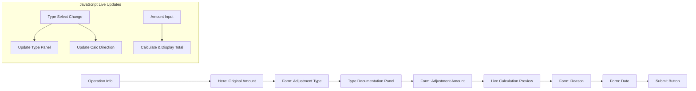

# Plan: Enhance `record_accounting_adjustment` Template

## Overview

Enhance the [`record_adjustment.html`](apps/app_adjustment/templates/app_adjustment/record_adjustment.html) template for the [`record_accounting_adjustment`](apps/app_operation/views/adjustment.py:24) view with three improvements:

1. **Show original amount** — Display the operation's base `amount` prominently
2. **JavaScript live "after adjustment" calculator** — Real-time preview of `original ± adjustment = new total`
3. **Better documentation of the adjustment type** — Dynamic info panel that appears when a type is selected

---

## Background Context

### Data Model

- [`Operation.amount`](apps/app_operation/models/operation.py:64) — The base/original amount of the operation (e.g., purchase invoice total)
- [`Operation.effective_amount`](apps/app_base/mixins.py:98) — Base amount + all non-reversed adjustments (via `AdjustableMixin`)
- [`AdjustmentType`](apps/app_adjustment/models.py:26) — Enum with:
  - `value` (e.g., `"PUR_RET"`) and `label` (e.g., `"Purchase: Return to Vendor (Credit)"`)
  - [`is_reduction()`](apps/app_adjustment/models.py:126) — `True` for reduction types that decrease the operation amount
  - Each type's `label` already contains a human-readable description

### Adjustment Direction Logic

The direction of an adjustment determines its effect on the operation amount:

- **Reduction types** (`is_reduction() == True`): `New Total = Original - Adjustment`
  - e.g., Purchase Return, Sale Discount, Overcharge Correction
- **Increase types** (`is_reduction() == False`): `New Total = Original + Adjustment`
  - e.g., Purchase Undercharge, Tax Addition, Late Fee

### Current Template

The current [`record_adjustment.html`](apps/app_adjustment/templates/app_adjustment/record_adjustment.html) is minimal:
- Shows operation reference info
- Renders the form fields (type, amount, reason, date)
- Has a small hint under reason: *"Required for general adjustment types"*
- No original amount display, no live calculator, no type documentation

### View Context

The view passes `{"form": form, "operation": operation}`. Both the original `operation.amount` and `operation.effective_amount` are accessible in the template.

---

## Changes Required

### 1. [`apps/app_operation/views/adjustment.py`](apps/app_operation/views/adjustment.py:24)

#### What to change

Add adjustment type metadata to the template context so JavaScript can determine direction and description without a round-trip.

**For both GET and error-rendered POST paths**, add to the context:

```python
from apps.app_adjustment.models import AdjustmentType
import json

# Build a JSON-safe mapping of type_value -> {label, is_reduction}
type_data = {
    t.value: {
        "label": str(t.label),
        "is_reduction": AdjustmentType.is_reduction(t.value),
    }
    for t in AdjustmentType
    if not AdjustmentType.is_item_correction(t.value)  # exclude item corrections
}

context["adjustment_type_data"] = json.dumps(type_data)
```

This provides a JavaScript object like:
```json
{
  "PUR_RET": {"label": "Purchase: Return to Vendor (Credit)", "is_reduction": true},
  "PUR_DISC": {"label": "Purchase: Post-Invoice Discount (Credit)", "is_reduction": true},
  "PUR_UNDER": {"label": "Purchase: Price Undercharge Correction (Debit)", "is_reduction": false},
  ...
}
```

**Affected lines**: Lines 42-48 (GET context), lines 56-58 (POST error context), lines 82-86 (exception context).

---

### 2. [`apps/app_adjustment/templates/app_adjustment/record_adjustment.html`](apps/app_adjustment/templates/app_adjustment/record_adjustment.html)

#### A. Hero Amount Section — Original + Effective

Add a prominent card above the form showing both the original (base) amount and the effective amount (after any prior adjustments):

```
┌──────────────────────────────────────┐
│  Operation Amount Summary            │
│                                      │
│  Original Amount:     $1,234.56      │
│  Effective Amount:    $1,234.56      │  (includes prior adjustments)
│  ─────────────────────────────       │
│  Prior Adjustments:   $   0.00       │  (difference = effective - original)
└──────────────────────────────────────┘
```

**Always show both** `operation.amount` (original) and `operation.effective_amount` (effective). The "Prior Adjustments" row highlights the difference between them — it will be $0.00 when there are no prior adjustments, and non-zero when there are. This gives the user full visibility into the operation's current financial state before applying this new adjustment.

#### B. JavaScript Live "After Adjustment" Calculator

Add a calculation preview section between the amount field and the reason field:

```
┌─────────────────────────────────────┐
│  Adjustment Preview                 │
│  Original Amount:      $1,234.56    │
│  Adjustment:          -$   50.00    │  (shows - for reduction, + for increase)
│  ─────────────────────────────      │
│  New Total:            $1,184.56    │
└─────────────────────────────────────┘
```

**JavaScript Logic** (in ``):

1. On page load, parse `adjustment_type_data` from a JSON script tag
2. On `change` of the `#id_type` select:
   - Look up the selected value in the type data map
   - Update the type info panel (see C below)
   - Update the calculation preview direction indicator (±)
3. On `input` of the `#id_amount` field:
   - Read the current value
   - Determine direction from the selected type
   - Calculate: `original_amount + (is_reduction ? -adjustment : +adjustment)`
   - Update the preview with formatted values
4. Handle edge cases: empty amount, invalid amount, no type selected

#### C. Adjustment Type Documentation Panel

Add an info panel below the type dropdown that updates dynamically:

```
┌─────────────────────────────────────┐
│  ℹ️ Purchase: Return to Vendor      │
│     (Credit)                        │
│                                     │
│  Effect: Reduction                  │
│  This adjustment DECREASES the      │
│  amount owed to the vendor.         │
└─────────────────────────────────────┘
```

Initially (when no type is selected), show a muted placeholder: *"Select an adjustment type to see details."*

---

## Detailed Implementation Steps

### Step 1: Modify the View (`adjustment.py`)

1. Import `json` at the top
2. Build the `adjustment_type_data` dict once
3. Add `"adjustment_type_data": json.dumps(type_data)` to all three context dicts (lines 47, 56, 85)

### Step 2: Modify the Template (`record_adjustment.html`)

1. **Add hero section** after the operation info line (after line 14)
   - Show `operation.amount|floatformat:2` formatted as currency
   - Conditionally show `operation.effective_amount|floatformat:2` if different

2. **Add the type info panel** after the type field (after line 47)
   - A `<div id="typeInfo">` with initial placeholder text
   - Content updated by JavaScript on type change

3. **Add the calculation preview** after the amount field (after line 63)
   - A `<div id="calculationPreview">` with rows for original, adjustment, separator, and total
   - Updated by JavaScript on amount input and type change

4. **Add inline JavaScript** in ``:
   - Parse the `adjustment_type_data` JSON
   - Format currency with `$` and 2 decimal places
   - Update type info and calculation preview on relevant events

---

## Files to Modify

| File | Changes |
|------|---------|
| [`apps/app_operation/views/adjustment.py`](apps/app_operation/views/adjustment.py) | Add `adjustment_type_data` JSON to context (3 context blocks) |
| [`apps/app_adjustment/templates/app_adjustment/record_adjustment.html`](apps/app_adjustment/templates/app_adjustment/record_adjustment.html) | Add hero amount section, type info panel, calculation preview, and inline JS |

---

## Mermaid: Template Layout Flow



---

## Edge Cases to Handle

1. **No type selected**: Hide calculation preview or show muted placeholder
2. **Empty/invalid amount**: Don't show a calculation result
3. **Existing adjustments**: The effective amount may differ from the original; show both clearly
4. **Zero amount**: `$0.00` is valid; show it properly
5. **Large numbers**: Ensure formatting doesn't break layout (use `font-monospace`)
6. **Non-numeric input**: HTML number input + `inputmode="decimal"` + JS parseFloat fallback
