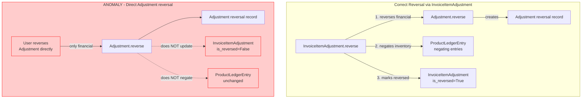
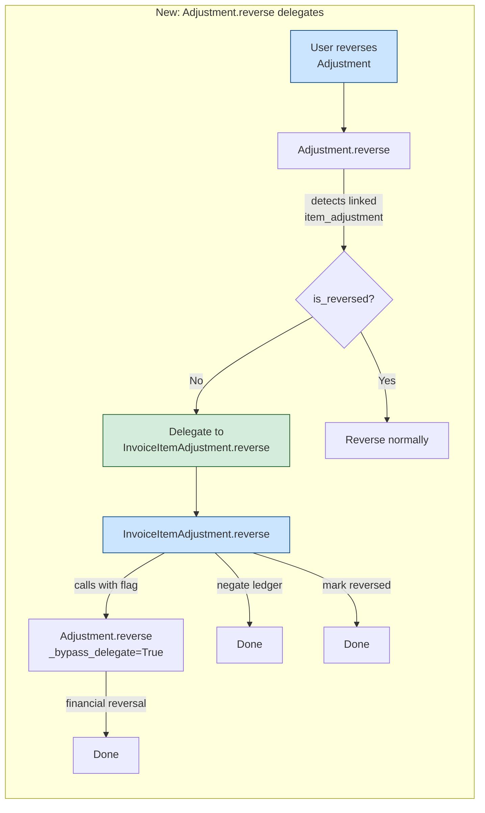

# Fix: InvoiceItemAdjustment Reversal Anomaly

## Problem Statement

When an [`InvoiceItemAdjustment`](apps/app_adjustment/models.py:336) is finalized via [`finalize()`](apps/app_adjustment/models.py:422), it creates an [`Adjustment`](apps/app_adjustment/models.py:153) record linked via the `adjustment` OneToOneField. This Adjustment handles the **financial** side (transactions, fund movements).

Currently, a user can reverse this Adjustment **directly** through the [`reverse_adjustment`](apps/app_operation/views/adjustment.py:272) view/URL, which:

1. Reverses the Adjustment's issuance transaction (financial side)
2. Marks the Adjustment as reversed via [`ReversableModel.reverse()`](apps/app_base/models.py:235)

But this does **NOT**:
1. Record negating [`ProductLedgerEntry`](apps/app_inventory/models.py:206) rows (inventory side)
2. Mark the parent [`InvoiceItemAdjustment`](apps/app_adjustment/models.py:336) as reversed

This leaves the system in an **inconsistent state**:
- The `InvoiceItemAdjustment` still has `is_reversed = False` (appears active)
- Its lines' inventory ledger entries remain unchanged
- The `Adjustment` is reversed but the `InvoiceItemAdjustment` is not

## Anomaly Data Flow



## Solution: Delegate from Adjustment.reverse() to InvoiceItemAdjustment.reverse()

When a user reverses an `Adjustment` directly, and that Adjustment has a linked non-reversed `InvoiceItemAdjustment`, the `Adjustment.reverse()` method will **delegate** to `InvoiceItemAdjustment.reverse()` instead. This ensures the full reversal flow runs:

1. ✅ Financial reversal (Adjustment's issuance transaction)
2. ✅ Inventory reversal (negating ProductLedgerEntry rows)
3. ✅ Both records marked as reversed

### Flow Diagram



## Changes Required

### 1. [`Adjustment.reverse()`](apps/app_adjustment/models.py:318) — Override to delegate

**File:** [`apps/app_adjustment/models.py`](apps/app_adjustment/models.py)

Add override of `reverse()` on the `Adjustment` model (after the `_reversable_transaction_types` property at line 325):

```python
def reverse(self, officer, date=None, reason=None, _from_item_adjustment=False):
    """
    Delegate reversal to the parent InvoiceItemAdjustment if one exists,
    ensuring both financial and inventory sides are properly reversed.
    
    The ``_from_item_adjustment`` flag prevents infinite recursion when
    InvoiceItemAdjustment.reverse() calls this method internally.
    """
    item_adj = getattr(self, 'item_adjustment', None)
    if (
        item_adj is not None
        and not item_adj.is_reversed
        and not _from_item_adjustment
    ):
        return item_adj.reverse(
            officer=officer, date=date or self.date, reason=reason or ""
        )
    return super().reverse(officer=officer, date=date, reason=reason)
```

### 2. [`InvoiceItemAdjustment.reverse()`](apps/app_adjustment/models.py:540) — Pass bypass flag

**File:** [`apps/app_adjustment/models.py`](apps/app_adjustment/models.py)

Update line 577 to pass `_from_item_adjustment=True`:

```python
# Before:
self.adjustment.reverse(officer=officer, date=date, reason=reason)

# After:
self.adjustment.reverse(
    officer=officer, date=date, reason=reason, _from_item_adjustment=True
)
```

### 3. View — No changes needed

The [`reverse_adjustment`](apps/app_operation/views/adjustment.py:272) view works as-is. When it calls `adjustment.reverse()`, the model layer will automatically delegate to the InvoiceItemAdjustment reversal. The user will be redirected to the operation detail page with a success message.

**However**, the success message should be updated to reflect that the entire item adjustment was reversed, not just the financial adjustment. We can update the success message in the view (line 360):

```python
# Before:
messages.success(request, _("Adjustment reversed successfully."))

# After (conditional):
if getattr(adjustment, 'item_adjustment', None) is not None:
    messages.success(
        request,
        _("Adjustment and its parent invoice item adjustment reversed successfully.")
    )
else:
    messages.success(request, _("Adjustment reversed successfully."))
```

### 4. Templates — No changes needed

The "Reverse" button remains visible for all non-reversed Adjustments, including those linked to InvoiceItemAdjustments, since reversing them now correctly triggers the full cascade.

### 5. New Test

**File:** [`apps/app_adjustment/tests/test_invoice_item_adjustment_reversal.py`](apps/app_adjustment/tests/test_invoice_item_adjustment_reversal.py)

Add tests:
1. Direct reversal of linked Adjustment delegates to InvoiceItemAdjustment and reverses both
2. Both `is_reversed` flags are set after direct reversal
3. Negating ProductLedgerEntry rows are created

```python
def test_reversing_adjustment_directly_also_reverses_item_adjustment(self):
    """Reversing an Adjustment that belongs to an InvoiceItemAdjustment
    must also reverse the parent InvoiceItemAdjustment."""
    op = _make_purchase_op(self.project, self.vendor, self.officer, Decimal("1000.00"))
    item = _make_invoice_with_item(op, self.template, Decimal("10"), Decimal("100.00"))
    _make_product_for_item(self.template, item, Decimal("100.00"))
    
    ia = _make_item_adj(op, InvoiceItemAdjustmentType.PURCHASE_ITEM_DECREASE, self.officer)
    _make_line(ia, item, new_unit_price=Decimal("90.00"))
    ia.finalize()
    
    # Reverse the Adjustment directly
    ia.adjustment.reverse(officer=self.officer, date=date.today(), reason="direct")
    
    ia.refresh_from_db()
    self.assertTrue(ia.is_reversed)
    self.assertTrue(ia.adjustment.is_reversed)

def test_direct_adjustment_reversal_creates_negating_ledger_entries(self):
    """Direct reversal of Adjustment must also negate ProductLedgerEntry rows."""
    op = _make_purchase_op(self.project, self.vendor, self.officer, Decimal("500.00"))
    item = _make_invoice_with_item(op, self.template, Decimal("5"), Decimal("100.00"))
    product = _make_product_for_item(self.template, item, Decimal("100.00"))
    
    ia = _make_item_adj(op, InvoiceItemAdjustmentType.PURCHASE_ITEM_DECREASE, self.officer)
    _make_line(ia, item, new_unit_price=Decimal("80.00"))
    ia.finalize()
    
    # Direct reversal
    ia.adjustment.reverse(officer=self.officer, date=date.today(), reason="direct")
    
    adj_entries = ProductLedgerEntry.objects.filter(
        product=product, entry_type=ProductLedgerEntry.EntryType.ADJUSTMENT
    ).order_by("id")
    self.assertEqual(adj_entries.count(), 2)
    self.assertEqual(adj_entries[0].value_delta, Decimal("-100.00"))
    self.assertEqual(adj_entries[1].value_delta, Decimal("100.00"))
```

## Edge Cases

| Case | Behavior |
|------|----------|
| `item_adjustment` already reversed | `Adjustment.reverse()` detects `is_reversed=True` → proceeds with normal self-reversal |
| `item_adjustment` not finalized (no adjustment linked) | `getattr(self, 'item_adjustment', None)` returns `None` → normal reversal |
| `InvoiceItemAdjustment.reverse()` calls `self.adjustment.reverse()` | Passes `_from_item_adjustment=True` → skips delegation, does normal reversal |
| User calls `adjustment.reverse()` from API/shell | Same delegation behavior — always safe |

## Summary of Files to Modify

| File | Change |
|------|--------|
| [`apps/app_adjustment/models.py`](apps/app_adjustment/models.py) | Override `Adjustment.reverse()` + update `InvoiceItemAdjustment.reverse()` call + update success message |
| [`apps/app_adjustment/tests/test_invoice_item_adjustment_reversal.py`](apps/app_adjustment/tests/test_invoice_item_adjustment_reversal.py) | Add tests for direct-reversal delegation |
