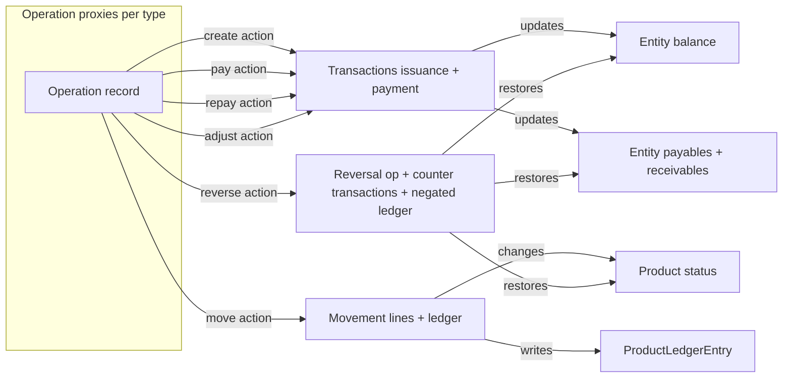

# Improve the Operation Test Suite — catch hidden bugs

Status: Planning
Owner: Architect → Code (implementation)
Related plan: [`fix-repayment-reversal-repaid-status-plan.md`](ai-plans/fix-repayment-reversal-repaid-status-plan.md)

## 1. Problem statement

The farm domain is a **graph of operations and linked transactions**. There are
[`19 operation types`](apps/app_operation/models/operation_type.py:4), each with its own
proxy model, configuration flags (`can_pay`, `has_repayment`, `has_invoice`,
`_is_one_shot_operation`, `is_adjustable`, …) and a defined set of **actions**
(create, pay, repay, reverse, adjust, move). Every action fans out into **many side
effects**:

- `Transaction` rows ([`Transaction`](apps/app_transaction/models.py:33))
- entity fund `balance`, `payables`, `receivables`
  ([`Entity`](apps/app_entity/models/__init__.py:414))
- `ProductLedgerEntry` rows ([`ProductLedgerEntry`](apps/app_inventory/models.py:37))
- `InventoryMovementLine` rows ([`InventoryMovementLine`](apps/app_inventory/models.py:1408))
- `Product` status transitions
- derived amounts (`amount_remaining_to_repay`, `effective_amount`, `moved_qty`)
- financial period assignment
- reversal mirrors and reversed-original flags
- guards that must also guarantee **atomicity** (nothing persisted on failure)

The suite **falsely passes but hides bugs** because of three systemic weaknesses:

1. **Bundled happy-path tests with weak assertions.** A single test asserts many
   side effects at once with loose checks like `.exists()`, `.count()`, `is not
   None`. Example: [`test_create_from_session_basic`](apps/app_operation/tests/operations/purchase/test_purchase_create.py:394)
   checks operation fields, one transaction, invoice items, movement count and a
   ledger `.exists()` in one body. When one side effect regresses, the failure is
   buried in a multi-assert test and the *value* bugs are never caught at all
   (an `.exists()` passes even when the amount/source/target/delta is wrong).

2. **Silent side effects.** Some effects are simply never asserted. The
   repayment-reversal bug that was just fixed (`reversal_of__isnull=True`
   exclusion in payables/receivables) existed for a long time because **no test
   checked payables/receivables after a reversal**. The existing reversal tests
   ([`test_worker_advance_worker_advance_reversal.py`](apps/app_operation/tests/operations/worker/test_worker_advance_worker_advance_reversal.py:124))
   check transactions and balances but never payables/receivables, product status,
   or the full ledger state.

3. **Duplicated, drifting setup.** Each operation test file re-implements the same
   helpers (`_make_officer`, `_inject_project`, `_make_worker_stakeholder`, …) —
   see [`test_worker_advance_worker_advance_create.py`](apps/app_operation/tests/operations/worker/test_worker_advance_worker_advance_create.py:25).
   This invites inconsistent fixtures and makes a canonical side-effect checklist
   impossible.

## 2. Goals and principles

1. **One test = one side effect.** Every model-level test asserts exactly **one**
   observable outcome (e.g. "issuance transaction has the right source/target",
   "reversal restores the project payables", "movement writes a REVERSAL ledger row
   with +5.00 qty"). When a test fails, it pinpoints the broken behavior. Genuine
   multi-step flows (wizards, view POST handlers, concurrency) may keep a small
   number of integration tests, but the core model side effects stay granular.

2. **Check all possible side effects.** For every operation type × action, every
   cell of the side-effect matrix (section 4) must be covered by at least one test.
   The matrix is the coverage contract; gaps are explicit bugs in the suite.

3. **Assert exact values, not existence.** Replace `.exists()` / `.count()` with
   exact `assertEqual` on amount, direction, source, target, deltas, status, and —
   where meaningful — on full record sets.

4. **Prove reversibility.** Add differential invariant tests: capture a snapshot of
   all balances/payables/receivables/ledger, run an action, then reverse it, and
   assert the world is unchanged. Also test partial reversals (e.g. reverse a full
   repayment → state equals the advance-only state).

5. **Atomicity on guards.** Every guard test (`assertRaises`) must also assert that
   **no partial side effect was persisted** (transaction count, ledger count,
   balances unchanged).

6. **Shared infrastructure.** One shared helper/base module so fixtures and
   assertion vocabulary are consistent and extendable.

## 3. Domain model for the suite



Side-effect inventory (each maps to one or more test methods):

| ID | Side effect | Source of truth |
|----|-------------|-----------------|
| SE1 | Operation record fields (type, source, dest, amount, date, period, category) | [`Operation`](apps/app_operation/models/operation.py:34) |
| SE2 | Transaction rows: exact type, source, target, amount, document, reversal links | [`Transaction`](apps/app_transaction/models.py:33) |
| SE3 | Entity fund balance deltas (payment-type transactions) | [`balance_at`](apps/app_entity/models/__init__.py:414) |
| SE4 | Entity payables / receivables deltas (issuance + repayment + reversal exclusion) | [`payables_at`](apps/app_entity/models/__init__.py:447) |
| SE5 | ProductLedgerEntry rows: exact qty/value deltas, entry type, idempotency key | [`ProductLedgerEntry.record`](apps/app_inventory/models.py:153) |
| SE6 | InventoryMovementLine rows: product, qty, group_key, reversal_of links | [`InventoryMovementLine`](apps/app_inventory/models.py:1408) |
| SE7 | Product status transitions and restoration on reversal | [`Product`](apps/app_inventory/models.py) |
| SE8 | Derived amounts: amount_remaining_to_repay, effective_amount, moved/remaining qty | [`Operation`](apps/app_operation/models/operation.py:701) |
| SE9 | Financial period auto-assignment on create and reversal | [`Operation.save`](apps/app_operation/models/operation.py:573) |
| SE10 | Guards raise ValidationError AND nothing is persisted (atomicity) | [`Operation.reverse`](apps/app_operation/models/operation.py:982), [`Transaction.reverse`](apps/app_transaction/models.py:206) |
| SE11 | Idempotency: re-running a write does not duplicate rows | [`ProductLedgerEntry`](apps/app_inventory/models.py:145) |
| SE12 | Audit trail entries (optional, low priority) | [`DebugContext`](apps/app_base/debug.py) |

## 4. Action × side-effect matrix (the coverage contract)

For each operation type that supports the action, the marked cells MUST have a test.
`—` means the action does not apply to that operation type (based on proxy flags).

| Action | SE1 | SE2 | SE3 | SE4 | SE5 | SE6 | SE7 | SE8 | SE9 | SE10 | SE11 |
|--------|-----|-----|-----|-----|-----|-----|-----|-----|-----|------|------|
| create (one-shot ops) | ✓ | ✓ | ✓ | ✓ | ✓ for inventory ops | ✓ for BIRTH/DEATH/CONSUMPTION | ✓ for inventory ops | ✓ | ✓ | ✓ | ✓ |
| create (issuance-only ops) | ✓ | ✓ | — | ✓ | — | — | — | ✓ | ✓ | ✓ | ✓ |
| pay (can_pay ops) | — | ✓ | ✓ | ✓ | — | — | — | — | — | ✓ | ✓ |
| repay (LOAN / WORKER_ADVANCE) | — | ✓ | ✓ | ✓ | — | — | — | ✓ | — | ✓ | ✓ |
| reverse (all ops) | ✓ | ✓ | ✓ | ✓ | ✓ for inventory ops | ✓ for inventory ops | ✓ for inventory ops | ✓ | ✓ | ✓ | ✓ |
| adjust (PURCHASE / SALE / EXPENSE) | — | ✓ | — | ✓ | ✓ | — | — | ✓ | — | ✓ | ✓ |
| move (PURCHASE / SALE) | — | — | — | — | ✓ | ✓ | ✓ | ✓ | — | ✓ | ✓ |

**Every reverse cell is the highest-value addition** — that is exactly where the
recent bug lived (SE4 on reverse) and where product status restoration (SE7) and
ledger negation (SE5) are most likely to drift silently.

## 5. Root causes found in the current suite (with concrete evidence)

1. **Bundled happy-path tests**
   - [`test_create_from_session_basic`](apps/app_operation/tests/operations/purchase/test_purchase_create.py:394)
     asserts ~7 side effects in one method, using `.exists()` for the ledger.
   - [`test_quick_consume_creates_full_pipeline`](apps/app_inventory/tests/test_quick_consume_from_stock.py:105)
     asserts operation + movement + transactions + ledger + product status in one go.
   - [`test_create_writes_movement_and_issuance_ledger_entries`](apps/app_operation/tests/operations/inventory/test_consumption_consumption_create.py:162)
     checks deltas only on `.first()` rows, not the full set.

2. **Weak / existence-only assertions**
   - [`test_creates_both_issuance_and_payment_transactions_at_creation`](apps/app_operation/tests/operations/worker/test_worker_advance_worker_advance_create.py:125)
     uses `.count() == 2` + `.exists()`; a wrong amount or wrong direction would pass.
   - [`test_create_from_session_basic`](apps/app_operation/tests/operations/purchase/test_purchase_create.py:433)
     ledger asserted via `.exists()` only.

3. **Silent side effects (gaps)**
   - **Reverse → SE4 payables/receivables**: NOT covered anywhere for operation
     reversals (only added for repayment reversal in
     [`EntityObligationRepaymentReversalTests`](apps/app_transaction/tests.py:982)). This gap is how the
     bug in [`_build_obligation_transactions`](apps/app_transaction/views.py:145) and
     [`_tx_sum_excluding_reversed`](apps/app_entity/models/__init__.py:447) went unnoticed.
   - **Create → SE4**: issuance-only create tests never assert payables/receivables.
   - **Reverse → SE7 product status restoration**: not asserted for most inventory ops.
   - **Reverse → SE5 full ledger negation set**: often checks one row type only.
   - **Guards → atomicity**: most `assertRaises` tests never verify nothing persisted.

4. **Duplicated fixtures**
   - The same ~60 lines of helpers are copy-pasted across every file under
     [`apps/app_operation/tests/operations`](apps/app_operation/tests/operations) and
     [`apps/app_transaction/tests.py`](apps/app_transaction/tests.py:982).

## 6. Implementation plan

### Phase A — Shared test infrastructure

Create `apps/app_operation/tests/base.py` (a package already exists as
`apps/app_operation/tests/__init__.py`):

1. Move the duplicated fixtures into one module:
   - `make_officer`, entity makers (`make_project`, `make_worker`, `make_vendor`,
     `make_client`, `make_shareholder`), `inject_funds`, `make_stakeholder`.
2. Add a `BaseOperationTestCase(TestCase)` with a canonical `setUp`:
   - `self.system`, `self.world`, `self.officer`, `self.project`
     (pre-funded), and per-subclass entity hooks.
3. Add exact-value assertion helpers used by all tests:
   - `assert_tx(op, tx_type, source, target, amount, reversal_of=None)` — finds the
     single matching tx and asserts every field.
   - `assert_tx_types(op, {type: count})` — asserts the exact transaction type set.
   - `assert_balance(entity, expected)`, `assert_payables(entity, expected)`,
     `assert_receivables(entity, expected)`.
   - `assert_ledger(product_or_item, entry_type, qty_delta, value_delta, count=1)`
     — asserts exact deltas over the full matching queryset.
   - `assert_movement(op, product, qty)` and `assert_product_status(product, status)`.
   - `snapshot_state()` / `assert_state_unchanged(snapshot)` — differential helper
     capturing every entity's balance/payables/receivables plus ledger totals.
4. Refactor existing operation test files to `from ..base import ...` (drop local
   duplicate helpers). This is mechanical and safe.

### Phase B — One-side-effect-per-test refactor (pilot: WORKER_ADVANCE)

Use the worker advance files as the pilot since they are small and representative:

1. Split bundled tests in
   [`test_worker_advance_worker_advance_create.py`](apps/app_operation/tests/operations/worker/test_worker_advance_worker_advance_create.py:125)
   into granular tests, one per side effect:
   - `test_create_persists_operation_fields` (SE1)
   - `test_create_creates_issuance_tx_exact` (SE2, exact source/target/amount)
   - `test_create_creates_payment_tx_exact` (SE2)
   - `test_create_no_extra_transactions` (SE2 exact count)
   - `test_create_project_balance_decreases` (SE3)
   - `test_create_worker_balance_increases` (SE3)
   - `test_create_project_receivables_increase` (SE4)
   - `test_create_worker_payables_increase` (SE4)
   - `test_create_remaining_to_repay_equals_amount` (SE8)
2. Split [`test_worker_advance_worker_advance_reversal.py`](apps/app_operation/tests/operations/worker/test_worker_advance_worker_advance_reversal.py:124)
   and **add the missing SE4 side effects**:
   - `test_reverse_creates_reversal_op` (SE1)
   - `test_reverse_marks_original` (SE1)
   - `test_reverse_creates_counter_tx_swapped` (SE2, exact per tx)
   - `test_reverse_project_balance_restored` (SE3)
   - `test_reverse_worker_balance_restored` (SE3)
   - `test_reverse_project_receivables_restored` (SE4) — the regression that was
     previously missing.
   - `test_reverse_worker_payables_restored` (SE4)
   - `test_reverse_remaining_to_repay_restored` (SE8)
   - `test_reverse_state_snapshot_unchanged` (differential, section 7)
   - guard tests (SE10) also assert atomicity.
3. Repeat the same split for the repayment file
   ([`test_worker_advance_worker_advance_repayment.py`](apps/app_operation/tests/operations/worker/test_worker_advance_worker_advance_repayment.py)).

### Phase C — Fill the matrix gaps across all operation types

For each operation type directory under
[`apps/app_operation/tests/operations`](apps/app_operation/tests/operations), ensure
every marked cell in the section-4 matrix has a test. Priority order:

1. **Reverse → SE4 for every type** (the bug class we already hit).
2. **Reverse → SE7 product status restoration** for BIRTH / DEATH / CONSUMPTION /
   SALE / CAPITAL_GAIN / CAPITAL_LOSS.
3. **Reverse → SE5 exact negation set** for inventory ops (assert every original
   ledger row has a matching `REVERSAL` row with exact negated deltas).
4. **Create → SE4** for issuance-bearing ops (PURCHASE, SALE, EXPENSE,
   PROJECT_REFUND, …).
5. **Pay / repay → SE3 + SE4 + SE8** for LOAN and WORKER_ADVANCE.
6. **Adjust → SE4 + SE5 + SE8** in `apps/app_adjustment/tests` (already partially
   covered by [`test_adjustment_adjustment_transaction.py`](apps/app_adjustment/tests/test_adjustment_adjustment_transaction.py:191)
   and [`test_invoice_item_adjustment_ledger_entry.py`](apps/app_adjustment/tests/test_invoice_item_adjustment_ledger_entry.py:177));
   add payables/receivables assertions to finalization/reversal tests.
7. **Move → SE5 + SE6 + SE7** for PURCHASE / SALE movements
   ([`test_inventory_movement.py`](apps/app_inventory/tests/test_inventory_movement.py:51)).

### Phase D — Strengthen weak assertions (no behavior change)

- Replace `.exists()` and bare `.count()` with exact-value assertions everywhere the
  expected value is deterministic.
- Replace `transactions.filter(type=...).exists()` patterns with
  `assert_tx_types(op, {...})`.
- For multi-item / multi-head operations (e.g. BIRTH with N calves), loop and assert
  **every** movement line / product, not just `.first()`.

### Phase E — Completeness harness and coverage checklist

1. Append the filled-in matrix (section 4) to this plan file with the **test method
   names** that cover each cell, so coverage is auditable. Update it as tests are
   added.
2. Add a single `CoverageManifestTest` in `apps/app_operation/tests/base.py` that
   holds a declared manifest mapping `(operation_type, action, side_effect)` →
   test method path, and fails if a listed test is missing. This makes the contract
   executable rather than aspirational. (Keep it simple; no external tooling —
   `pytest-django` is not installed, the project uses `manage.py test`.)
3. Do **not** convert existing broad integration tests (wizard flows, view POST
   handlers) into granular tests; those legitimately remain integration tests. The
   granular rule targets model-level side effects.

### Phase F — Verification

- `python manage.py check`
- Targeted:
  `manage.py test --parallel=8 apps.app_operation apps.app_transaction apps.app_inventory apps.app_adjustment apps.app_entity`
- Full suite: `manage.py test --parallel=8` (per the project rule).
- Confirm the newly added SE4-reversal tests would have **failed before** the
  `reversal_of__isnull=True` fix (i.e. the tests are meaningful, not tautological).

## 7. Differential invariant tests (the key new safety net)

For every operation type that supports reversal, add:

```text
def test_create_then_reverse_leaves_world_unchanged(self):
    snapshot = snapshot_state()          # balances + payables + receivables + ledger totals
    op = self._make_and_save()
    op.reverse(officer=self.officer)
    assert_state_unchanged(snapshot)
```

And for repayment-bearing ops (LOAN / WORKER_ADVANCE):

```text
def test_repay_then_reverse_repayment_returns_to_advance_state(self):
    # state after advance == state after (advance + repay + reverse repayment)
```

These catch exactly the class of bug that slipped through: a side effect that is
silent in normal create/reverse tests (e.g. a reversal mirror leaking into
payables) is caught because it changes a balance the differential snapshot tracks.

## 8. Naming convention

- Granular tests: `test_<action>_<side_effect>_<qualifier?>` — e.g.
  `test_reverse_project_receivables_restored`, `test_move_writes_ledger_reversal`,
  `test_adjust_decrease_reduces_payables`.
- Keep the existing per-type test file layout and the
  `test_<domain>_<feature>.py` naming (e.g.
  [`test_worker_advance_worker_advance_reversal.py`](apps/app_operation/tests/operations/worker/test_worker_advance_worker_advance_reversal.py)).

## 9. Rollout order (incremental, each step green)

1. Phase A infrastructure (helpers + base class) — no test behavior change.
2. Phase B pilot: WORKER_ADVANCE create/repay/reverse split + missing SE4 tests.
3. Phase C gaps per operation type, one type at a time (LOAN, PURCHASE/SALE,
   BIRTH/DEATH/CONSUMPTION, CAPITAL_*, corrections/cash/funding/distribution,
   adjustments, movements).
4. Phase D assertion strengthening alongside each Phase C step.
5. Phase E coverage manifest + filled-in matrix.
6. Phase F full-suite verification.

## 10. Out of scope (this pass)

- Adding new production behavior; this plan only improves tests and adds shared
  helpers. If a gap test exposes a real bug, that bug is fixed separately with its
  own plan/commit.
- Restructuring the view-level integration tests into granular tests.
- Introducing new test tooling (no pytest-django).

## 11. Implementation status

### Phase A — DONE
- Created [`apps/app_operation/tests/base.py`](apps/app_operation/tests/base.py):
  consolidated fixtures (`make_officer`, `make_project`, `make_worker`,
  `make_stakeholder`, `inject_project_fund`, `build_worker_advance`,
  `make_worker_advance`) and exact-value assertion helpers
  (`assert_tx`, `assert_tx_types`, `assert_counter_tx`, `assert_balance`,
  `assert_payables`, `assert_receivables`, `assert_ledger`, `assert_movement`,
  `assert_product_status`, `snapshot_state`, `assert_state_unchanged`).

### Phase B — DONE (WORKER_ADVANCE pilot)
- [`test_worker_advance_worker_advance_create.py`](apps/app_operation/tests/operations/worker/test_worker_advance_worker_advance_create.py):
  bundled happy-path tests split into granular SE2/SE3/SE4/SE8 tests; added
  `test_create_project_receivables_increase`, `test_create_worker_payables_increase`,
  `test_create_project_payables_unchanged`, `test_create_worker_receivables_unchanged`.
- [`test_worker_advance_worker_advance_reversal.py`](apps/app_operation/tests/operations/worker/test_worker_advance_worker_advance_reversal.py):
  added SE4 restoration tests (`test_reverse_project_receivables_restored`,
  `test_reverse_worker_payables_restored`, `test_reverse_project_payables_unchanged`,
  `test_reverse_worker_receivables_unchanged`) and the differential invariant
  `test_create_then_reverse_leaves_world_unchanged`.
- [`test_worker_advance_worker_advance_repayment.py`](apps/app_operation/tests/operations/worker/test_worker_advance_worker_advance_repayment.py):
  added SE4 repayment tests, the repayment-reversal regression
  `test_reversed_repayment_keeps_project_payables_zero`, and the differential
  invariant `test_repay_then_reverse_repayment_returns_to_advance_state`.
- All three files now inherit [`BaseOperationTestCase`](apps/app_operation/tests/base.py)
  and drop their duplicated local helpers.

### Verification (Phase F, partial)
- Worker advance suite: 64 tests, OK.
- Broader run `apps.app_operation apps.app_transaction apps.app_entity`: **1110 tests, OK**.
- **Meaningfulness check**: temporarily reverting `reversal_of__isnull=True` in
  [`_tx_sum_excluding_reversed`](apps/app_entity/models/__init__.py:447) makes exactly
  the 5 new SE4/differential tests fail
  (`test_create_then_reverse_leaves_world_unchanged`,
  `test_reverse_project_payables_unchanged`, `test_reverse_worker_receivables_unchanged`,
  `test_repay_then_reverse_repayment_returns_to_advance_state`,
  `test_reversed_repayment_keeps_project_payables_zero`), proving they are not
  tautological. The fix was restored after the check (working tree clean for the model).

### Phase C — DONE (partial; see notes below)
Filled the matrix gaps across operation types. All additions are **exact-value**
SE4 (payables/receivables) + differential-invariant tests, reusing the module-level
helpers `snapshot_derived_state` / `assert_derived_state_unchanged` exported from
[`apps/app_operation/tests/base.py`](apps/app_operation/tests/base.py) so the shared
fixture vocabulary extends to non-`BaseOperationTestCase` files.

1. **Reverse → SE4 for every obligation-bearing type** (the bug class):
   - [`test_purchase_reversal.py`](apps/app_operation/tests/operations/purchase/test_purchase_reversal.py):
     `test_reverse_restores_project_payables`, `test_reverse_restores_vendor_receivables`,
     `test_reverse_project_receivables_unchanged`, `test_reverse_vendor_payables_unchanged`,
     `test_create_then_reverse_leaves_world_unchanged`.
   - [`test_sale_sale_reversal.py`](apps/app_operation/tests/operations/sale/test_sale_sale_reversal.py):
     project-receivables / client-payables restoration + unchanged-bucket tests +
     differential.
   - [`test_expense_expense_reversal.py`](apps/app_operation/tests/operations/expense/test_expense_expense_reversal.py):
     project-payables restoration + differential.
   - [`test_loan_loan_reversal.py`](apps/app_operation/tests/operations/loan/test_loan_loan_reversal.py):
     `test_reverse_issuance_leaves_obligations_zero` + differential.
   - [`test_profit_distribution_profit_distribution_reversal.py`](apps/app_operation/tests/operations/distribution/test_profit_distribution_profit_distribution_reversal.py)
     and [`test_project_refund_project_refund_reversal.py`](apps/app_operation/tests/operations/funding/test_project_refund_project_refund_reversal.py):
     one-shot ops stay net-zero through reversal (mirrors must not leak) + differential.
2. **Reverse → differential invariants for the non-obligation types**: cash
   injection/withdrawal, project funding, internal transfer, correction credit/debit,
   capital gain/loss, loss coverage — each gains
   `test_create_then_reverse_leaves_world_unchanged` (re-funding the source first
   where the setUp drains it).
3. **Create → SE4**: purchase (project payables / vendor receivables), sale
   (project receivables / client payables), expense (project payables), profit
   distribution & project refund (one-shot nets to zero).
4. **Pay/repay → SE4 for LOAN**: disbursement increases debtor-payables /
   creditor-receivables; repayment decreases them; a repayment with no prior
   disbursement drives them **negative** (net-sum semantics, pinned in
   `test_repayment_without_disbursement_drives_obligations_negative`); plus the
   differential `test_repay_then_reverse_repayment_returns_to_advance_state`.
5. **Adjust → SE4**: [`test_adjustment_adjustment_reversal.py`](apps/app_adjustment/tests/test_adjustment_adjustment_reversal.py)
   — PURCHASE_RETURN reduces project-payables / vendor-receivables to 900 and the
   reversal restores 1000.
6. **Move → SE5 + SE7**: [`test_inventory_movement.py`](apps/app_inventory/tests/test_inventory_movement.py)
   — PURCHASE movement writes an exact `PURCHASE_MOVEMENT` ledger row (+3.00) and
   materialises the product ACTIVE; SALE movement writes `SALE_MOVEMENT` (−8.00).
7. **Reverse → SE5 exact negation set**: [`test_birth_birth_reversal.py`](apps/app_operation/tests/operations/birth/test_birth_birth_reversal.py)
   gains `test_reverse_movement_ledger_negation_exact_set` (every one of the 5
   `BIRTH_MOVEMENT` rows has a −1.00 `REVERSAL` mirror, not just the first row).

### Phase C residual — DONE (SE7 status restoration + remaining SE5 negation sets)
Closed the residual gaps from the original Phase C pass. Product status is a
**computed** property ([`Product.status`](apps/app_inventory/models.py:1091)) that
derives from the latest non-reversed status-changing operation, so reversing
DEATH/SALE/CONSUMPTION restores the product to ACTIVE automatically; these tests
pin that contract and cover the previously-missing reversal files.

1. **DEATH — new reversal test file** [`test_death_death_reversal.py`](apps/app_operation/tests/operations/inventory/test_death_death_reversal.py):
   SE1 reversal record/marking, SE2 counter transactions (2), SE6 movement-line
   reversal, **SE5 exact negation set** (`test_reverse_movement_ledger_negation_exact_set`
   — the single `DEATH_MOVEMENT` row has a +5.00 `REVERSAL` mirror), **SE7 status
   restoration** (`test_death_moves_product_to_dead_status`,
   `test_reversed_product_returns_to_active_status`), and SE10 constraints.
2. **SALE → SE7** [`test_sale_sale_reversal.py`](apps/app_operation/tests/operations/sale/test_sale_sale_reversal.py):
   `SaleReversalProductStatusRestorationTest` — a product linked to a non-reversed
   SALE item carries SOLD status and returns to ACTIVE after the sale is reversed.
   (Contract-only sale: a SALE with an unreversed movement line is blocked from
   operation reversal by design — the `reversal_of__isnull=True` guard.)
3. **BIRTH → SE7** [`test_birth_birth_reversal.py`](apps/app_operation/tests/operations/birth/test_birth_birth_reversal.py):
   `test_reverse_born_products_remain_active` — the 5 per-head products persist
   through reversal and stay ACTIVE (BIRTH is inbound; products persist by design).
4. **CAPITAL_GAIN / CAPITAL_LOSS → SE7** ([`test_capital_gain_capital_gain_reversal.py`](apps/app_operation/tests/operations/capital/test_capital_gain_capital_gain_reversal.py),
   [`test_capital_loss_capital_loss_reversal.py`](apps/app_operation/tests/operations/capital/test_capital_loss_capital_loss_reversal.py)):
   value-only ops must **never** change a linked product's status — pinned ACTIVE
   through create + reverse.
5. **CONSUMPTION → SE5 exact negation set** [`test_consumption_consumption_reversal.py`](apps/app_operation/tests/operations/inventory/test_consumption_consumption_reversal.py):
   `test_reverse_movement_ledger_negation_exact_set` — every `CONSUMPTION_MOVEMENT`
   row (not just `.first()`) has a matching +5.00 `REVERSAL` mirror.

**Notes / findings (behavior pinned, not changed):**
- LOAN/repayment obligations are **net sums without clamping** — a repayment with
  no prior disbursement makes payables/receivables go negative (−200 in the test).
- The full-world differential invariant does **not** hold for BIRTH/CONSUMPTION
  reversals because the products legitimately persist (net-zero ledger) and the
  consumption test setup leaves the product absent from the ledger before the op;
  those op types keep their granular SE5/SE7 tests instead of a differential.

### Verification
- `python manage.py check` — OK.
- Targeted runs (create/reversal/loan/adjustment/movement/distribution/funding/
  cash/corrections/capital + the new SE7/SE5 residual tests): all OK.
- Broader run `apps.app_operation apps.app_transaction apps.app_inventory
  apps.app_adjustment apps.app_entity`: **1377 tests, OK** (16 new tests added).

### Phase D — DONE (weak assertions strengthened, no behavior change)

Strengthened weak `.exists()` / bare `.count()` assertions across the suite with
exact-value assertions:

1. **Transaction type maps** — the pervasive
   `transactions = op.get_all_transactions(); assertEqual(count, 2); assertTrue(filter(type=...).exists())`
   pattern was replaced with the module-level
   [`assert_tx_types(test_case, op, {...})`](apps/app_operation/tests/base.py) helper
   (added to base.py so any TestCase can use it). Applied to every one-shot create
   file (cash injection/withdrawal, project funding/refund, corrections, capital
   gain/loss, internal transfer, profit distribution, loss coverage, birth, death,
   consumption), the issuance-only create files (purchase, sale, expense, loan), the
   purchase `create_from_session` flow, the adjustment transaction file, the
   `Operation.create()` integration test, and the `app_transaction` model tests
   (capital gain / cash injection / purchase auto-transaction tests now assert exact
   type/count maps + exact amounts instead of `count() >= 1`).
2. **Ledger assertions** — replaced `.exists()` with exact counts and exact
   `quantity_delta` / `value_delta` on the full matching queryset:
   - purchase `create_from_session` (basic, full-flow, ledger-verification tests)
   - birth / consumption create `test_create_writes_movement_and_issuance_ledger_entries`
   - birth / consumption / death reversal `test_reverse_negates_ledger_entries`
3. **Multi-item / multi-head loops** — birth create now asserts **every** per-head
   movement ledger row (not just `.first()`), every lazily-created product is ACTIVE,
   and the reversal negation-set tests for BIRTH/CONSUMPTION/DEATH assert
   `value_delta` on every reversal row, not just quantity.
4. **Counter-transaction exact sets** — birth / consumption / death reversal tests
   now assert the exact counter-transaction type map (`Counter` over
   `reversal_of__isnull=False`) instead of `.exists()` pairs.
5. **Entity wizard / form tests** — replaced per-item `.exists()` with exact set
   membership (`set(values_list(...))`) for linked categories / product templates and
   exact entity count on person-create.
6. **Guard assertions left as-is** — `assertFalse(...exists())` negative checks
   (no movement line / no adjustment persisted on guard failure) are intentionally
   kept because they already pin "nothing was persisted" (atomicity).

**Correction during verification:** the purchase full-flow ledger count is 16 (1
`PURCHASE_ISSUANCE` + 15 per-head `PURCHASE_MOVEMENT` rows), and the consumption
issuance-reversal query needed a `product__isnull=True` disambiguator (movement
reversals also carry the invoice item). Both fixed; tests green.

### Verification
- `python manage.py check` — OK.
- Full targeted run `apps.app_operation apps.app_transaction apps.app_inventory
  apps.app_adjustment apps.app_entity`: **1377 tests, OK** (same count as after
  Phase C — Phase D changes assertions only, no new tests).

### Phase E — DONE (completeness harness + coverage checklist)

1. **Filled-in matrix** — appended below. Every cell of the section-4 matrix that
   has a dedicated test is mapped to the concrete test method that pins it, so
   coverage is auditable (update the table when tests are added/renamed).
2. **Executable contract** — [`COVERAGE_MANIFEST`](apps/app_operation/tests/base.py)
   in [`apps/app_operation/tests/base.py`](apps/app_operation/tests/base.py) holds the
   same `(operation_type, action, side_effect) -> test path` mapping.
   [`CoverageManifestTest`](apps/app_operation/tests/base.py) fails whenever a declared
   test method is renamed, moved or deleted, so the matrix cannot silently drift
   from the suite. Because Django only auto-discovers `test*.py` modules,
   [`test_coverage_manifest.py`](apps/app_operation/tests/test_coverage_manifest.py)
   re-exports the class so it runs under `manage.py test`.
3. Broad integration tests (wizard flows, view POST handlers) were **not**
   converted into granular tests; the granular rule targets model-level side
   effects (they legitimately remain integration tests).

### Phase E — filled-in matrix (audit table)

Side-effect codes (SE1..SE12) are defined in section 3. The `side_effect` field
uses the SE code for primary cells and a free-form qualifier (`+…`,
`differential`) for the extra crown-jewel assertions. Paths are
`module:Class.method` relative to `apps/`.

| (operation_type, action, side_effect) | Test method |
|---|---|
| (WORKER_ADVANCE, create, SE2) | `app_operation/tests/operations/worker/test_worker_advance_worker_advance_create.py:WorkerAdvanceCreateTest.test_create_creates_issuance_tx_exact` |
| (WORKER_ADVANCE, create, SE3) | `app_operation/tests/operations/worker/test_worker_advance_worker_advance_create.py:WorkerAdvanceCreateTest.test_create_project_balance_decreases` |
| (WORKER_ADVANCE, create, SE4) | `app_operation/tests/operations/worker/test_worker_advance_worker_advance_create.py:WorkerAdvanceCreateTest.test_create_project_receivables_increase` |
| (WORKER_ADVANCE, create, SE8) | `app_operation/tests/operations/worker/test_worker_advance_worker_advance_create.py:WorkerAdvanceCreateTest.test_create_remaining_to_repay_equals_amount` |
| (WORKER_ADVANCE, repay, SE2) | `app_operation/tests/operations/worker/test_worker_advance_worker_advance_repayment.py:WorkerAdvanceRepaymentTest.test_repayment_creates_repayment_tx_exact` |
| (WORKER_ADVANCE, repay, SE3) | `app_operation/tests/operations/worker/test_worker_advance_worker_advance_repayment.py:WorkerAdvanceRepaymentTest.test_worker_fund_decreases_after_repayment` |
| (WORKER_ADVANCE, repay, SE4) | `app_operation/tests/operations/worker/test_worker_advance_worker_advance_repayment.py:WorkerAdvanceRepaymentTest.test_repayment_decreases_project_receivables` |
| (WORKER_ADVANCE, repay, SE8) | `app_operation/tests/operations/worker/test_worker_advance_worker_advance_repayment.py:WorkerAdvanceRepaymentTest.test_amount_remaining_to_repay_decreases_after_repayment` |
| (WORKER_ADVANCE, repay, SE4+reversed_repayment_no_leak) | `app_operation/tests/operations/worker/test_worker_advance_worker_advance_repayment.py:WorkerAdvanceRepaymentTest.test_reversed_repayment_keeps_project_payables_zero` |
| (WORKER_ADVANCE, repay, differential) | `app_operation/tests/operations/worker/test_worker_advance_worker_advance_repayment.py:WorkerAdvanceRepaymentTest.test_repay_then_reverse_repayment_returns_to_advance_state` |
| (WORKER_ADVANCE, reverse, SE1) | `app_operation/tests/operations/worker/test_worker_advance_worker_advance_reversal.py:WorkerAdvanceReversalTest.test_reverse_creates_reversal_operation` |
| (WORKER_ADVANCE, reverse, SE2) | `app_operation/tests/operations/worker/test_worker_advance_worker_advance_reversal.py:WorkerAdvanceReversalTest.test_reverse_creates_counter_transactions_for_issuance_and_payment` |
| (WORKER_ADVANCE, reverse, SE3) | `app_operation/tests/operations/worker/test_worker_advance_worker_advance_reversal.py:WorkerAdvanceReversalTest.test_project_fund_restored_after_reversal` |
| (WORKER_ADVANCE, reverse, SE4) | `app_operation/tests/operations/worker/test_worker_advance_worker_advance_reversal.py:WorkerAdvanceReversalTest.test_reverse_project_receivables_restored` |
| (WORKER_ADVANCE, reverse, SE4+unchanged_buckets) | `app_operation/tests/operations/worker/test_worker_advance_worker_advance_reversal.py:WorkerAdvanceReversalTest.test_reverse_project_payables_unchanged` |
| (WORKER_ADVANCE, reverse, differential) | `app_operation/tests/operations/worker/test_worker_advance_worker_advance_reversal.py:WorkerAdvanceReversalTest.test_create_then_reverse_leaves_world_unchanged` |
| (WORKER_ADVANCE, reverse, SE10) | `app_operation/tests/operations/worker/test_worker_advance_worker_advance_reversal.py:WorkerAdvanceReversalTest.test_reversal_blocked_when_repayment_exists` |
| (PURCHASE, create, SE2) | `app_operation/tests/operations/purchase/test_purchase_create.py:PurchaseCreateTest.test_save_creates_exactly_one_issuance_transaction` |
| (PURCHASE, create, SE4) | `app_operation/tests/operations/purchase/test_purchase_create.py:PurchaseCreateTest.test_create_project_payables_increase` |
| (PURCHASE, create, SE8) | `app_operation/tests/operations/purchase/test_purchase_create.py:PurchaseCreateTest.test_amount_remaining_to_settle_equals_full_amount_after_creation` |
| (PURCHASE, create, SE5) | `app_operation/tests/operations/purchase/test_purchase_create.py:PurchaseCreateFromSessionTest.test_create_from_session_ledger_entries_created` |
| (PURCHASE, pay, SE2) | `app_operation/tests/operations/purchase/test_purchase_payment.py:PurchasePaymentTest.test_payment_creates_purchase_payment_transaction` |
| (PURCHASE, pay, SE3) | `app_operation/tests/operations/purchase/test_purchase_payment.py:PurchasePaymentTest.test_project_fund_decreases_by_payment_amount` |
| (PURCHASE, pay, SE8) | `app_operation/tests/operations/purchase/test_purchase_payment.py:PurchasePaymentTest.test_amount_remaining_to_settle_decreases_after_payment` |
| (PURCHASE, pay, SE10) | `app_operation/tests/operations/purchase/test_purchase_payment.py:PurchasePaymentTest.test_payment_blocked_when_project_fund_has_insufficient_balance` |
| (PURCHASE, reverse, SE1) | `app_operation/tests/operations/purchase/test_purchase_reversal.py:PurchaseReversalTest.test_reverse_creates_reversal_operation` |
| (PURCHASE, reverse, SE2) | `app_operation/tests/operations/purchase/test_purchase_reversal.py:PurchaseReversalTest.test_reverse_creates_counter_transaction_for_issuance` |
| (PURCHASE, reverse, SE4) | `app_operation/tests/operations/purchase/test_purchase_reversal.py:PurchaseReversalTest.test_reverse_restores_project_payables` |
| (PURCHASE, reverse, SE4+unchanged_buckets) | `app_operation/tests/operations/purchase/test_purchase_reversal.py:PurchaseReversalTest.test_reverse_project_receivables_unchanged` |
| (PURCHASE, reverse, differential) | `app_operation/tests/operations/purchase/test_purchase_reversal.py:PurchaseReversalTest.test_create_then_reverse_leaves_world_unchanged` |
| (PURCHASE, reverse, SE10) | `app_operation/tests/operations/purchase/test_purchase_reversal.py:PurchaseReversalTest.test_reversal_blocked_when_payment_exists` |
| (PURCHASE, move, SE5) | `app_inventory/tests/test_inventory_movement.py:InventoryMovementCreationTest.test_create_inventory_movement_purchase` |
| (PURCHASE, move, SE6) | `app_inventory/tests/test_inventory_movement.py:InventoryMovementCreationTest.test_create_inventory_movement_purchase` |
| (PURCHASE, move, SE7) | `app_inventory/tests/test_inventory_movement.py:InventoryMovementCreationTest.test_create_inventory_movement_purchase` |
| (SALE, create, SE2) | `app_operation/tests/operations/sale/test_sale_sale_create.py:SaleCreateTest.test_save_creates_exactly_one_issuance_transaction` |
| (SALE, create, SE4) | `app_operation/tests/operations/sale/test_sale_sale_create.py:SaleCreateTest.test_create_project_receivables_increase` |
| (SALE, create, SE8) | `app_operation/tests/operations/sale/test_sale_sale_create.py:SaleCreateTest.test_amount_remaining_to_settle_equals_full_amount_after_creation` |
| (SALE, pay, SE2) | `app_operation/tests/operations/sale/test_sale_sale_collection.py:SaleCollectionTest.test_collection_creates_sale_collection_transaction` |
| (SALE, pay, SE3) | `app_operation/tests/operations/sale/test_sale_sale_collection.py:SaleCollectionTest.test_project_fund_increases_by_collection_amount` |
| (SALE, pay, SE8) | `app_operation/tests/operations/sale/test_sale_sale_collection.py:SaleCollectionTest.test_amount_remaining_to_settle_decreases_after_collection` |
| (SALE, reverse, SE1) | `app_operation/tests/operations/sale/test_sale_sale_reversal.py:SaleReversalTest.test_reverse_creates_reversal_operation` |
| (SALE, reverse, SE2) | `app_operation/tests/operations/sale/test_sale_sale_reversal.py:SaleReversalTest.test_reverse_creates_counter_transaction_for_issuance` |
| (SALE, reverse, SE4) | `app_operation/tests/operations/sale/test_sale_sale_reversal.py:SaleReversalTest.test_reverse_restores_project_receivables` |
| (SALE, reverse, SE7) | `app_operation/tests/operations/sale/test_sale_sale_reversal.py:SaleReversalProductStatusRestorationTest.test_reverse_restores_sold_product_to_active` |
| (SALE, reverse, differential) | `app_operation/tests/operations/sale/test_sale_sale_reversal.py:SaleReversalTest.test_create_then_reverse_leaves_world_unchanged` |
| (SALE, reverse, SE10) | `app_operation/tests/operations/sale/test_sale_sale_reversal.py:SaleReversalTest.test_reversal_blocked_when_collection_exists` |
| (SALE, move, SE5) | `app_inventory/tests/test_inventory_movement.py:InventoryMovementCreationTest.test_sale_operation_movement` |
| (EXPENSE, create, SE2) | `app_operation/tests/operations/expense/test_expense_expense_create.py:ExpenseCreateTest.test_save_creates_exactly_one_issuance_transaction` |
| (EXPENSE, create, SE4) | `app_operation/tests/operations/expense/test_expense_expense_create.py:ExpenseCreateTest.test_create_project_payables_increase` |
| (EXPENSE, create, SE8) | `app_operation/tests/operations/expense/test_expense_expense_create.py:ExpenseCreateTest.test_amount_remaining_to_settle_equals_full_amount_after_creation` |
| (EXPENSE, pay, SE2) | `app_operation/tests/operations/expense/test_expense_expense_payment.py:ExpensePaymentTest.test_payment_creates_expense_payment_transaction` |
| (EXPENSE, pay, SE3) | `app_operation/tests/operations/expense/test_expense_expense_payment.py:ExpensePaymentTest.test_project_fund_decreases_by_payment_amount` |
| (EXPENSE, pay, SE8) | `app_operation/tests/operations/expense/test_expense_expense_payment.py:ExpensePaymentTest.test_amount_remaining_to_settle_decreases_after_payment` |
| (EXPENSE, reverse, SE1) | `app_operation/tests/operations/expense/test_expense_expense_reversal.py:ExpenseReversalTest.test_reverse_creates_reversal_operation` |
| (EXPENSE, reverse, SE2) | `app_operation/tests/operations/expense/test_expense_expense_reversal.py:ExpenseReversalTest.test_reverse_creates_counter_transaction_for_issuance` |
| (EXPENSE, reverse, SE4) | `app_operation/tests/operations/expense/test_expense_expense_reversal.py:ExpenseReversalTest.test_reverse_restores_project_payables` |
| (EXPENSE, reverse, differential) | `app_operation/tests/operations/expense/test_expense_expense_reversal.py:ExpenseReversalTest.test_create_then_reverse_leaves_world_unchanged` |
| (EXPENSE, reverse, SE10) | `app_operation/tests/operations/expense/test_expense_expense_reversal.py:ExpenseReversalTest.test_reversal_blocked_when_payment_exists` |
| (LOAN, create, SE2) | `app_operation/tests/operations/loan/test_loan_loan_create.py:LoanCreateTest.test_creates_issuance_transaction_on_save` |
| (LOAN, create, SE8) | `app_operation/tests/operations/loan/test_loan_loan_create.py:LoanCreateTest.test_amount_remaining_to_repay_equals_issuance_amount_initially` |
| (LOAN, pay, SE2) | `app_operation/tests/operations/loan/test_loan_loan_disbursement.py:LoanDisbursementTest.test_payment_creates_loan_payment_transaction` |
| (LOAN, pay, SE3) | `app_operation/tests/operations/loan/test_loan_loan_disbursement.py:LoanDisbursementTest.test_creditor_fund_decreases_after_payment` |
| (LOAN, pay, SE4) | `app_operation/tests/operations/loan/test_loan_loan_disbursement.py:LoanDisbursementTest.test_payment_increases_debtor_payables` |
| (LOAN, repay, SE2) | `app_operation/tests/operations/loan/test_loan_loan_repayment.py:LoanRepaymentTest.test_repayment_creates_loan_repayment_transaction` |
| (LOAN, repay, SE3) | `app_operation/tests/operations/loan/test_loan_loan_repayment.py:LoanRepaymentTest.test_debtor_fund_decreases_after_repayment` |
| (LOAN, repay, SE4) | `app_operation/tests/operations/loan/test_loan_loan_repayment.py:LoanRepaymentTest.test_repayment_decreases_debtor_payables` |
| (LOAN, repay, SE4+no_disbursement_negative) | `app_operation/tests/operations/loan/test_loan_loan_repayment.py:LoanRepaymentTest.test_repayment_without_disbursement_drives_obligations_negative` |
| (LOAN, repay, SE8) | `app_operation/tests/operations/loan/test_loan_loan_repayment.py:LoanRepaymentTest.test_amount_remaining_to_repay_decreases_after_repayment` |
| (LOAN, repay, differential) | `app_operation/tests/operations/loan/test_loan_loan_repayment.py:LoanRepaymentTest.test_repay_then_reverse_repayment_returns_to_advance_state` |
| (LOAN, reverse, SE1) | `app_operation/tests/operations/loan/test_loan_loan_reversal.py:LoanReversalTest.test_reverse_creates_reversal_operation` |
| (LOAN, reverse, SE2) | `app_operation/tests/operations/loan/test_loan_loan_reversal.py:LoanReversalTest.test_reverse_creates_counter_issuance_transaction` |
| (LOAN, reverse, SE4) | `app_operation/tests/operations/loan/test_loan_loan_reversal.py:LoanReversalTest.test_reverse_issuance_leaves_obligations_zero` |
| (LOAN, reverse, differential) | `app_operation/tests/operations/loan/test_loan_loan_reversal.py:LoanReversalTest.test_create_then_reverse_leaves_world_unchanged` |
| (LOAN, reverse, SE10) | `app_operation/tests/operations/loan/test_loan_loan_reversal.py:LoanReversalTest.test_reversal_blocked_when_payment_disbursement_exists` |
| (BIRTH, create, SE2) | `app_operation/tests/operations/birth/test_birth_birth_create.py:BirthCreateTest.test_save_creates_issuance_and_payment_transactions` |
| (BIRTH, create, SE5) | `app_operation/tests/operations/birth/test_birth_birth_create.py:BirthCreateTest.test_create_writes_movement_and_issuance_ledger_entries` |
| (BIRTH, create, SE6) | `app_operation/tests/operations/birth/test_birth_birth_create.py:BirthCreateTest.test_create_auto_creates_inbound_movement_lines` |
| (BIRTH, create, SE7) | `app_operation/tests/operations/birth/test_birth_birth_create.py:BirthCreateTest.test_created_product_is_active` |
| (BIRTH, reverse, SE1) | `app_operation/tests/operations/birth/test_birth_birth_reversal.py:BirthReversalTest.test_reverse_creates_reversal_record` |
| (BIRTH, reverse, SE2) | `app_operation/tests/operations/birth/test_birth_birth_reversal.py:BirthReversalTest.test_reverse_creates_counter_transactions` |
| (BIRTH, reverse, SE5) | `app_operation/tests/operations/birth/test_birth_birth_reversal.py:BirthReversalTest.test_reverse_movement_ledger_negation_exact_set` |
| (BIRTH, reverse, SE6) | `app_operation/tests/operations/birth/test_birth_birth_reversal.py:BirthReversalTest.test_reverse_reverses_auto_movement_lines` |
| (BIRTH, reverse, SE7) | `app_operation/tests/operations/birth/test_birth_birth_reversal.py:BirthReversalTest.test_reverse_born_products_removed_from_stock` |
| (BIRTH, reverse, SE10) | `app_operation/tests/operations/birth/test_birth_birth_reversal.py:BirthReversalTest.test_cannot_reverse_already_reversed_operation` |
| (DEATH, create, SE2) | `app_operation/tests/operations/inventory/test_death_death_create.py:DeathCreateTest.test_save_creates_issuance_and_payment_transactions` |
| (DEATH, reverse, SE1) | `app_operation/tests/operations/inventory/test_death_death_reversal.py:DeathReversalTest.test_reverse_creates_reversal_record` |
| (DEATH, reverse, SE2) | `app_operation/tests/operations/inventory/test_death_death_reversal.py:DeathReversalTest.test_reverse_creates_counter_transactions` |
| (DEATH, reverse, SE5) | `app_operation/tests/operations/inventory/test_death_death_reversal.py:DeathReversalTest.test_reverse_movement_ledger_negation_exact_set` |
| (DEATH, reverse, SE6) | `app_operation/tests/operations/inventory/test_death_death_reversal.py:DeathReversalTest.test_reverse_reverses_auto_movement_lines` |
| (DEATH, reverse, SE7) | `app_operation/tests/operations/inventory/test_death_death_reversal.py:DeathReversalTest.test_reversed_product_returns_to_active_status` |
| (DEATH, reverse, SE10) | `app_operation/tests/operations/inventory/test_death_death_reversal.py:DeathReversalTest.test_cannot_reverse_already_reversed_operation` |
| (CONSUMPTION, create, SE2) | `app_operation/tests/operations/inventory/test_consumption_consumption_create.py:ConsumptionCreateTest.test_create_creates_issuance_and_payment_transactions` |
| (CONSUMPTION, create, SE5) | `app_operation/tests/operations/inventory/test_consumption_consumption_create.py:ConsumptionCreateTest.test_create_writes_movement_and_issuance_ledger_entries` |
| (CONSUMPTION, create, SE6) | `app_operation/tests/operations/inventory/test_consumption_consumption_create.py:ConsumptionCreateTest.test_create_auto_creates_movement_line` |
| (CONSUMPTION, create, SE7) | `app_operation/tests/operations/inventory/test_consumption_consumption_create.py:ConsumptionCreateTest.test_create_marks_product_consumed` |
| (CONSUMPTION, reverse, SE1) | `app_operation/tests/operations/inventory/test_consumption_consumption_reversal.py:ConsumptionReversalTest.test_reverse_creates_reversal_record` |
| (CONSUMPTION, reverse, SE2) | `app_operation/tests/operations/inventory/test_consumption_consumption_reversal.py:ConsumptionReversalTest.test_reverse_creates_counter_transactions` |
| (CONSUMPTION, reverse, SE5) | `app_operation/tests/operations/inventory/test_consumption_consumption_reversal.py:ConsumptionReversalTest.test_reverse_movement_ledger_negation_exact_set` |
| (CONSUMPTION, reverse, SE6) | `app_operation/tests/operations/inventory/test_consumption_consumption_reversal.py:ConsumptionReversalTest.test_reverse_reverses_auto_movement_lines` |
| (CONSUMPTION, reverse, SE7) | `app_operation/tests/operations/inventory/test_consumption_consumption_reversal.py:ConsumptionReversalTest.test_reversed_product_returns_to_active_status` |
| (CAPITAL_GAIN, create, SE2) | `app_operation/tests/operations/capital/test_capital_gain_capital_gain_create.py:CapitalGainCreateTest.test_creates_issuance_and_payment_transactions` |
| (CAPITAL_GAIN, create, SE3) | `app_operation/tests/operations/capital/test_capital_gain_capital_gain_create.py:CapitalGainCreateTest.test_project_fund_increases_by_gain_amount` |
| (CAPITAL_GAIN, reverse, SE1) | `app_operation/tests/operations/capital/test_capital_gain_capital_gain_reversal.py:CapitalGainReversalTest.test_reverse_creates_reversal_operation` |
| (CAPITAL_GAIN, reverse, SE2) | `app_operation/tests/operations/capital/test_capital_gain_capital_gain_reversal.py:CapitalGainReversalTest.test_reverse_creates_counter_transactions` |
| (CAPITAL_GAIN, reverse, SE3) | `app_operation/tests/operations/capital/test_capital_gain_capital_gain_reversal.py:CapitalGainReversalTest.test_project_fund_restored_after_reversal` |
| (CAPITAL_GAIN, reverse, SE7) | `app_operation/tests/operations/capital/test_capital_gain_capital_gain_reversal.py:CapitalGainReversalProductStatusTest.test_gain_and_reversal_keep_product_active` |
| (CAPITAL_GAIN, reverse, differential) | `app_operation/tests/operations/capital/test_capital_gain_capital_gain_reversal.py:CapitalGainReversalTest.test_create_then_reverse_leaves_world_unchanged` |
| (CAPITAL_LOSS, create, SE2) | `app_operation/tests/operations/capital/test_capital_loss_capital_loss_create.py:CapitalLossCreateTest.test_creates_issuance_and_payment_transactions` |
| (CAPITAL_LOSS, create, SE3) | `app_operation/tests/operations/capital/test_capital_loss_capital_loss_create.py:CapitalLossCreateTest.test_project_fund_decreases_by_loss_amount` |
| (CAPITAL_LOSS, reverse, SE1) | `app_operation/tests/operations/capital/test_capital_loss_capital_loss_reversal.py:CapitalLossReversalTest.test_reverse_creates_reversal_operation` |
| (CAPITAL_LOSS, reverse, SE2) | `app_operation/tests/operations/capital/test_capital_loss_capital_loss_reversal.py:CapitalLossReversalTest.test_reverse_creates_counter_transactions` |
| (CAPITAL_LOSS, reverse, SE3) | `app_operation/tests/operations/capital/test_capital_loss_capital_loss_reversal.py:CapitalLossReversalTest.test_project_fund_restored_after_reversal` |
| (CAPITAL_LOSS, reverse, SE7) | `app_operation/tests/operations/capital/test_capital_loss_capital_loss_reversal.py:CapitalLossReversalProductStatusTest.test_loss_and_reversal_keep_product_active` |
| (CAPITAL_LOSS, reverse, differential) | `app_operation/tests/operations/capital/test_capital_loss_capital_loss_reversal.py:CapitalLossReversalTest.test_create_then_reverse_leaves_world_unchanged` |
| (CASH_INJECTION, create, SE2) | `app_operation/tests/operations/cash/test_cash_injection_cash_injection_create.py:CashInjectionCreateTest.test_creates_issuance_and_payment_transactions` |
| (CASH_INJECTION, create, SE3) | `app_operation/tests/operations/cash/test_cash_injection_cash_injection_create.py:CashInjectionCreateTest.test_receiver_balance_increases_after_cash_injection` |
| (CASH_INJECTION, reverse, SE1) | `app_operation/tests/operations/cash/test_cash_injection_cash_injection_reversal.py:CashInjectionReversalTest.test_reverse_creates_reversal_operation` |
| (CASH_INJECTION, reverse, SE2) | `app_operation/tests/operations/cash/test_cash_injection_cash_injection_reversal.py:CashInjectionReversalTest.test_reverse_creates_counter_transactions` |
| (CASH_INJECTION, reverse, SE3) | `app_operation/tests/operations/cash/test_cash_injection_cash_injection_reversal.py:CashInjectionReversalTest.test_receiver_balance_restored_to_zero_after_reversal` |
| (CASH_INJECTION, reverse, differential) | `app_operation/tests/operations/cash/test_cash_injection_cash_injection_reversal.py:CashInjectionReversalTest.test_create_then_reverse_leaves_world_unchanged` |
| (CASH_WITHDRAWAL, create, SE2) | `app_operation/tests/operations/cash/test_cash_withdrawal_cash_withdrawal_create.py:CashWithdrawalCreateTest.test_creates_issuance_and_payment_transactions` |
| (CASH_WITHDRAWAL, create, SE3) | `app_operation/tests/operations/cash/test_cash_withdrawal_cash_withdrawal_create.py:CashWithdrawalCreateTest.test_withdrawer_balance_decreases_after_withdrawal` |
| (CASH_WITHDRAWAL, create, SE10) | `app_operation/tests/operations/cash/test_cash_withdrawal_cash_withdrawal_create.py:CashWithdrawalCreateTest.test_insufficient_funds_blocked` |
| (CASH_WITHDRAWAL, reverse, SE1) | `app_operation/tests/operations/cash/test_cash_withdrawal_cash_withdrawal_reversal.py:CashWithdrawalReversalTest.test_reverse_creates_reversal_operation` |
| (CASH_WITHDRAWAL, reverse, SE2) | `app_operation/tests/operations/cash/test_cash_withdrawal_cash_withdrawal_reversal.py:CashWithdrawalReversalTest.test_reverse_creates_counter_transactions` |
| (CASH_WITHDRAWAL, reverse, SE3) | `app_operation/tests/operations/cash/test_cash_withdrawal_cash_withdrawal_reversal.py:CashWithdrawalReversalTest.test_withdrawer_balance_restored_after_reversal` |
| (CASH_WITHDRAWAL, reverse, differential) | `app_operation/tests/operations/cash/test_cash_withdrawal_cash_withdrawal_reversal.py:CashWithdrawalReversalTest.test_create_then_reverse_leaves_world_unchanged` |
| (PROJECT_FUNDING, create, SE2) | `app_operation/tests/operations/funding/test_project_funding_project_funding_create.py:ProjectFundingCreateTest.test_creates_issuance_and_payment_transactions` |
| (PROJECT_FUNDING, create, SE3) | `app_operation/tests/operations/funding/test_project_funding_project_funding_create.py:ProjectFundingCreateTest.test_project_fund_increases_after_funding` |
| (PROJECT_FUNDING, reverse, SE1) | `app_operation/tests/operations/funding/test_project_funding_project_funding_reversal.py:ProjectFundingReversalTest.test_reverse_creates_reversal_operation` |
| (PROJECT_FUNDING, reverse, SE2) | `app_operation/tests/operations/funding/test_project_funding_project_funding_reversal.py:ProjectFundingReversalTest.test_reverse_creates_counter_transactions` |
| (PROJECT_FUNDING, reverse, SE3) | `app_operation/tests/operations/funding/test_project_funding_project_funding_reversal.py:ProjectFundingReversalTest.test_project_fund_restored_after_reversal` |
| (PROJECT_FUNDING, reverse, differential) | `app_operation/tests/operations/funding/test_project_funding_project_funding_reversal.py:ProjectFundingReversalTest.test_create_then_reverse_leaves_world_unchanged` |
| (PROJECT_REFUND, create, SE2) | `app_operation/tests/operations/funding/test_project_refund_project_refund_create.py:ProjectRefundCreateTest.test_creates_issuance_and_payment_transactions` |
| (PROJECT_REFUND, create, SE3) | `app_operation/tests/operations/funding/test_project_refund_project_refund_create.py:ProjectRefundCreateTest.test_project_fund_decreases_after_refund` |
| (PROJECT_REFUND, create, SE4) | `app_operation/tests/operations/funding/test_project_refund_project_refund_create.py:ProjectRefundCreateTest.test_create_leaves_payables_receivables_zero` |
| (PROJECT_REFUND, reverse, SE1) | `app_operation/tests/operations/funding/test_project_refund_project_refund_reversal.py:ProjectRefundReversalTest.test_reverse_creates_reversal_operation` |
| (PROJECT_REFUND, reverse, SE2) | `app_operation/tests/operations/funding/test_project_refund_project_refund_reversal.py:ProjectRefundReversalTest.test_reverse_creates_counter_transactions` |
| (PROJECT_REFUND, reverse, SE3) | `app_operation/tests/operations/funding/test_project_refund_project_refund_reversal.py:ProjectRefundReversalTest.test_project_fund_restored_after_reversal` |
| (PROJECT_REFUND, reverse, SE4) | `app_operation/tests/operations/funding/test_project_refund_project_refund_reversal.py:ProjectRefundReversalTest.test_reverse_leaves_payables_receivables_zero` |
| (PROJECT_REFUND, reverse, differential) | `app_operation/tests/operations/funding/test_project_refund_project_refund_reversal.py:ProjectRefundReversalTest.test_create_then_reverse_leaves_world_unchanged` |
| (INTERNAL_TRANSFER, create, SE2) | `app_operation/tests/operations/transfer/test_internal_transfer_internal_transfer_create.py:InternalTransferCreateTest.test_creates_issuance_and_payment_transactions` |
| (INTERNAL_TRANSFER, create, SE3) | `app_operation/tests/operations/transfer/test_internal_transfer_internal_transfer_create.py:InternalTransferCreateTest.test_source_balance_decreases_after_transfer` |
| (INTERNAL_TRANSFER, reverse, SE1) | `app_operation/tests/operations/transfer/test_internal_transfer_internal_transfer_reversal.py:InternalTransferReversalTest.test_reverse_creates_reversal_operation` |
| (INTERNAL_TRANSFER, reverse, SE2) | `app_operation/tests/operations/transfer/test_internal_transfer_internal_transfer_reversal.py:InternalTransferReversalTest.test_reverse_creates_counter_transactions` |
| (INTERNAL_TRANSFER, reverse, SE3) | `app_operation/tests/operations/transfer/test_internal_transfer_internal_transfer_reversal.py:InternalTransferReversalTest.test_source_balance_restored_after_reversal` |
| (INTERNAL_TRANSFER, reverse, differential) | `app_operation/tests/operations/transfer/test_internal_transfer_internal_transfer_reversal.py:InternalTransferReversalTest.test_create_then_reverse_leaves_world_unchanged` |
| (CORRECTION_CREDIT, create, SE2) | `app_operation/tests/operations/corrections/test_correction_correction_credit_create.py:CorrectionCreditCreateTest.test_creates_issuance_and_payment_transactions` |
| (CORRECTION_CREDIT, create, SE3) | `app_operation/tests/operations/corrections/test_correction_correction_credit_create.py:CorrectionCreditCreateTest.test_project_fund_increases_by_correction_amount` |
| (CORRECTION_CREDIT, reverse, SE1) | `app_operation/tests/operations/corrections/test_correction_correction_credit_reversal.py:CorrectionCreditReversalTest.test_reverse_creates_reversal_operation` |
| (CORRECTION_CREDIT, reverse, SE2) | `app_operation/tests/operations/corrections/test_correction_correction_credit_reversal.py:CorrectionCreditReversalTest.test_reverse_creates_counter_transactions` |
| (CORRECTION_CREDIT, reverse, SE3) | `app_operation/tests/operations/corrections/test_correction_correction_credit_reversal.py:CorrectionCreditReversalTest.test_project_fund_restored_after_reversal` |
| (CORRECTION_CREDIT, reverse, differential) | `app_operation/tests/operations/corrections/test_correction_correction_credit_reversal.py:CorrectionCreditReversalTest.test_create_then_reverse_leaves_world_unchanged` |
| (CORRECTION_DEBIT, create, SE2) | `app_operation/tests/operations/corrections/test_correction_correction_debit_create.py:CorrectionDebitCreateTest.test_creates_issuance_and_payment_transactions` |
| (CORRECTION_DEBIT, create, SE3) | `app_operation/tests/operations/corrections/test_correction_correction_debit_create.py:CorrectionDebitCreateTest.test_project_fund_decreases_by_correction_amount` |
| (CORRECTION_DEBIT, reverse, SE1) | `app_operation/tests/operations/corrections/test_correction_correction_debit_reversal.py:CorrectionDebitReversalTest.test_reverse_creates_reversal_operation` |
| (CORRECTION_DEBIT, reverse, SE2) | `app_operation/tests/operations/corrections/test_correction_correction_debit_reversal.py:CorrectionDebitReversalTest.test_reverse_creates_counter_transactions` |
| (CORRECTION_DEBIT, reverse, SE3) | `app_operation/tests/operations/corrections/test_correction_correction_debit_reversal.py:CorrectionDebitReversalTest.test_project_fund_restored_after_reversal` |
| (CORRECTION_DEBIT, reverse, differential) | `app_operation/tests/operations/corrections/test_correction_correction_debit_reversal.py:CorrectionDebitReversalTest.test_create_then_reverse_leaves_world_unchanged` |
| (PURCHASE, adjust, SE2) | `app_adjustment/tests/test_adjustment_adjustment_transaction.py:AdjustmentTransactionTest.test_purchase_adjustment_creates_purchase_adjustment_transaction` |
| (SALE, adjust, SE2) | `app_adjustment/tests/test_adjustment_adjustment_transaction.py:AdjustmentTransactionTest.test_sale_adjustment_creates_sale_adjustment_transaction` |
| (EXPENSE, adjust, SE2) | `app_adjustment/tests/test_adjustment_adjustment_transaction.py:AdjustmentTransactionTest.test_expense_adjustment_creates_expense_adjustment_transaction` |
| (PURCHASE, adjust, SE4) | `app_adjustment/tests/test_adjustment_adjustment_reversal.py:AdjustmentReversalTest.test_purchase_return_reduces_project_payables` |
| (PURCHASE, adjust, SE5) | `app_adjustment/tests/test_invoice_item_adjustment_ledger_entry.py:LedgerEntryTest.test_purchase_price_decrease_ledger_entry` |
| (PURCHASE, adjust, SE8) | `app_adjustment/tests/test_adjustment_adjustment_effective_amount.py:AdjustmentEffectiveAmountTest.test_single_decrease_reduces_effective_amount` |
| (PURCHASE, adjust, SE11) | `app_adjustment/tests/test_invoice_item_adjustment_ledger_entry.py:LedgerEntryTest.test_idempotency_key_prevents_duplicate_entries` |
| (PURCHASE, adjust, reverse_SE4) | `app_adjustment/tests/test_adjustment_adjustment_reversal.py:AdjustmentReversalTest.test_reverse_adjustment_restores_project_payables` |
| (PURCHASE, adjust, reverse_SE5) | `app_adjustment/tests/test_invoice_item_adjustment_reversal.py:ReversalTest.test_reversal_creates_negating_ledger_entry` |
| (PURCHASE, adjust, reverse_SE8) | `app_adjustment/tests/test_invoice_item_adjustment_reversal.py:ReversalTest.test_reversal_restores_effective_amount` |
| (∅, transaction reverse, SE2/SE10) | `app_transaction/tests.py:TransactionReversalTests.test_reverse_creates_reversal_transaction` |
| (∅, transaction reverse, SE2/SE10) | `app_transaction/tests.py:TransactionReversalTests.test_reversal_swaps_source_and_target` |
| (WORKER_ADVANCE, repay, SE4) | `app_transaction/tests.py:EntityObligationRepaymentReversalTests.test_reversed_repayment_does_not_create_phantom_payables` |
| (CAPITAL_GAIN, create, SE2+auto) | `app_transaction/tests.py:TransactionAutoCreationTests.test_capital_gain_creates_issuance_transaction` |

### Verification (Phase E)
- `python manage.py check` — OK.
- Targeted: `manage.py test --parallel=8 apps.app_operation.tests.test_coverage_manifest` — **1 test, OK** (all `COVERAGE_MANIFEST` paths resolve).
- **Meaningfulness check**: pointing a manifest entry at a non-existent test method fails the run with the exact missing path, proving the manifest is a real guard, not a tautology.

### Remaining
- The full-world differential invariant intentionally does **not** hold for
  BIRTH/CONSUMPTION reversals (products persist by design / setup leaves the product
  absent from the ledger pre-op) — covered instead by the granular SE5/SE7 tests
  added in the Phase C residual.
- Every new granular test must be registered in the section-4 matrix above **and**
  in `COVERAGE_MANIFEST` (a missing/renamed method makes `CoverageManifestTest`
  fail, so the two cannot drift).


## 12. BIRTH reversal → remove the born product from stock (design)

### Problem
Reversing a BIRTH negates the ledger and reverses the movement lines, but the
per-head `Product` rows persist and still appear in stock:

1. [`Product.status`](apps/app_inventory/models.py:1091) is computed from the
   *latest non-reversed* status-changing operation. A born-and-reversed animal
   has `last_op is None` → it defaults to `ACTIVE` ([`test_reverse_born_products_remain_active`](apps/app_operation/tests/operations/birth/test_birth_birth_reversal.py:184)
   pins this today).
2. The stock view's incoming/outgoing sums ([`stock_detail`](apps/app_inventory/views.py:58))
   count original movement lines via `reversal_of__isnull=True`. Reversal lines
   are excluded, but the *original* BIRTH line is preserved and still counts, so
   a reversed-born animal keeps `net_qty = +1` per head and stays in the
   **"live"** tab — even though the ledger (`state_as_of`) is 0.

### Decision — do **not** delete `Product` rows
Deleting breaks the audit trail and the FK `PROTECT` on ledger/movement lines
and the `mother` link. Instead, mark the animal as permanently out of stock and
fix the view accounting:

1. **New `Product.Status.REMOVED`** ([`Product.Status`](apps/app_inventory/models.py:1015)).
   [`Product.status`](apps/app_inventory/models.py:1091) returns `REMOVED` when
   `last_op is None` **and** the product has a BIRTH that was reversed
   (`operation__reversed_by__isnull=False`). Any other non-reversed
   status-changing op (PURCHASE/BIRTH/DEATH/SALE/CONSUMPTION) keeps its
   precedence (e.g. a born-then-sold animal stays SOLD even if the birth is
   later reversed — no resurrection).
2. **`Product.validate_active`** ([`models.py`](apps/app_inventory/models.py:1150)):
   treat `REMOVED` like SOLD/DEAD/CONSUMED — blocked in new operations, allowed
   for reversals/adjustments.
3. **Stock view reversal-aware sums** ([`stock_detail`](apps/app_inventory/views.py:58)):
   add `movement_lines__reversed_by__isnull=True` to the incoming/outgoing Sum
   `Case` filters so a *reversed* movement no longer counts toward net qty.
   A reversed-born animal then nets to 0 and leaves the **"live"** tab. This is
   the root-cause fix and also corrects the analogous reversed-purchase case.
4. **Templates**: add an explicit `REMOVED` badge branch in
   [`stock_detail.html`](apps/app_inventory/templates/app_inventory/stock_detail.html:156),
   [`product_detail.html`](apps/app_inventory/templates/app_inventory/product_detail.html:197),
   [`product_template_detail.html`](apps/app_inventory/templates/app_inventory/product_template_detail.html:179).
5. `is_physically_moved` / `is_obligated_only` stay unchanged (the SALE
   obligated-only guard at [`models.py`](apps/app_inventory/models.py:1514)
   depends on them).

### Tests to change / add
- Rename [`test_reverse_born_products_remain_active`](apps/app_operation/tests/operations/birth/test_birth_birth_reversal.py:184)
  → `test_reverse_born_products_removed_from_stock` (assert `REMOVED`, not ACTIVE).
- Update `COVERAGE_MANIFEST` `(BIRTH, reverse, SE7)` ([`base.py`](apps/app_operation/tests/base.py:588))
  and the section-4 filled-in matrix row for `(BIRTH, reverse, SE7)` to the new name.
- Add [`test_product.py`](apps/app_inventory/tests/test_product.py) unit tests:
  REMOVED after a reversed birth; SOLD precedence when the animal was also sold;
  bare product / purchase product stay ACTIVE.
- Add a `stock_detail` view test: a reversed-born animal is **not** in the "live" tab.

### Verification
- `python manage.py check`
- Targeted: `manage.py test --parallel=8 apps.app_inventory.tests.test_product apps.app_operation.tests.operations.birth apps.app_inventory.tests.test_views_get_stock_detail_view`
- Broader: `manage.py test --parallel=8 apps.app_operation apps.app_transaction apps.app_inventory apps.app_adjustment apps.app_entity`

### Entity investigation — born products are assigned to the SYSTEM entity (pre-existing bug)

A probe confirmed that a born `Product` gets `entity = SYSTEM` (`entity_id == system_id`,
`project_product_count=0`, `system_product_count=1`), so it appears in the **System's**
stock page and never in the farm (project) stock page.

**Root cause** — [`InventoryMovementLine.save()`](apps/app_inventory/models.py:1646)
lazily creates the per-head `Product` via `create_products_for_item(...,
entity=self.operation.source, ...)`. That is correct for PURCHASE (source = project) but
wrong for BIRTH, whose source is the System entity by design
([`BirthOperation.clean_source`](apps/app_operation/models/proxies/op_birth.py:48)
requires `source.is_system`). The `# project entity` comment is a leftover.

**Impact of fixing born products → PROJECT** (use `operation.destination` for BIRTH):

| Area | Today (entity=SYSTEM) | After fix (entity=PROJECT) |
|---|---|---|
| Project `stock_detail` live tab | born animals absent | born animals appear (intended) |
| DEATH/CONSUMPTION product picker ([`forms.py`](apps/app_inventory/forms.py:370) filters `entity=entity`) | born animals not selectable | selectable (fix) |
| Mother picker ([`forms.py`](apps/app_inventory/forms.py:208) filters `entity=project`) | born animal can't be a mother | can be a mother (fix) |
| Outbound ownership guard ([`models.py`](apps/app_inventory/models.py:1585)) | born animal fails "does not belong to project" | passes (fix) |
| SALE / DEATH / CONSUMPTION of a born animal | blocked by ownership guard | works (fix) |
| Birth reversal-removal (this feature) | visible only on System stock page | visible on project stock page |

No existing test asserts the born product's entity, so no current test breaks; no schema
change or migration is required (only the assignment at creation time). Existing DB rows
are unaffected unless a backfill is added (out of scope).

**Recommendation: fix the entity assignment as part of this work** — born animals are
currently invisible to the farm's stock and cannot be sold/died/consumed, which
contradicts the purpose of birth (creating stock that can later leave via SALE/DEATH/
CONSUMPTION). The fix is contained in `InventoryMovementLine.save()` (via a small
`inventory_receiving_entity`-style helper mirroring [`inventory_owner_entity`](apps/app_operation/models/operation.py:123)).

### Implementation status — DONE
Implemented both the reversal-removal and the born-product entity fix. All changes
preserve the audit trail (no rows are deleted; reversal uses mirror rows + the new
computed `REMOVED` status).

1. **New `Product.Status.REMOVED`** ([`Product.Status`](apps/app_inventory/models.py:1015)).
   [`Product.status`](apps/app_inventory/models.py:1091) returns `REMOVED` when the product
   has no non-reversed status-changing operation **and** its origin BIRTH was reversed
   (`operation__reversed_by__isnull=False`). Precedence preserved — a born-then-sold animal
   stays SOLD even if the birth is later reversed.
2. **`Product.validate_active`** ([`models.py`](apps/app_inventory/models.py:1150)) treats
   `REMOVED` like SOLD/DEAD/CONSUMED (blocked in new ops, allowed for reversals/adjustments).
3. **Stock view reversal-aware sums** ([`stock_detail`](apps/app_inventory/views.py:58)) —
   added `movement_lines__reversed_by__isnull=True` to the incoming/outgoing `Sum` `Case`
   filters so a reversed movement no longer counts toward net qty; a reversed-born animal
   leaves the project's "live" tab.
4. **Entity fix** — added [`Operation.inventory_receiving_entity`](apps/app_operation/models/operation.py:149)
   (returns `destination` for BIRTH, `source` for PURCHASE) and used it in
   [`InventoryMovementLine.save()`](apps/app_inventory/models.py:1646) for lazy product
   creation. Born products now belong to the **project**, so they appear in the farm's stock,
   are selectable for DEATH/CONSUMPTION and as mothers, and pass the outbound ownership guard
   (previously blocked).
5. **Templates** — explicit `REMOVED` badge branch in
   [`stock_detail.html`](apps/app_inventory/templates/app_inventory/stock_detail.html:156),
   [`product_detail.html`](apps/app_inventory/templates/app_inventory/product_detail.html:197),
   [`product_template_detail.html`](apps/app_inventory/templates/app_inventory/product_template_detail.html:179).

**Tests**
- [`test_birth_birth_reversal.py`](apps/app_operation/tests/operations/birth/test_birth_birth_reversal.py:184):
  `test_reverse_born_products_remain_active` → `test_reverse_born_products_removed_from_stock`
  (asserts `REMOVED` and that `validate_active()` raises).
- `COVERAGE_MANIFEST` `(BIRTH, reverse, SE7)` ([`base.py`](apps/app_operation/tests/base.py:588))
  and the section-4 matrix row updated to the new method name.
- [`test_product.py`](apps/app_inventory/tests/test_product.py):
  `test_status_removed_after_reversed_birth`, `test_status_sold_takes_priority_over_reversed_birth`,
  `test_validate_active_raises_for_removed_product`.
- [`test_views_get_stock_detail_view.py`](apps/app_inventory/tests/test_views_get_stock_detail_view.py:43):
  `test_reversed_birth_product_not_in_live_stock` — born product in the **project** live tab
  before reversal, `REMOVED` + absent from live tab after reversal.

**Verification**
- `python manage.py check` — OK.
- Targeted: product / inventory movement / birth / stock-detail-view / quick-consume /
  coverage-manifest — **88 tests, OK**.
- Broader: `manage.py test --parallel=8 apps.app_operation apps.app_transaction
  apps.app_inventory apps.app_adjustment apps.app_entity` — **1382 tests, OK**.

### Remaining (unchanged)
- Reversing DEATH already returns the animal to ACTIVE via the computed status
  ([`test_reversed_product_returns_to_active_status`](apps/app_operation/tests/operations/inventory/test_death_death_reversal.py:215));
  no change needed.
- Pre-existing born products in the DB keep `entity=SYSTEM`; a data backfill is out of scope.

## 13. Product ownership revision — avoid wrong ownership across operations (audit + design)

### Audit — where product ownership (`entity`) is set or validated

| # | Path | Behavior today | Correct? |
|---|---|---|---|
| 1 | [`InventoryMovementLine.save()`](apps/app_inventory/models.py:1646) lazy product creation | `entity = inventory_receiving_entity or operation.source` (PURCHASE→source/project, BIRTH→destination/project) | ✓ (fixed in §12) |
| 2 | SALE `create_from_session` ([`op_sale.py`](apps/app_operation/models/proxies/op_sale.py:169)) | creates products `entity=project` (seller); internal-client clone `entity=client` | ✓ intentional intra-farm transfer |
| 3 | DEATH/CONSUMPTION product picker ([`forms.py`](apps/app_inventory/forms.py:370)) | `Product.objects.filter(entity=entity)` (project) | ✓ ownership-restricted |
| 4 | [`Operation.save_inventory`](apps/app_operation/models/operation.py:854) ownership guard | rejects product not owned by `inventory_owner_entity` (DEATH/CONSUMPTION→source, CAPITAL_GAIN→destination, CAPITAL_LOSS→source) | ✓ for the formset path |
| 5 | [`InventoryMovementLine.clean`](apps/app_inventory/models.py:1585) + movement registration ([`views.py`](apps/app_inventory/views.py:595)) | owner via `_outbound_owner_entity` / `inventory_owner_entity` | ✓ (duplicated logic) |
| 6 | **Evaluation (CAPITAL_GAIN/LOSS) form + create** ([`evaluation.py`](apps/app_operation/views/create_operation/evaluation.py:47)) | queryset `Product.objects.filter(product_template__entities=project)` — filters by **template assignment**, NOT `product.entity`; the create path links the product directly with only `validate_active()`, no ownership check | ✗ **GAP** |

### Issues found
1. **[BUG] Evaluation ownership gap** — `EvaluationForm.product` and the evaluation create
   path never check `product.entity == project`. A crafted POST can record CAPITAL_GAIN/LOSS
   on an asset owned by another entity (or a SYSTEM-owned born product) whenever the template
   is assigned to the project. (DEATH/CONSUMPTION restrict by `product.entity`; evaluation does not.)
2. **[Maintenance] Duplicated ownership mapping** — `Operation.inventory_owner_entity`
   ([`operation.py`](apps/app_operation/models/operation.py:123)) and
   `InventoryMovementLine._outbound_owner_entity` ([`models.py`](apps/app_inventory/models.py:1493))
   encode the same SALE→destination / DEATH/CONSUMPTION→source rule in two places and can drift.
3. **[Fixed] BIRTH entity** — resolved in §12.

### Proposed changes
1. **Fix evaluation ownership**: restrict `EvaluationForm.product` to
   `Product.objects.filter(entity=project)` (consistent with DEATH/CONSUMPTION) **and** add the
   ownership guard to the evaluation create path (mirroring `save_inventory`) so a wrong-owner
   product raises `ValidationError` even on a crafted POST.
2. **Centralize the ownership helper**: make `InventoryMovementLine._outbound_owner_entity()`
   delegate to `self.operation.inventory_owner_entity` (single source of truth) so the two
   mappings cannot drift.
3. **Add an ownership test matrix** covering every product-referencing operation: PURCHASE/BIRTH
   create project-owned products; SALE seller owns + internal-client clone owns its copy;
   DEATH/CONSUMPTION reject a wrong-owner product; evaluation (CAPITAL_GAIN/LOSS) rejects a
   wrong-owner product; movement registration rejects a wrong-owner product.

### Out of scope
- Data backfill for existing wrong-owner rows.
- A dedicated product-transfer (re-ownership) operation.
- **Note (pre-existing, out of scope):** the evaluation view calls
  `self._create_operation(...)` which is not defined anywhere in the codebase
  ([`evaluation.py`](apps/app_operation/views/create_operation/evaluation.py:204)), so a
  valid evaluation POST currently falls into the generic `except` and re-renders the form
  with an error. That is a separate broken-feature bug, not an ownership issue; fixing it
  requires its own plan.

### Implementation status — DONE (ownership revision)
1. **Evaluation ownership fixed** ([`evaluation.py`](apps/app_operation/views/create_operation/evaluation.py:47)):
   `EvaluationForm.product` now uses `Product.objects.filter(entity=project)` (product owner)
   instead of `product_template__entities=project` (template assignment), and the create path
   raises `ValidationError` when `product.entity_id != self.project.id`.
2. **Ownership helper centralized** ([`models.py`](apps/app_inventory/models.py:1493)):
   `InventoryMovementLine._outbound_owner_entity()` now delegates to
   `Operation.inventory_owner_entity` (single source of truth).
3. **Ownership test matrix**:
   - [`test_evaluation_ownership.py`](apps/app_operation/tests/views/test_evaluation_ownership.py):
     form includes owned product / excludes other-owned (even with a shared template); POST of
     a wrong-owner product creates no capital op; owned product passes form validation.
   - [`test_inventory_movement.py`](apps/app_inventory/tests/test_inventory_movement.py):
     `test_purchase_lazy_product_belongs_to_project` (PURCHASE lazy product → project),
     `test_outbound_owner_entity_delegates_to_operation` (SALE/DEATH/CONSUMPTION owner
     matches `inventory_owner_entity`). SALE wrong-owner rejection already existed.

**Verification**
- `python manage.py check` — OK.
- Targeted: evaluation ownership / inventory movement / product / birth / stock-detail-view /
  coverage-manifest — **85 tests, OK**.
- Broader: `manage.py test --parallel=8 apps.app_operation apps.app_transaction
  apps.app_inventory apps.app_adjustment apps.app_entity` — **1387 tests, OK** (5 new).