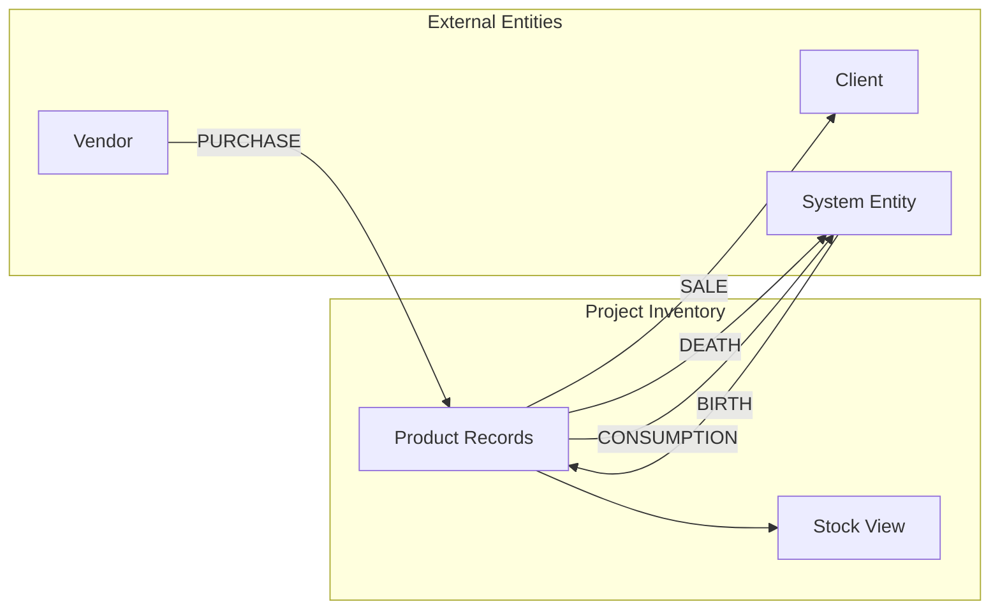

# Plan: Unify All Inventory Operations Under Movement Lines

## Problem Statement

Currently, [`save_inventory()`](apps/app_operation/models/operation.py:538) creates `Product` records for the **full contract quantity** at operation creation time — before any physical movement occurs. This creates a mismatch:

1. **Contract layer** — `InvoiceItem` represents what was ordered/sold (an obligation)
2. **Inventory layer** — `Product` should represent physical goods actually in stock

Products are created as placeholders for goods that may never arrive, and [`Product.is_obligated_only`](apps/app_inventory/models.py:700) exists solely to distinguish "paper products" from "physical products." This forces downstream complexity: [`record_adjustment_line()`](apps/app_inventory/models.py:132) must write ledger corrections for contract changes that have no physical reality.

## Proposed Principle

> **All inventory operations (PURCHASE, SALE, BIRTH, DEATH, CONSUMPTION) flow through `InventoryMovementLine`. Products are created only when a movement line records a physical transfer. Value-only events (CAPITAL_GAIN, CAPITAL_LOSS) remain as direct ledger entries.**

This unifies the architecture:

```
Movement Line (physical transfer) → creates/links Product → record_movement_line() → ledger
```

### Movement Direction for Each Operation

| Operation | Source Entity | Destination Entity | Product action | Stock view effect |
|---|---|---|---|---|
| **PURCHASE** | Vendor | Project | Created (lazy) | Product appears in stock |
| **SALE** | Project | Client | Linked (exists) | Product removed from stock |
| **BIRTH** | System | Project | Created (lazy) | Product appears in stock |
| **DEATH** | Project | System | Linked (exists) | Product removed from stock (→ deadstock tab) |
| **CONSUMPTION** | Project | System or Consumption entity | Linked (exists) | Product removed from stock |
| **CAPITAL_GAIN** | — | — | No movement | Value-only ledger entry (unchanged) |
| **CAPITAL_LOSS** | — | — | No movement | Value-only ledger entry (unchanged) |

### Entity Flow Diagram



---

## Detailed Design

### 1. [`InventoryMovementLine`](apps/app_inventory/models.py:937) — Universal Movement Carrier

The `InventoryMovementLine` model already has all the fields needed:
- `operation` — FK to the parent operation
- `invoice_item` — FK to the contract line
- `product` — FK to the Product (nullable, created lazily)
- `quantity` — how much moved
- `date` — when it happened
- `group_key` — groups lines created together

#### 1a. Extend [`record_movement_line()`](apps/app_inventory/models.py:206) to handle all operation types

**Before:** Only PURCHASE and SALE (if/elif chain).

**After:** A `_MAP` dict covering all 7 operation types:

```python
_MAP = {
    OperationType.PURCHASE: (cls.EntryType.PURCHASE, 1, 1),
    OperationType.SALE: (cls.EntryType.SALE, -1, -1),
    OperationType.BIRTH: (cls.EntryType.BIRTH, 1, 1),
    OperationType.DEATH: (cls.EntryType.DEATH, -1, -1),
    OperationType.CONSUMPTION: (cls.EntryType.CONSUMPTION, -1, -1),
    OperationType.CAPITAL_GAIN: (cls.EntryType.CAPITAL_GAIN, 0, 1),
    OperationType.CAPITAL_LOSS: (cls.EntryType.CAPITAL_LOSS, 0, -1),
}
```

Also added null-safety guard: if `line.product is None`, returns `(0, 0)` instead of crashing.

#### 1b. Extend [`InventoryMovementLine.save()`](apps/app_inventory/models.py:1111) for lazy Product creation

```python
def save(self, *args, **kwargs):
    from apps.app_operation.models.operation_type import OperationType

    is_new = self.pk is None
    if is_new and self.product_id is None:
        op_type = self.operation.operation_type
        if op_type in (OperationType.PURCHASE, OperationType.BIRTH):
            self.product = self._create_product_for_movement()
    super().save(*args, **kwargs)
    if is_new:
        negate = self.reversal_of_id is not None
        ProductLedgerEntry.record_movement_line(self, negate=negate)
```

#### 1c. Add `_create_product_for_movement()` helper

Creates Product records lazily at movement time:

```python
def _create_product_for_movement(self):
    from apps.app_inventory.models import Product, ProductTemplate

    template = self.invoice_item.product_template
    op = self.operation
    owning_entity = op.period_entity or op.destination

    if template.tracking_mode == ProductTemplate.TrackingMode.INDIVIDUAL:
        products = []
        qty = int(self.quantity)
        for _ in range(max(qty, 1)):
            product = Product.objects.create(
                entity=owning_entity,
                product_template=template,
                quantity=1,
                unit_price=self.invoice_item.unit_price,
            )
            product.invoice_items.add(self.invoice_item)
            products.append(product)
        return products[0]
    else:
        product = Product.objects.create(
            entity=owning_entity,
            product_template=template,
            quantity=int(self.quantity),
            unit_price=self.invoice_item.unit_price,
        )
        product.invoice_items.add(self.invoice_item)
        return product
```

### 2. Auto-Create Movement Lines for BIRTH and DEATH

#### 2a. [`save_inventory()`](apps/app_operation/models/operation.py:538) — rewritten

```python
def save_inventory(self, bound_formset):
    from apps.app_inventory.models import ProductLedgerEntry

    if self.operation_type in (OperationType.BIRTH, OperationType.DEATH):
        self._auto_create_inventory_movements(bound_formset)

    elif self.operation_type in (OperationType.CAPITAL_GAIN, OperationType.CAPITAL_LOSS):
        for form in bound_formset.forms:
            item = form.instance
            if not item.pk:
                continue
            selected = form.cleaned_data.get("selected_product")
            if selected:
                is_reversal = getattr(self, "reversal_of_id", None) is not None
                selected.validate_active(allow_reversal=is_reversal)
                selected.invoice_items.add(item)
        ProductLedgerEntry.record(self)

    # PURCHASE and SALE: no-op — movement lines are user-driven
```

#### 2b. The `_auto_create_inventory_movements()` helper

```python
def _auto_create_inventory_movements(self, bound_formset):
    import uuid
    from apps.app_inventory.models import InventoryMovementLine

    group_key = uuid.uuid4().hex[:8]

    for form in bound_formset.forms:
        item = form.instance
        if not item.pk:
            continue

        if self.operation_type == OperationType.BIRTH:
            InventoryMovementLine.objects.create(
                operation=self,
                invoice_item=item,
                quantity=item.quantity,
                date=self.date,
                officer=self.officer,
                group_key=group_key,
                # product=None → lazy-created by InventoryMovementLine.save()
            )

        elif self.operation_type == OperationType.DEATH:
            selected = form.cleaned_data.get("selected_product")
            if selected:
                InventoryMovementLine.objects.create(
                    operation=self,
                    invoice_item=item,
                    product=selected,
                    quantity=item.quantity,
                    date=self.date,
                    officer=self.officer,
                    group_key=group_key,
                )
```

### 3. Remove `create_products_for_item()` for BIRTH

`InvoiceItem.create_products_for_item()` is no longer called by BIRTH — products are created by `InventoryMovementLine.save()` lazy creation. The factory method is kept for backward compatibility / manual use.

### 4. Update Views

#### 4a. [`create_inventory_movement()`](apps/app_inventory/views.py:401)

Removed `ValidationError` when invoice item has no linked product:

```python
if not line.product_id:
    first_product = line.invoice_item.products.first()
    if first_product:
        line.product = first_product
    # else: product stays None → lazy creation in InventoryMovementLine.save()
```

#### 4b. [`register_deferred_movements()`](apps/app_inventory/views.py:610)

Allows `product=None` for BATCH/COMMODITY — product is created lazily by `InventoryMovementLine.save()`.

### 5. Update [`PurchaseOperation.create_from_session()`](apps/app_operation/models/proxies/op_purchase.py:94)

Removed the Product creation step (was: `InvoiceItem.create_products_for_item()`). Now creates `InventoryMovementLine` with `product=None`:

```python
received_qty = Decimal(item_data.get("received_qty", "0"))
if received_qty > Decimal("0"):
    InventoryMovementLine.objects.create(
        operation=op,
        invoice_item=invoice_item,
        product=None,  # lazy-created by save()
        quantity=received_qty,
        date=date_val,
        officer=officer,
        notes="",
        group_key=group_key,
    )
```

### 6. SaleOperation.create_from_session()

**No change needed.** SALE operations select existing products — no lazy creation.

### 7. Reversal Logic in [`Operation.reverse()`](apps/app_operation/models/operation.py:647)

```python
def reverse(self, officer, date=None, reason=None):
    reversal = super().reverse(officer=officer, date=date, reason=reason)

    if type(self).has_invoice:
        from apps.app_inventory.models import ProductLedgerEntry

        if self.operation_type in (OperationType.PURCHASE, OperationType.SALE):
            moved = self.movement_lines.filter(reversal_of__isnull=True).exists()
            if moved:
                raise ValidationError(
                    _("Cannot reverse this operation. "
                      "Reverse all inventory movements first.")
                )
            # No movements → nothing to reverse on inventory side

        elif self.operation_type in (OperationType.BIRTH, OperationType.DEATH):
            for line in self.movement_lines.filter(reversal_of__isnull=True):
                line.reverse(officer=officer, date=date)

        elif self.operation_type in (OperationType.CAPITAL_GAIN, OperationType.CAPITAL_LOSS):
            ProductLedgerEntry.record(self, negate=True)

    return reversal
```

Also removed the stale `self.inventory_movements.prefetch_related("lines")` block (removed `InventoryMovement` model).

### 8. Adjustments — Value-Only in [`record_adjustment_line()`](apps/app_inventory/models.py:132)

`quantity_delta` is always `Decimal("0.00")`. Adjustments change the **contract**, not physical inventory:

```python
defaults={
    "product": product,
    "entry_type": entry_type,
    "date": date,
    "quantity_delta": Decimal("0.00"),
    "value_delta": (val_delta * val_sign).quantize(Decimal("0.01")),
},
```

Also: if invoice item has no linked products yet (lazy creation), silently skip:

```python
products = list(line.invoice_item.products.all())
if not products:
    return 0, 0
```

### 9. `can_create_movement`

Unchanged — still restricted to PURCHASE and SALE. BIRTH/DEATH movement lines are auto-created by `save_inventory()`.

### 10. Stock View Updates

#### 10a. Live/Dead/Consumed/Sold Tabs

[`stock_detail()`](apps/app_inventory/views.py:25) rewritten with tab-based filtering. Uses `?tab=live|dead|consumed|sold` query parameter.

**Annotation approach** — annotates each Product with `incoming` (Sum of PURCHASE/BIRTH movement quantities) and `outgoing` (Sum of SALE/DEATH/CONSUMPTION movement quantities) using `Case/When`:

```python
products_with_qty = base_qs.annotate(
    incoming=Sum(
        Case(
            When(
                movement_lines__operation__operation_type__in=incoming_ops,
                movement_lines__reversal_of__isnull=True,
                then=F("movement_lines__quantity"),
            ),
            default=Value(Decimal("0.00")),
            output_field=DecimalField(max_digits=10, decimal_places=2),
        )
    ),
    outgoing=Sum(
        Case(
            When(
                movement_lines__operation__operation_type__in=outgoing_ops,
                movement_lines__reversal_of__isnull=True,
                then=F("movement_lines__quantity"),
            ),
            default=Value(Decimal("0.00")),
            output_field=DecimalField(max_digits=10, decimal_places=2),
        )
    ),
)
```

**Python filtering** — each tab filters in Python using `net_qty = incoming - outgoing` and checking movement line existence:

| Tab | Filter |
|---|---|
| `live` | `net_qty > 0` |
| `dead` | `net_qty <= 0` AND has DEATH movement |
| `consumed` | `net_qty <= 0` AND has CONSUMPTION movement |
| `sold` | `net_qty <= 0` AND has SALE movement |

**Key nuance:** CONSUMPTION can be partial. A product stays in the Live tab until fully consumed (net_qty <= 0).

### 11. `Product.status` — Derive from Movement Lines

[`Product.status`](apps/app_inventory/models.py:728) now derives from movement lines instead of `invoice_items`:

```python
@property
def status(self) -> str:
    from apps.app_operation.models.operation_type import OperationType

    TERMINAL_TYPES = {
        OperationType.DEATH: self.Status.DEAD,
        OperationType.SALE: self.Status.SOLD,
        OperationType.CONSUMPTION: self.Status.CONSUMED,
    }

    last_outgoing = (
        self.movement_lines.filter(
            reversal_of__isnull=True,
            operation__operation_type__in=list(TERMINAL_TYPES),
        )
        .order_by("-date", "-created_at")
        .values_list("operation__operation_type", flat=True)
        .first()
    )

    if last_outgoing is None:
        return self.Status.ACTIVE
    return TERMINAL_TYPES[last_outgoing]
```

Added `CONSUMED = "CONSUMED"` to the `Status` TextChoices enum.

### 12. Template — Tab Navigation

[`stock_detail.html`](apps/app_inventory/templates/app_inventory/stock_detail.html) updated with:
- Tab navigation bar (Live / Dead / Consumed / Sold)
- Tab links use `?tab=` query parameter
- Each product row includes CONSUMED badge styling
- Removed obligated inbound/outbound product sections (no products exist until movement under lazy creation)

---

## Summary of All Code Changes (Actual)

| # | File | Change | Status |
|---|---|---|---|
| 1 | [`models.py:206`](apps/app_inventory/models.py:206) | Extended `record_movement_line()` with `_MAP` dict (all 7 ops) | ✅ Done |
| 2 | [`models.py:1111`](apps/app_inventory/models.py:1111) | Extended `save()` — lazy Product creation for PURCHASE/BIRTH | ✅ Done |
| 3 | [`models.py:1062`](apps/app_inventory/models.py:1062) | Added `_create_product_for_movement()` helper | ✅ Done |
| 4 | [`operation.py:538`](apps/app_operation/models/operation.py:538) | Rewrote `save_inventory()` — auto-movements for BIRTH/DEATH | ✅ Done |
| 5 | [`operation.py:572`](apps/app_operation/models/operation.py:572) | Added `_auto_create_inventory_movements()` helper | ✅ Done |
| 6 | [`operation.py:647`](apps/app_operation/models/operation.py:647) | Restructured `reverse()` per operation type | ✅ Done |
| 7 | [`operation.py:647`](apps/app_operation/models/operation.py:647) | Removed stale `inventory_movements` reference | ✅ Done |
| 8 | [`views.py:401`](apps/app_inventory/views.py:401) | Removed ValidationError when no product exists | ✅ Done |
| 9 | [`views.py:610`](apps/app_inventory/views.py:610) | Allowed null product for BATCH/COMMODITY | ✅ Done |
| 10 | [`op_purchase.py:179`](apps/app_operation/models/proxies/op_purchase.py:179) | Removed Product creation from `create_from_session()` | ✅ Done |
| 11 | [`models.py:132`](apps/app_inventory/models.py:132) | `record_adjustment_line()` — `quantity_delta=0`, silent skip | ✅ Done |
| 12 | [`models.py:728`](apps/app_inventory/models.py:728) | `Product.status` derives from movement lines + CONSUMED added | ✅ Done |
| 13 | [`views.py:25`](apps/app_inventory/views.py:25) | Live/Dead/Consumed/Sold tabs on stock page | ✅ Done |
| 14 | [`stock_detail.html`](apps/app_inventory/templates/app_inventory/stock_detail.html) | Tab navigation + CONSUMED badge + removed obligated sections | ✅ Done |

## Architecture Before vs After

### Before (Current)

```
save_inventory()
  ├── PURCHASE: create_products_for_item() → Product (placeholder)
  ├── BIRTH:    create_products_for_item() → Product (immediate)
  ├── SALE:     link existing Product
  ├── DEATH:    link existing Product → record() → ledger
  ├── CAP_GAIN: link existing Product → record() → ledger
  └── CAP_LOSS: link existing Product → record() → ledger

Movement (separate, only PURCHASE/SALE):
  InventoryMovementLine.save() → record_movement_line() → ledger
```

### After (Implemented)

```
save_inventory()
  ├── BIRTH:    _auto_create_movement() → InventoryMovementLine.save()
  │               → _create_product_for_movement() → Product
  │               → record_movement_line(BIRTH) → ledger
  ├── DEATH:    _auto_create_movement() → InventoryMovementLine.save()
  │               → record_movement_line(DEATH) → ledger
  ├── CAP_GAIN: link product → record(CAPITAL_GAIN) → ledger
  └── CAP_LOSS: link product → record(CAPITAL_LOSS) → ledger

User-driven movement (PURCHASE/SALE):
  InventoryMovementLine.save()
    ├── product=None → _create_product_for_movement() → Product (PURCHASE only)
    └── record_movement_line(PURCHASE/SALE) → ledger

Stock View:
  ├── Live tab:    net_qty > 0
  ├── Dead tab:    has DEATH movement, net_qty <= 0
  ├── Consumed tab: has CONSUMPTION movement, net_qty <= 0
  └── Sold tab:    has SALE movement, net_qty <= 0
```

## Resolved Design Decisions

| # | Question | Decision |
|---|---|---|
| 1 | INDIVIDUAL tracking + partial movement | **One Product per arrived unit** — `_create_product_for_movement()` creates individual Product records for INDIVIDUAL tracking, one per movement line. |
| 2 | BIRTH entity direction | System entity is a **singleton with `is_system=True`**. The helper queries `Entity.objects.get(is_system=True)`. |
| 3 | Consumption target | Always **System** entity — no configurable destination. |
| 4 | `Product.unit_price` at BIRTH | Use `invoice_item.unit_price`. If auto-valuation is needed with no explicit price, default to **1** as placeholder value. |
| 5 | Deadstock view location | **Tabs on the stock page** — Live/Dead/Consumed/Sold, not separate URLs. |
