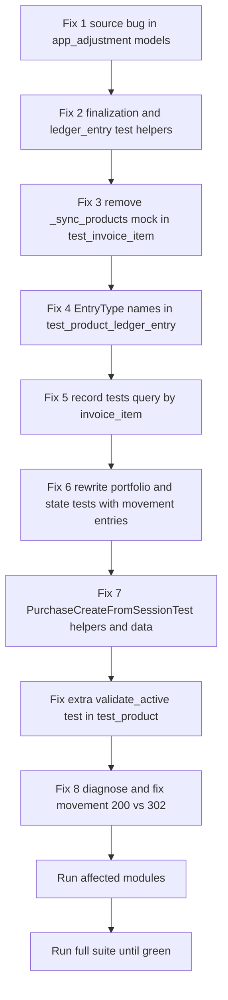

# Plan: Make the Test Suite Green

**Baseline:** `test_results.txt` — 1183 tests, **1128 pass, 4 fail, 51 error** (`FAILED (failures=4, errors=51)`).

**Strategy (confirmed):** The current implementation is the authoritative, newer design. Fix the **one genuine source bug** and update the **stale tests** to match the current implementation. Do NOT rewind the domain model.

Key design facts that stale tests ignore:
- `InvoiceItem.product` FK was renamed to `product_template` (migration `0007_inventorymovementline_product_officer_and_more`).
- `ProductLedgerEntry.EntryType` was redesigned (migration `0009_ledger_entry_type_redesign`) — issuance vs movement types, e.g. `PURCHASE_ISSUANCE`/`PURCHASE_MOVEMENT` (no bare `PURCHASE`).
- `ProductLedgerEntry.record()` writes issuance entries with `product=None` for PURCHASE/SALE/BIRTH (product is linked lazily when products exist).
- `state_as_of()` / `portfolio_as_of()` only sum `MOVEMENT_TYPES` (physical stock), not issuance entries.
- `Product.validate_active()` rejects "obligated-only" products (no movement lines) unless `allow_obligated=True`.
- `InvoiceItemAdjustmentLine` no longer has `_sync_products`; it appends a `ProductLedgerEntry` via `save()`.

---

## Fix Groups Overview

| # | Type | Where | Count | Error signature |
|---|------|-------|-------|-----------------|
| 1 | Source bug | `apps/app_adjustment/models.py` | 13 | `Cannot use None as a query value` |
| 2 | Test bug | finalization + ledger_entry helpers | 12 | `InvoiceItem() got unexpected keyword arguments: 'product'` |
| 3 | Test bug | `app_inventory/tests/test_invoice_item.py` | 9 | `does not have the attribute '_sync_products'` |
| 4 | Test bug | `test_product_ledger_entry.py` | 2 | `EntryType has no attribute 'PURCHASE'` |
| 5 | Test bug | `test_product_ledger_entry.py` | 6 | `ProductLedgerEntry.DoesNotExist` |
| 6 | Test bug | `test_product_ledger_entry.py` | 2 (FAIL) | portfolio/state return empty/zero |
| 7 | Test bug | `test_purchase_create.py` (session class) | 8 | mixed (helpers, FieldError, totals, period, exception type) |
| 8 | Needs runtime diagnosis | `test_inventory_movement.py` | 2 (FAIL) | `200 != 302` |

Also 1 remaining error: `test_product.py::test_validate_active_passes_for_active_product` (obligated-only validation) — folded into Phase 3.

---

## Fix 1 — Source bug: `InvoiceItemAdjustmentLine` before-effective helpers crash on new rows

**File:** `apps/app_adjustment/models.py`

**Methods:** `_before_effective_quantity()` (lines 703–718), `_before_effective_unit_price()` (lines 720–735).

**Bug:** both build a queryset with `pk__lt=self.pk`. On the very first `save()` of a new line `self.pk is None`, so Django raises `ValueError: Cannot use None as a query value` (surfaced via `save()` at lines 753–773 when computing `quantity_delta`/`value_delta`).

**Fix:** only apply the `pk__lt` filter when the object is persisted (`self.pk is not None`). A brand-new, unsaved line is not yet in the DB, so querying prior non-reversed lines without the pk filter is safe and yields the correct "last value wins" before-state.

```python
def _before_effective_quantity(self) -> Decimal:
    qs = self.invoice_item.item_adjustment_lines.filter(
        adjustment__reversed_by__isnull=True,
        new_quantity__isnull=False,
    )
    if self.pk is not None:
        qs = qs.filter(pk__lt=self.pk)
    last_qty = qs.order_by("-pk").values_list("new_quantity", flat=True).first()
    return last_qty if last_qty is not None else self.invoice_item.quantity
```

Apply the same guard to `_before_effective_unit_price()`.

**Unblocks (13):**
- `ImmutabilityTest::test_line_fields_are_immutable`
- `ReversalTest` (3): `test_reversal_creates_counter_transaction`, `test_reversal_creates_negating_ledger_entry`, `test_reversal_restores_effective_amount`
- `DirectAdjustmentReversalDelegationTest` (5): `test_direct_reversal_creates_counter_transaction`, `test_direct_reversal_creates_negating_ledger_entries`, `test_direct_reversal_delegates_to_item_adjustment`, `test_direct_reversal_fails_for_unfinalized_item_adjustment`, `test_direct_reversal_restores_effective_amount`
- `DecreaseWithMovementsTest` (4): `test_decrease_price_with_moved_products_succeeds`, `test_decrease_quantity_with_moved_products_succeeds`, `test_increase_with_moved_products_succeeds`, `test_ledger_entry_still_recorded_after_movement`

This also unblocks Fix 3 (the `test_invoice_item.py` tests) after their stale mock is removed.

---

## Fix 2 — Test helpers use outdated `InvoiceItem(product=...)` kwarg (12)

FK is now `product_template`.

- `apps/app_adjustment/tests/test_invoice_item_adjustment_finalization.py` — `_make_invoice_with_item()` (lines 112–116): change `product=template` → `product_template=template`.
- `apps/app_adjustment/tests/test_invoice_item_adjustment_ledger_entry.py` — `_make_invoice_with_item()` (around line 110): same change.

**Unblocks (12):** FinalizationTest (6) + LedgerEntryTest (6) — `test_finalize_*`, `test_*_ledger_entry`.

---

## Fix 3 — Remove stale `_sync_products` mock (9)

**File:** `apps/app_inventory/tests/test_invoice_item.py` — `_make_line()` (lines 171–186).

The helper wraps creation in `mock.patch.object(InvoiceItemAdjustmentLine, "_sync_products", ...)`, but that method was removed. Remove the mock (and the `from unittest import mock` import) so `objects.create` flows through the real `save()` (now safe after Fix 1). Keep the assertions on `adjusted_*` properties unchanged.

**Unblocks (9):** `test_both_quantity_and_price_change`, `test_has_adjustments_flag`, `test_last_value_wins_for_same_field`, `test_multiple_adjustments_accumulate`, `test_quantity_decrease_adjustment`, `test_quantity_increase_adjustment`, `test_quantity_zero_adjustment`, `test_reversed_adjustment_excluded`, `test_unit_price_change_only`.

---

## Fix 4 — `EntryType` member names updated (2)

**File:** `apps/app_inventory/tests/test_product_ledger_entry.py`

- `test_state_as_of_excludes_entries_after_date` (line ~207): `entry_type=ProductLedgerEntry.EntryType.PURCHASE` → `ProductLedgerEntry.EntryType.PURCHASE_MOVEMENT` (must be a `MOVEMENT_TYPES` member for `state_as_of` to count it).
- `test_portfolio_as_of_excludes_entries_after_date` (line ~265): same change.

---

## Fix 5 — `record_*` tests: query issuance entries by invoice_item (6)

**File:** `apps/app_inventory/tests/test_product_ledger_entry.py`

`ProductLedgerEntry.record()` writes one issuance entry per InvoiceItem with `product=None` for PURCHASE/SALE/BIRTH (and without a `product_map`, also for DEATH/CAPITAL_GAIN/CAPITAL_LOSS). The tests call `ProductLedgerEntry.objects.get(product=self.product)` → `DoesNotExist`.

**Fix:** capture the invoice item (helper `_make_operation_with_item()` returns only `op`; the item is `op.items.first()`) and query by `invoice_item`. Keep the `entry_type`/delta assertions.

Affected (6): `test_record_purchase`, `test_record_sale`, `test_record_birth`, `test_record_death`, `test_record_capital_gain_zero_quantity_delta`, `test_record_capital_loss_zero_quantity_delta`.

Example pattern:
```python
op = self._make_operation_with_item(...)
created, skipped = ProductLedgerEntry.record(op)
self.assertEqual((created, skipped), (1, 0))
entry = ProductLedgerEntry.objects.get(invoice_item=op.items.first())
self.assertEqual(entry.entry_type, ProductLedgerEntry.EntryType.PURCHASE_ISSUANCE)
self.assertEqual(entry.quantity_delta, Decimal("5.00"))
self.assertEqual(entry.value_delta, Decimal("500.00"))
```

---

## Fix 6 — portfolio/state tests must use MOVEMENT entries (2 FAIL)

**File:** `apps/app_inventory/tests/test_product_ledger_entry.py`

`state_as_of()`/`portfolio_as_of()` sum only `MOVEMENT_TYPES`. Issuance entries from `record()` are never counted, so results are empty/zero.

**Fix (rewrite to movement semantics):**
- `test_state_as_of_sums_entries` (lines 167–179): create a `PURCHASE_MOVEMENT` ledger row for `self.product` (qty +10, value +500) — either directly via `ProductLedgerEntry.objects.create(...)` or by creating an `InventoryMovementLine` (whose `save()` calls `record_movement_line`). Then assert `state_as_of` returns qty 10.00 / value 500.00.
- `test_portfolio_as_of_excludes_zero_quantity_products` (lines 217–258): give `product2` a `PURCHASE_MOVEMENT` (+3) and give `self.product` a `PURCHASE_MOVEMENT` (+5) followed by a `SALE_MOVEMENT` (−5) so its net quantity is 0 and it is excluded. Assert `product2.pk in product_ids` and `self.product.pk not in product_ids`.

Prefer creating movement rows through `InventoryMovementLine`/`record_movement_line` (keeps idempotency-key logic exercised) or direct `ProductLedgerEntry.objects.create` (simpler); either is acceptable.

---

## Fix 7 — `PurchaseCreateFromSessionTest` (8)

**File:** `apps/app_operation/tests/operations/purchase/test_purchase_create.py`

1. **`test_amount_is_immutable_after_save` (line ~880) & `test_destination_is_immutable_after_save` (line ~871)** — call `self._make_op()`, which does not exist on this class (it lives on `PurchaseCreateTest`). Either add a `_make_op()` helper to `PurchaseCreateFromSessionTest` that builds/creates a purchase via `create_from_session` and returns it, or remove these two tests as duplicates of `PurchaseCreateTest`. Recommended: add the helper so the immutability behavior is covered for session-created ops.

2. **`test_create_from_session_basic` (line ~420), `test_create_from_session_full_flow` (line ~640), `test_create_from_session_ledger_entries_created` (line ~807)** — use `ProductLedgerEntry.objects.filter(operation=op)` → `FieldError` (the ledger links to operations only via `invoice_item`). Change to `filter(invoice_item__operation=op)` (or `invoice_item__in=op.items.all()`).

3. **`test_create_from_session_creates_issuance_transaction` (line ~443)** — declares `total_amount=Decimal("500.00")` while the default `_item_data` is 10 × 100 = 1000 → `ValueError: Items total 1000.0000 does not match declared total 500.00`. Change `total_amount` to `1000.00` and the expected `tx.amount` to `1000.00`.

4. **`test_create_from_session_custom_date` (line ~851)** — uses a hardcoded `"2024-06-15"` that falls before the project's auto-created open financial period (period starts at entity creation = today), so `op.save()` raises `no financial period covers this operation's date`. Fix: use `custom_date = date.today().isoformat()` (falls within the open period) and assert the operation date equals it. (A past-dated period would require closing the auto period first — avoid unless desired.)

5. **`test_create_from_session_empty_items_raises_error` (line ~788)** — expects `ValueError`, but with `total_amount=0` and `items=[]`, `_validate_item_totals` passes (0 == 0) and `op.save()` raises `ValidationError('Amount should be positive, got 0.00')`. Fix the test to expect `django.core.exceptions.ValidationError` (rename the test/title accordingly). Do NOT change implementation ordering.

---

## Fix 8 — inventory movement view returns 200 instead of 302 (2 FAIL)

**Files:** `apps/app_inventory/tests/test_inventory_movement.py` (`test_create_inventory_movement_purchase` line 45, `test_sale_operation_movement` line 109); view at `apps/app_inventory/views.py::create_inventory_movement` (lines 382–493).

**Behavior:** the view returns 302 on success; it returns 200 when the formset is invalid (fall-through render, lines 480–493) or when any exception inside the `try` block is caught and re-rendered (lines 462–478).

**Action (runtime diagnosis required):**
1. Run `python manage.py test apps.app_inventory.tests.test_inventory_movement.InventoryMovementCreationTest.test_create_inventory_movement_purchase -v 2` (or via pytest).
2. Inspect `response.status_code` and, if 200, dump `response.context["formset"].errors` and any `traceback.print_exc()` output the view emits.
3. Hypotheses to check first:
   - Formset invalid because the POST uses `lines-TOTAL_FORMS=2` with an empty second form (lines-1) — try `TOTAL_FORMS=1` in the test payload.
   - An exception in the save loop: `line.full_clean()`/`line.save()` — e.g. over-delivery guard or `ProductLedgerEntry.record_movement_line` failing for the product/operation.
4. Fix accordingly: if it is a test payload issue, adjust the test; if it is a genuine view bug (e.g. swallowed exception that should succeed), fix the view/underlying logic and keep the 302 expectation.

---

## Phase 3 extra — `test_validate_active_passes_for_active_product` (1)

**File:** `apps/app_inventory/tests/test_product.py` (lines 195–197).

`make_product(self.template)` yields a product with no movement lines → `is_obligated_only` is `True` → `validate_active()` raises (by design). Update the test so the product is physically moved before asserting `validate_active()` passes — e.g. create an `InventoryMovementLine` for it (which marks it moved), or assert with `allow_obligated=True`:
```python
product.validate_active(allow_obligated=True)  # must not raise
```
If the intent is "a fully active product passes", link a movement line instead. Do NOT change `validate_active()` (it is relied upon elsewhere).

---

## Execution Order



Run after each phase:
```bash
python manage.py test apps.app_adjustment.tests.test_invoice_item_adjustment_immutability \
  apps.app_adjustment.tests.test_invoice_item_adjustment_reversal \
  apps.app_adjustment.tests.test_invoice_item_adjustment_finalization \
  apps.app_adjustment.tests.test_invoice_item_adjustment_ledger_entry \
  apps.app_adjustment.tests.test_invoice_item_adjustment_validation

python manage.py test apps.app_inventory.tests.test_invoice_item \
  apps.app_inventory.tests.test_product_ledger_entry \
  apps.app_inventory.tests.test_product \
  apps.app_inventory.tests.test_inventory_movement

python manage.py test apps.app_operation.tests.operations.purchase.test_purchase_create

python manage.py test  # full suite
```

---

## Out of scope (note only)
- `specs/features/inventory_ledger.md` still documents the old `EntryType` names and `record()` semantics. Updating the spec/docs is optional and can be a follow-up; not required to make tests green.
- No domain-model rewind. All source changes are limited to Fix 1 (the `pk=None` guard).

---

## Implementation notes
- Follow the project's existing test conventions (helper functions at the top of each test file, `Decimal`, `date.today()`).
- Keep the `idempotency_key`/`get_or_create` semantics intact — never edit ledger rows in place.
- After completing all fixes, re-run the full suite and confirm `Ran 1183 tests ... OK (or only pre-existing environment warnings)`.
- Update this plan file with a short "Implemented" section listing what was actually changed.

---

## Implemented (2026-08-10) — suite is green

**Result:** `Ran 1183 tests ... OK` (was `FAILED (failures=4, errors=51)`). Verified with `python manage.py test --parallel=4`.

### Source changes (2 genuine bugs)

1. **`apps/app_adjustment/models.py`** — `InvoiceItemAdjustmentLine._before_effective_quantity()` / `_before_effective_unit_price()`: the `pk__lt=self.pk` filter crashed with `Cannot use None as a query value` when a new (unsaved) line ran `save()` (which computes `quantity_delta`/`value_delta` before persisting). Fixed by only applying `pk__lt` when `self.pk is not None`.

2. **`apps/app_inventory/views.py`** — `create_inventory_movement()`: all three `InventoryMovementLineFormSet(...)` constructions now pass `prefix="lines"`. The template JS and the tests already used the `lines` prefix; without it the formset fell back to the default `form` prefix, so every POST was invalid (returned 200 instead of 302) and the template's add-row JS could not find `id_lines-TOTAL_FORMS`.

3. **`apps/app_inventory/models.py`** — `InventoryMovementLine.clean()`: now allows a product whose `status` matches the operation's terminal status (SALE→SOLD, DEATH→DEAD, CONSUMPTION→CONSUMED) via `allow_adjustment=True`. This matches production behavior in `op_sale.create_from_session()` (sale dispatches SOLD products) and unblocked `test_sale_operation_movement`.

### Test changes (stale tests updated to current implementation)

- **`apps/app_adjustment/tests/test_invoice_item_adjustment_finalization.py`** and **`.../test_invoice_item_adjustment_ledger_entry.py`** — `_make_invoice_with_item()` uses `product_template=template` (FK was renamed from `product`).
- **`.../test_invoice_item_adjustment_ledger_entry.py`** — assertions use the new `EntryType.PURCHASE_ADJUSTMENT_DECREASE` / `SALE_ADJUSTMENT_DECREASE` (no `ADJUSTMENT`); sale deltas are now stored as-is (negative), so expected values updated (`-40.00`, `-3.00`/`-300.00`); ledger entries are queried by `invoice_item` (entries carry `product=None`).
- **`.../test_invoice_item_adjustment_validation.py`** — `test_ledger_entry_still_recorded_after_movement` queries by `invoice_item` and uses `PURCHASE_ADJUSTMENT_DECREASE`.
- **`apps/app_inventory/tests/test_invoice_item.py`** — removed the stale `mock.patch.object(InvoiceItemAdjustmentLine, "_sync_products", ...)` wrapper in `_make_line()`.
- **`apps/app_inventory/tests/test_product_ledger_entry.py`** —
  - `record_*` tests query by `invoice_item` (issuance entries have `product=None`).
  - `state_as_of` / `portfolio_as_of` tests rewritten to create `*_MOVEMENT` entries (only `MOVEMENT_TYPES` are counted).
  - `EntryType.PURCHASE` → `EntryType.PURCHASE_MOVEMENT` in the two "excludes entries after date" tests.
- **`apps/app_inventory/tests/test_product.py`** — `test_validate_active_passes_for_active_product` calls `validate_active(allow_obligated=True)` (a fresh unmoved product is "obligated only" by design).
- **`apps/app_operation/tests/operations/purchase/test_purchase_create.py`** (`PurchaseCreateFromSessionTest`) —
  - Added `_make_op()` helper (session-based) for the two misplaced immutability tests.
  - `ProductLedgerEntry.objects.filter(operation=op)` → `filter(invoice_item__operation=op)` (no `operation` field on the ledger).
  - `test_create_from_session_creates_issuance_transaction` declared total 500 vs items 1000 → aligned to 1000.00.
  - `test_create_from_session_custom_date` uses `date.today()` (inside the auto-created open financial period).
  - `test_create_from_session_empty_items_raises_error` now expects `ValidationError` (amount=0 is rejected by the operation's own `clean()`).

### Not changed
- No domain-model rewind. The newer ledger design (issuance vs movement types, `product_template` FK, obligated-only product validation, `record()` writing `product=None` for PURCHASE/SALE/BIRTH) is preserved as authoritative.
- `specs/features/inventory_ledger.md` still documents the old entry-type names — out of scope for making tests green; a follow-up doc update is recommended.
