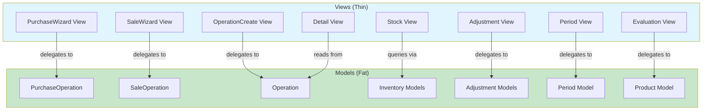

# Plan: Move View-Heavy Logic to Models

## Objective
Refactor the codebase following the "fat models, thin views" Django principle by moving business logic from view files into model methods, properties, and managers.

---

## Findings Summary

After analyzing all view files across [`apps/app_operation/views/`](apps/app_operation/views/), [`apps/app_inventory/views.py`](apps/app_inventory/views.py), and [`apps/app_adjustment/views.py`](apps/app_adjustment/views.py), the following areas contain business logic that should reside in models:

---

## Phase 1: Purchase/Sale Wizard — `_do_submit()` (High Priority)

**Files:**
- [`apps/app_operation/views/purchase_wizard.py`](apps/app_operation/views/purchase_wizard.py:512)
- [`apps/app_operation/views/sale_wizard.py`](apps/app_operation/views/sale_wizard.py:512)

**What's in the views:**
Both wizards have a near-identical `_do_submit()` function (~90 lines each) that orchestrates:
1. Integrity check (items total vs declared total)
2. Operation creation (`PurchaseOperation` / `SaleOperation`)
3. `InvoiceItem` creation per item
4. `Product` creation and M2M linking
5. `InventoryMovementLine` creation for received/delivered quantities
6. Payment transaction creation

**What to move:**
- Add `PurchaseOperation.create_from_session(session_data, officer)` classmethod
- Add `SaleOperation.create_from_session(session_data, officer)` classmethod
- Refactor both `_do_submit()` to single-line delegation

**Model files to modify:**
- [`apps/app_operation/models/proxies/op_purchase.py`](apps/app_operation/models/proxies/op_purchase.py)
- [`apps/app_operation/models/proxies/op_sale.py`](apps/app_operation/models/proxies/op_sale.py)

---

## Phase 2: Operation Create View — Computation/Creation Logic

**File:** [`apps/app_operation/views/create.py`](apps/app_operation/views/create.py)

**What's in the views:**
- `_compute_amount()` (line 280): Sums formset quantities × prices
- `_create_operation()` (line 292): Creates operation with resolved entities
- `_process_payment()` (line 305): Validates and creates payment (amount ≤ total, partial payment rules)
- `_process_invoice()` (line 328): Saves formset and calls `save_inventory()`

**What to move:**
- Add `Operation.create_with_items(config, ...)` factory method
- Add `Operation.validate_and_process_payment(amount, officer, date)` method
- The `save_inventory()` already exists on [`Operation`](apps/app_operation/models/operation.py:370) — good, but could be expanded

**Model files to modify:**
- [`apps/app_operation/models/operation.py`](apps/app_operation/models/operation.py)
- [`apps/app_operation/models/proxies/op_purchase.py`](apps/app_operation/models/proxies/op_purchase.py) (inherits)

---

## Phase 3: Stock/Inventory Views — Query Logic

**File:** [`apps/app_inventory/views.py`](apps/app_inventory/views.py)

**What's in the views:**
- `stock_detail()` (line 29): Complex queries for:
  - Portfolio via `ProductLedgerEntry.portfolio_as_of()` (already on model ✅)
  - Unreceived purchases (InvoiceItems without movement lines)
  - Undelivered sales (InvoiceItems without movement lines)
- `_build_invoice_items_json()` (line 239): Computes `already_moved` and `max_allowed` per invoice item
- `create_inventory_movement()` (line 264): Movement creation with product derivation

**What to move:**
- Add `InvoiceItem.unreceived_purchases()` and `InvoiceItem.undelivered_sales()` manager methods
- Add `InvoiceItem.movement_summary()` for JSON data computation
- Delegate movement creation to `InventoryMovementLine.bulk_create_from_formset()`

**Model files to modify:**
- [`apps/app_inventory/models.py`](apps/app_inventory/models.py)

---

## Phase 4: Detail View — Template Data Computation (High Priority)

**File:** [`apps/app_operation/views/detail.py`](apps/app_operation/views/detail.py)

**What's in the views:**
- Lines 86-148: Massive `items_data` computation including:
  - Movement line grouping by `group_key`
  - Direction logic (`return_out`, `return_in`, `receive`, `deliver`)
  - Net quantity calculation per group
  - `is_fully_moved` flag
- Lines 163-245: Payment balance computation:
  - Active transactions filtering
  - Paid amount, outstanding balance, net adjustment, overpayment
  - Payment/repayment transaction filtering

**What to move:**
- Add `Operation.items_data` property returning the computed list
- Add `Operation.payment_balance_detail` property returning dict
- Simplify view to just call `operation.items_data` and `operation.payment_balance_detail`

**Model files to modify:**
- [`apps/app_operation/models/operation.py`](apps/app_operation/models/operation.py)

---

## Phase 5: Adjustment Views — Business Logic

**File:** [`apps/app_operation/views/adjustment.py`](apps/app_operation/views/adjustment.py)

**What's in the views:**
- `record_item_adjustment()` (line 98): Parses per-item POST fields, validates, creates `InvoiceItemAdjustment` and lines
- Reversal validation logic (is_reversed, is_reversal checks) repeated across 4 functions

**What to move:**
- Add `InvoiceItemAdjustment.create_from_post_data(operation, items_data, date, reason, officer)` classmethod
- Add `AdjustmentBase.validate_can_reverse()` method to centralize reversal checks

**Model files to modify:**
- [`apps/app_adjustment/models.py`](apps/app_adjustment/models.py)
- [`apps/app_adjustment/_item_type.py`](apps/app_adjustment/_item_type.py)

---

## Phase 6: Evaluation View — Valuation Logic

**File:** [`apps/app_operation/views/evaluation.py`](apps/app_operation/views/evaluation.py)

**What's in the views:**
- Lines 131-172: Valuation delta calculation, CapitalGain/CapitalLoss determination, InvoiceItem + ProductLedgerEntry creation

**What to move:**
- Add `Product.evaluate(new_unit_price, date, description, officer)` method that returns the created operation

**Model files to modify:**
- [`apps/app_inventory/models.py`](apps/app_inventory/models.py) — `Product` model

---

## Phase 7: Period View — Close/Ledger Logic

**File:** [`apps/app_operation/views/period.py`](apps/app_operation/views/period.py)

**What's in the views:**
- `period_close_view()` (line 90): Outstanding balances checks (receivables, payables, loans, advances) — 6 repeated property checks
- `period_ledger_view()` (line 238): Running balance computation with direction logic

**What to move:**
- Add `FinancialPeriod.close_warnings` property returning list of warning strings
- Add `FinancialPeriod.ledger_data` property returning computed ledger rows

**Model files to modify:**
- [`apps/app_operation/models/period.py`](apps/app_operation/models/period.py)

---

## Phase 8: Record Transaction — Eligibility Checks

**File:** [`apps/app_operation/views/record_transaction.py`](apps/app_operation/views/record_transaction.py)

**What's in the views:**
- `record_transaction_repayment()` (line 134): Repayment eligibility checks (operation type support, amount ≤ remaining)

**What to move:**
- Add `Operation.validate_repayment(amount)` method raising ValidationError
- Simplify view to call `operation.validate_repayment(amount)`

**Model files to modify:**
- [`apps/app_operation/models/operation.py`](apps/app_operation/models/operation.py)

---

## Architecture Diagram

---

## Key Principles

1. **Views handle**: HTTP request/response, form validation, messages, redirects, template rendering
2. **Models handle**: Business logic, data validation, data computation, cross-entity orchestration
3. **No side effects in properties**: Properties should be idempotent and read-only
4. **Atomicity**: Complex operations should be wrapped in `@transaction.atomic` at the model level
5. **Testability**: New model methods should have corresponding unit tests

---

## Testing Strategy

- Each new model method should have targeted unit tests
- Existing view tests should continue passing (behavioral contract preserved)
- Key areas to test: `create_from_session()`, `items_data`, `payment_balance_detail`, `evaluate()`
- Run existing tests before and after each phase: `python manage.py test apps.app_operation.tests apps.app_inventory.tests`
