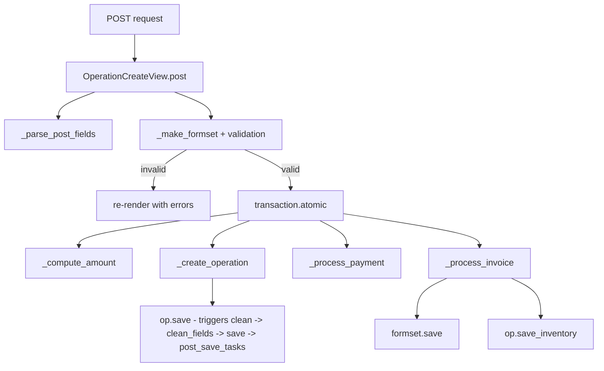
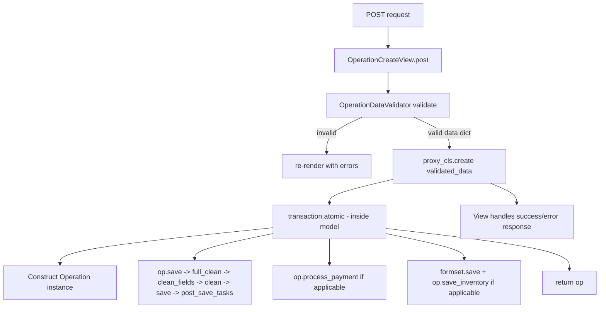

# Refactor: Move POST Business Logic from View to Model

## Problem

The [`OperationCreateView.post()`](apps/app_operation/views/create_operation/base.py:125) method in the base view is too heavy — it directly handles:

1. Parsing POST fields (`_parse_post_fields`)
2. Formset creation & validation (`_make_formset`)
3. Amount computation (`_compute_amount`)
4. Operation creation (`_create_operation`)
5. Payment processing (`_process_payment`)
6. Invoice + inventory processing (`_process_invoice`)

Steps 3–6 contain **business logic** that belongs in the model layer. The view should only validate input and orchestrate, not implement domain rules.

## Scope

**This refactor targets only [`OperationCreateView.post()`](apps/app_operation/views/create_operation/base.py:125)** — the base view used by generic operation creation.

- Other operations with specific views ([`BirthCreateView`](apps/app_operation/views/create_operation/create_birth_view.py), [`DeathCreateView`](apps/app_operation/views/create_operation/create_death_view.py), [`SaleCreateView`](apps/app_operation/views/create_operation/create_sale_view.py), [`EvaluationCreateView`](apps/app_operation/views/create_operation/evaluation.py)) will be migrated in a separate task.
- The wizards ([`purchase_wizard.py`](apps/app_operation/views/create_operation/purchase_wizard.py), [`sale_wizard.py`](apps/app_operation/views/create_operation/sale_wizard.py)) have their own creation paths via `create_from_session()` — **not touched**.
- [`_build_formset`](apps/app_operation/views/create_operation/base.py:31) is a shared module-level helper used by other views — **kept** in views module.

## Current Architecture



## Target Architecture



## Detailed Steps

### Step 1: Create `OperationDataValidator`

**New file:** [`apps/app_operation/validators.py`](apps/app_operation/validators.py)

A standalone validator class that:

- Takes `request.POST` and the view's `data` config dict
- Validates and returns a clean `ParsedOperationData` dataclass:
  ```python
  @dataclass
  class ParsedOperationData:
      date: date
      description: str
      selected_category_id: int | None
      amount: Decimal          # computed from formset or direct POST
      amount_paid: Decimal     # 0 if not applicable
      raw_post: QueryDict      # forwarded for formset rebinding in create()
  ```
- Validates:
  - Date is parseable (or defaults to today)
  - Category exists if `has_category` and `category_required`
  - Amount is valid positive decimal (when no invoice)
- Raises `ValidationError` on failure

### Step 2: Add `Operation.create()` classmethod to base `Operation` model

**File:** [`apps/app_operation/models/operation.py`](apps/app_operation/models/operation.py)

Add a new classmethod:

```python
@classmethod
def create(cls, *, operation_type, source, destination, amount, date,
           description, officer, amount_paid=None, formset=None,
           project=None, **kwargs) -> "Operation":
    """
    Factory that orchestrates the full creation pipeline.
    
    All inside transaction.atomic():
      1. Construct Operation instance
      2. op.save() -> full_clean() -> clean_fields() -> clean() -> save() -> post_save_tasks
      3. If can_pay and amount_paid > 0: op.process_payment(amount_paid, officer, date)
      4. If has_invoice: formset.save(), op.save_inventory(formset)
      
    Returns the saved Operation instance.
    Proxy subclasses may override this to add custom logic.
    """
```

**Key points:**
- Called on the proxy class (e.g. `PurchaseOperation.create(...)`)
- `save()` already triggers `full_clean()` via [`BaseModel.save()`](apps/app_base/models.py:103) which calls `clean_fields()` → `clean()` → `super().save()` → `post_save()`
- The existing `post_save_tasks` mechanism (appended in [`Operation.save()`](apps/app_operation/models/operation.py:323)) continues to work
- Proxy subclasses can **override** `create()` to add custom logic, calling `super().create()` for the common pipeline

### Step 3: Refactor `OperationCreateView.post()`

**File:** [`apps/app_operation/views/create_operation/base.py`](apps/app_operation/views/create_operation/base.py)

Simplify `post()` to:

1. **Parse & validate** POST fields via `OperationDataValidator`
2. **Validate formset** via existing `_make_formset()`
3. **Delegate** to `proxy_cls.create(parsed_data, formset=formset)`
4. **Handle success/error** responses

Remove these helper methods:
- `_parse_post_fields()` — logic moves to validator
- `_compute_amount()` — logic moves to validator (amount computed from formset or POST)
- `_create_operation()` — replaced by `proxy_cls.create()`
- `_process_payment()` — moves inside `Operation.create()`
- `_process_invoice()` — moves inside `Operation.create()`

Keep:
- `_make_formset()` — still needed for formset creation (view concern)
- `_build_context()` — template rendering
- `_build_formset()` — shared module-level helper, used by other views

### Step 4: Proxy override pattern

Some proxy classes may need custom `create()` logic. For example, `EvaluationCreateView` currently creates `InvoiceItem` and `ProductLedgerEntry` directly — that logic could move into a `CapitalGainOperation.create()` / `CapitalLossOperation.create()` override.

Pattern:

```python
class CapitalGainOperation(Operation):
    @classmethod
    def create(cls, **kwargs):
        # custom logic
        op = super().create(**kwargs)
        # additional steps
        return op
```

**Note:** This is for a **future** task when the specific views are migrated. For now, the base `Operation.create()` handles the common case (used by the generic form view).

### Step 5: Tests

- **`OperationDataValidator` tests**: date parsing, category validation, amount validation
- **`Operation.create()` tests**: happy path with payment, with invoice, validation failures
- **Existing view tests**: must pass unchanged (behavior-preserving refactor)

## Files to Modify

| File | Action |
|------|--------|
| [`apps/app_operation/validators.py`](apps/app_operation/validators.py) | **Create** — `OperationDataValidator` class with `ParsedOperationData` dataclass |
| [`apps/app_operation/models/operation.py`](apps/app_operation/models/operation.py) | **Modify** — Add `Operation.create()` classmethod |
| [`apps/app_operation/views/create_operation/base.py`](apps/app_operation/views/create_operation/base.py) | **Modify** — Simplify `post()`; remove `_parse_post_fields`, `_compute_amount`, `_create_operation`, `_process_payment`, `_process_invoice` |

## Design Decisions

1. **`Operation.create()` accepts a pre-built formset**, not raw POST. The view is responsible for creating the formset (it has access to request, project, proxy_cls). This keeps formset logic in the view layer and avoids importing form classes into models.

2. **`create()` uses `post_save_tasks` under the hood**: The existing [`Operation.save()`](apps/app_operation/models/operation.py:360) already appends `_validate_invoice_items` as a post-save task. The new `create()` method calls `save()` first, then processes payment and invoice in the same atomic block — after the post-save tasks have run.

3. **Proxy overrides**: Since `create()` is a classmethod on `Operation`, proxy subclasses can override it. They can call `super().create()` for the common pipeline, then add their own logic before/after.

4. **Error handling stays in the view**: `Operation.create()` raises exceptions; the view catches them and renders error responses.
