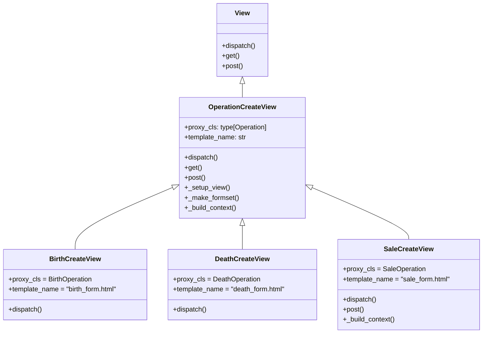

# Refactor BirthCreateView & DeathCreateView to Follow Base Creation Path

## Problem Statement

`BirthCreateView` and `DeathCreateView` currently bypass `OperationCreateView.dispatch()` entirely by calling `View.dispatch(self, ...)` directly. This means:

1. Any future enhancements or fixes added to [`OperationCreateView.dispatch()`](apps/app_operation/views/create_operation/base.py:89) are **not inherited** by Birth/Death views.
2. The error handling for invalid `proxy_cls` resolution in the base dispatch is **skipped**.
3. The base dispatch's audit/debug context around proxy resolution is **lost**.
4. The pattern is **inconsistent** — child views duplicate setup logic instead of delegating to the parent.

## Current Architecture

### URL Routing

| URL Pattern | View | URL Kwargs |
|---|---|---|
| `<int:pk>/<op_type>/create` | [`OperationCreateView`](apps/app_operation/views/create_operation/base.py:69) | `pk`, `op_type` |
| `<int:pk>/birth/create` | [`BirthCreateView`](apps/app_operation/views/create_operation/create_birth_view.py:11) | `pk` |
| `<int:pk>/death/create` | [`DeathCreateView`](apps/app_operation/views/create_operation/create_death_view.py:16) | `pk` |
| `<int:pk>/sale/create` | [`SaleCreateView`](apps/app_operation/views/create_operation/create_sale_view.py:16) | `pk` |

### Current dispatch() Flow

**Base** [`OperationCreateView.dispatch()`](apps/app_operation/views/create_operation/base.py:89):
```
1. DebugContext.section (with op_type from URL)
2. proxy_cls = get_canonical_type(kwargs["op_type"])  ← requires `op_type` kwarg
3. If invalid proxy_cls → return HttpResponseBadRequest
4. self.proxy_cls = proxy_cls
5. self._setup_view(kwargs["pk"], request)
6. DebugContext.success
7. return super().dispatch(request, *args, **kwargs)  → View.dispatch() → get()/post()
```

**Child** [`BirthCreateView.dispatch()`](apps/app_operation/views/create_operation/create_birth_view.py:15):
```
1. DebugContext.section (with project_pk)
2. self._setup_view(kwargs["pk"], request)
3. DebugContext.success
4. return View.dispatch(self, request, *args, **kwargs)  ← bypasses base.dispatch()
```

**Child** [`DeathCreateView.dispatch()`](apps/app_operation/views/create_operation/create_death_view.py:20):
```
(Same pattern as BirthCreateView)
```

**Child** [`SaleCreateView.dispatch()`](apps/app_operation/views/create_operation/create_sale_view.py:20):
```
1. DebugContext.section
2. self._setup_view(kwargs["pk"], request)
3. Related entities check → redirect if empty  ← BUSINESS LOGIC IN DISPATCH
4. return View.dispatch(self, request, *args, **kwargs)  ← bypasses base.dispatch()
```

### Why They Bypass Base dispatch()

The base [`dispatch()`](apps/app_operation/views/create_operation/base.py:90) resolves `proxy_cls` via:
```python
proxy_cls = get_canonical_type(kwargs["op_type"])
```

But Birth/Death/Sale URLs do **not** include an `<op_type>` URL parameter — they have dedicated routes. So calling `super().dispatch()` would fail because `kwargs["op_type"]` doesn't exist.

Instead, child views set `proxy_cls` as a **class attribute** and call `_setup_view()` themselves.

## Solution

### Key Insight from Discussion

The `SaleCreateView` client check (`get_related_entities` → redirect if empty) is **business logic** that belongs in `post()` validation, not in `dispatch()`. Django's `dispatch()` is for routing and view setup only — business validation belongs in HTTP handlers. This means:

1. **No `_check_prerequisites()` hook is needed** — it was only relevant for preserving misplaced dispatch-time logic.
2. **All three child views** (Birth, Death, Sale) follow the **same pattern**: override `dispatch()` with a specific debug section, call `super().dispatch()`.
3. **SaleCreateView** gets the client check moved into `post()` as a validation step.

### 1. [`base.py`](apps/app_operation/views/create_operation/base.py) — Make `dispatch()` Support Both Patterns

Modify `OperationCreateView.dispatch()` to detect whether `proxy_cls` should be resolved from the URL or from the class attribute:

```python
@method_decorator(debug_view)
def dispatch(self, request, *args, **kwargs):
    with DebugContext.section(
        "Setting up operation creation view",
        {
            "op_type": kwargs.get("op_type"),
            "pk": kwargs.get("pk"),
            "user": request.user.username,
        },
    ):
        # Resolve proxy_cls: URL-based when op_type present, class-attribute otherwise
        op_type = kwargs.get("op_type")
        if op_type:
            proxy_cls = get_canonical_type(op_type)
            if not proxy_cls:
                error_msg = _("Unsupported operation %(op_type)s") % {
                    "op_type": op_type
                }
                DebugContext.error(error_msg, None, {"op_type": op_type})
                DebugContext.audit(
                    action="invalid_operation_type",
                    entity_type="Operation",
                    entity_id=None,
                    details={"op_type": op_type},
                    user=request.user.username,
                )
                return HttpResponseBadRequest(error_msg)
            self.proxy_cls = proxy_cls
        # else: proxy_cls already set as class attribute on child class

        self._setup_view(kwargs["pk"], request)
        DebugContext.success(
            "View setup complete", {"op_type": self.canonical_op_type}
        )
    return super().dispatch(request, *args, **kwargs)
```

**Key change**: Instead of always resolving from `kwargs["op_type"]`, check if `kwargs.get("op_type")` exists first. If not, trust the class-attribute `self.proxy_cls` (set on child classes).

**Note**: The `proxy_cls` type annotation on [`line 73`](apps/app_operation/views/create_operation/base.py:73) remains as-is — it's a type hint only.

### 2. [`create_birth_view.py`](apps/app_operation/views/create_operation/create_birth_view.py) — Delegate to `super().dispatch()`

```python
class BirthCreateView(OperationCreateView):
    proxy_cls = BirthOperation
    template_name = "app_operation/birth_form.html"

    @method_decorator(debug_view)
    def dispatch(self, request, *args, **kwargs):
        with DebugContext.section(
            "Setting up birth creation view",
            {
                "project_pk": kwargs.get("pk"),
                "user": request.user.username,
            },
        ):
            return super().dispatch(request, *args, **kwargs)
```

The child's `dispatch()` wraps the parent's `dispatch()` in a more specific debug section. The parent handles:
- `proxy_cls` resolution (uses class attribute since no `op_type` in URL)
- `_setup_view()` call
- `super().dispatch()` → `View.dispatch()` → `get()`/`post()`

### 3. [`create_death_view.py`](apps/app_operation/views/create_operation/create_death_view.py) — Same Pattern + Clean Imports

```python
class DeathCreateView(OperationCreateView):
    proxy_cls = DeathOperation
    template_name = "app_operation/death_form.html"

    @method_decorator(debug_view)
    def dispatch(self, request, *args, **kwargs):
        with DebugContext.section(
            "Setting up death creation view",
            {
                "project_pk": kwargs.get("pk"),
                "user": request.user.username,
            },
        ):
            return super().dispatch(request, *args, **kwargs)
```

**Remove unused imports**: `BirthOperation`, `PurchaseOperation`, `SaleOperation` are imported but not used.

### 4. [`create_sale_view.py`](apps/app_operation/views/create_operation/create_sale_view.py) — Same dispatch Pattern + Move Client Check to `post()`

**dispatch()** — Same pattern as Birth/Death:

```python
class SaleCreateView(OperationCreateView):
    proxy_cls = SaleOperation
    template_name = "app_operation/sale_form.html"

    @method_decorator(debug_view)
    def dispatch(self, request, *args, **kwargs):
        with DebugContext.section(
            "Setting up sale creation view",
            {
                "project_pk": kwargs.get("pk"),
                "user": request.user.username,
            },
        ):
            return super().dispatch(request, *args, **kwargs)

    def post(self, request, *args, **kwargs):
        # Validate that the project has active clients before processing sale
        related_entities = self.proxy_cls.get_related_entities(
            self.project, self.data
        )
        if not related_entities:
            warning_msg = _(
                "This project has no active clients. "
                "Add a client before recording a sale."
            )
            messages.warning(request, warning_msg)
            return redirect("operation_list_view", person_pk=self.project.pk)
        return super().post(request, *args, **kwargs)

    def _build_context(self, **kwargs):
        ctx = super()._build_context(**kwargs)
        ctx["project_balance"] = self.project.balance
        return ctx
```

**Remove unused imports**: `BirthOperation`, `DeathOperation`, `PurchaseOperation`.

## Detailed Execution Flow After Refactor

### BirthCreateView dispatch (e.g., `GET /project/5/birth/create`)

```
BirthCreateView.dispatch()
  ├── DebugContext.section("Setting up birth creation view")
  │   └── super().dispatch() → OperationCreateView.dispatch()
  │       ├── DebugContext.section("Setting up operation creation view")
  │       │   ├── kwargs.get("op_type") → None → skip URL resolution
  │       │   ├── self.proxy_cls → BirthOperation (class attribute)
  │       │   ├── self._setup_view(pk=5, request)
  │       │   │   ├── self.canonical_op_type ← lookup PROXY_MAP for BirthOperation
  │       │   │   ├── self.data ← BirthOperation.resolve_request(5, request)
  │       │   │   ├── self.has_invoice ← True
  │       │   │   └── self.project ← url_entity
  │       │   └── DebugContext.success
  │       └── super().dispatch() → View.dispatch()
  │           └── self.get() or self.post()  (inherited from base)
  └── HTTP Response
```

### SaleCreateView POST submission

```
SaleCreateView.dispatch()
  └── super().dispatch() → OperationCreateView.dispatch()
      ├── proxy_cls = SaleOperation (class attribute)
      ├── _setup_view(pk, request)
      └── super().dispatch() → View.dispatch()
          └── request.method == "POST" → self.post()
              ├── SaleCreateView.post()
              │   ├── Check related_entities
              │   ├── If no clients → redirect (short-circuit)
              │   └── If clients exist → super().post()
              │       └── OperationCreateView.post()
              │           ├── Validate POST data
              │           ├── Create formset
              │           ├── Compute amount
              │           └── proxy_cls.create(...)
              └── HTTP Response
```

## Mermaid: Inheritance & Dispatch Flow



## Files to Modify

| File | Changes |
|---|---|
| [`apps/app_operation/views/create_operation/base.py`](apps/app_operation/views/create_operation/base.py) | Modify `dispatch()` to check `kwargs.get("op_type")` before resolving proxy_cls. |
| [`apps/app_operation/views/create_operation/create_birth_view.py`](apps/app_operation/views/create_operation/create_birth_view.py) | Change `View.dispatch()` to `super().dispatch()`. Remove manual `_setup_view()` call. |
| [`apps/app_operation/views/create_operation/create_death_view.py`](apps/app_operation/views/create_operation/create_death_view.py) | Same as birth. Remove unused imports: `BirthOperation`, `PurchaseOperation`, `SaleOperation`. |
| [`apps/app_operation/views/create_operation/create_sale_view.py`](apps/app_operation/views/create_operation/create_sale_view.py) | Same dispatch pattern. Move client check from dispatch to `post()` override. Remove unused imports. |

## What's NOT Changing

- The `get()` and `post()` methods on the base class — they already work correctly.
- The `_setup_view()` method — its contract remains the same.
- The URL configuration — no changes needed.
- The proxy model classes — no changes needed.
- [`EvaluationCreateView`](apps/app_operation/views/create_operation/evaluation.py) — fundamentally different flow, out of scope.

## Testing Considerations

1. **Birth creation via dedicated URL** `/<pk>/birth/create` — verify form renders, submission succeeds.
2. **Death creation via dedicated URL** `/<pk>/death/create` — verify form renders, submission succeeds.
3. **Generic URL fallback** `/<pk>/<op_type>/create` — verify still works for types without dedicated views.
4. **Sale creation POST** `/<pk>/sale/create` — verify client check on POST; redirect if no clients.
5. **Sale creation GET** `/<pk>/sale/create` — verify form renders even without clients.
6. **Invalid op_type** via generic URL — verify `HttpResponseBadRequest` is returned.
