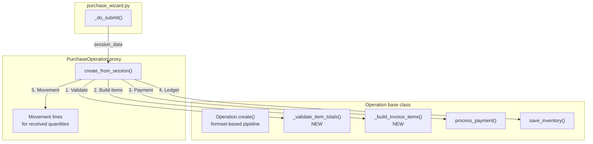

# Refactoring Plan: Align `PurchaseOperation.create_from_session` with Base `Operation.create`

## 1. Current State Analysis

### [`Operation.create()`](apps/app_operation/models/operation.py:219) (base class method)

```
┌─────────────────────────────────────────────────────┐
│                 Operation.create()                   │
│                                                     │
│  1. Construct op = cls(...)                         │
│  2. op.save() → full_clean → clean → post_save     │
│  3. Payment: op.process_payment()                   │
│     (if can_pay and amount_paid > 0)                │
│  4. Invoice: formset = InvoiceItemCreateFormSet     │
│     bound to raw_post, formset.save()               │
│  5. Inventory: op.save_inventory(bound_formset)     │
│     → ProductLedgerEntry.record()                   │
└─────────────────────────────────────────────────────┘
```

**Input**: `raw_post` (request.POST) + individual kwargs (`source`, `destination`, `amount`, etc.)

### [`PurchaseOperation.create_from_session()`](apps/app_operation/models/proxies/op_purchase.py:94) (proxy-specific)

```
┌──────────────────────────────────────────────────────────┐
│           PurchaseOperation.create_from_session()         │
│                                                          │
│  1. Integrity check: item totals vs declared total       │
│  2. Resolve vendor from session_data["vendor_id"]        │
│  3. Construct op = cls(...)                              │
│  4. op.save()                                            │
│  5. For each item:                                       │
│     - Lookup ProductTemplate                             │
│     - Create InvoiceItem manually                        │
│     - Create InventoryMovementLine if received_qty > 0   │
│  6. ProductLedgerEntry.record(op)                        │
│  7. Payment: op.create_payment_transaction()             │
└──────────────────────────────────────────────────────────┘
```

**Input**: `session_data` (structured dict with `vendor_id`, `items[]`, `total_amount`, etc.)

### Key Differences

| Aspect | `Operation.create()` | `create_from_session()` | Can Reuse? |
|--------|---------------------|------------------------|------------|
| Integrity check | ❌ None | ✅ Item totals vs total | **Extract to shared** |
| Op construction | ✅ Using `cls()` | ✅ Using `cls()` | ✅ Already similar |
| `op.save()` | ✅ Triggers full pipeline | ✅ Triggers full pipeline | ✅ Already shared |
| InvoiceItem creation | ✅ Via formset (auto) | ✅ Manual (with template lookup) | **Partially** (data format differs) |
| Movement lines | ❌ Deferred (user later) | ✅ Created immediately | **Purchase-specific** |
| `ProductLedgerEntry` | ✅ Via `save_inventory()` | ✅ Direct `record()` call | **Refactor to use `save_inventory()`** |
| Payment | ✅ Via `process_payment()` | ❌ Direct `create_payment_transaction()` | **Refactor to use `process_payment()`** |

## 2. Proposed Refactoring

### Goal

Make `create_from_session` reuse base `Operation` methods wherever possible, keeping only purchase-specific logic (integrity check, movement lines) in the proxy.

### Approach: Three-Phase Refactoring

---

### Phase 1 — Extract Shared Classmethods to `Operation` base

#### 1a. Add [`Operation._validate_item_totals()`](apps/app_operation/models/operation.py:219)  NEW

```python
@classmethod
def _validate_item_totals(cls, items_data: list[dict], declared_total: Decimal) -> None:
    """Validate that sum(item.qty * item.unit_price) matches declared_total."""
    computed = sum(
        Decimal(item["quantity"]) * Decimal(item["unit_price"])
        for item in items_data
    )
    if abs(computed - declared_total) > Decimal("0.01"):
        raise ValueError(
            _("Items total %(items)s does not match declared total %(total)s.")
            % {"items": computed, "total": declared_total}
        )
```

**Used by**: Both [`PurchaseOperation`](apps/app_operation/models/proxies/op_purchase.py) and [`SaleOperation`](apps/app_operation/models/proxies/op_sale.py) (both have identical integrity check logic).

#### 1b. Add [`Operation._build_invoice_items()`](apps/app_operation/models/operation.py) NEW

```python
@classmethod
def _build_invoice_items(cls, operation, items_data: list[dict]) -> list[InvoiceItem]:
    """Create InvoiceItem records from a list of item dicts.
    
    Each dict requires: product_template_id, quantity, unit_price
    Each dict may include: description
    Returns the created InvoiceItem instances.
    """
    from apps.app_inventory.models import InvoiceItem, ProductTemplate
    
    invoice_items = []
    for item_data in items_data:
        try:
            template = ProductTemplate.objects.get(pk=item_data["product_template_id"])
        except ProductTemplate.DoesNotExist:
            raise ValidationError(_("Product template not found or has been deleted."))
        
        invoice_item = InvoiceItem.objects.create(
            operation=operation,
            product_template=template,
            description=item_data.get("description", ""),
            quantity=Decimal(item_data["quantity"]),
            unit_price=Decimal(item_data["unit_price"]),
        )
        invoice_items.append(invoice_item)
    
    return invoice_items
```

**Used by**: Both [`PurchaseOperation`](apps/app_operation/models/proxies/op_purchase.py) and [`SaleOperation`](apps/app_operation/models/proxies/op_sale.py) (identical template lookup + InvoiceItem creation).

---

### Phase 2 — Refactor `PurchaseOperation.create_from_session()` to Use Shared Methods

```python
@classmethod
@transaction.atomic
def create_from_session(cls, project, session_data: dict, officer) -> "PurchaseOperation":
    from apps.app_entity.models import Entity

    date_val = datetime.fromisoformat(session_data["date"]).date()
    try:
        vendor = Entity.objects.get(pk=session_data["vendor_id"])
    except Entity.DoesNotExist:
        raise ValidationError(_("Vendor not found or has been deleted."))

    desc = session_data.get("description", "")
    total = Decimal(session_data["total_amount"])
    paid = Decimal(session_data.get("amount_paid", "0"))
    items_data = session_data["items"]

    # ── 1. Integrity check (shared) ──────────────────────────
    cls._validate_item_totals(items_data, total)

    # ── 2. Construct & save operation (shared with base) ─────
    op = cls(
        source=project,
        destination=vendor,
        amount=total,
        date=date_val,
        description=desc,
        officer=officer,
        operation_type="PURCHASE",
    )
    op.save()

    # ── 3. Create InvoiceItems (shared) ──────────────────────
    invoice_items = cls._build_invoice_items(op, items_data)

    # ── 4. Movement lines for received quantities (purchase-specific) ──
    group_key = uuid.uuid4().hex[:8]
    for item_data, invoice_item in zip(items_data, invoice_items):
        received_qty = Decimal(item_data.get("received_qty", "0"))
        if received_qty > Decimal("0"):
            InventoryMovementLine.objects.create(
                operation=op,
                invoice_item=invoice_item,
                product=None,
                quantity=received_qty,
                date=date_val,
                officer=officer,
                notes="",
                group_key=group_key,
            )

    # ── 5. Record issuance ledger entries (shared: via save_inventory) ──
    ProductLedgerEntry.record(op)

    # ── 6. Payment processing (shared via base) ───────────────
    if paid > Decimal("0"):
        op.process_payment(
            amount_paid=paid,
            officer=officer,
            date=date_val,
            description=_("Payment for Purchase #%(pk)s") % {"pk": op.pk},
        )

    return op
```

---

### Phase 3 — Similarly Refactor `SaleOperation.create_from_session()`

[`SaleOperation.create_from_session()`](apps/app_operation/models/proxies/op_sale.py:98) has identical integrity check and InvoiceItem creation logic. It should also use `cls._validate_item_totals()` and `cls._build_invoice_items()`.

---

## 3. What Changes & What Stays the Same

### Files to Modify

| File | Changes |
|------|---------|
| [`apps/app_operation/models/operation.py`](apps/app_operation/models/operation.py) | Add `_validate_item_totals()` and `_build_invoice_items()` classmethods |
| [`apps/app_operation/models/proxies/op_purchase.py`](apps/app_operation/models/proxies/op_purchase.py) | Refactor `create_from_session()` to use shared methods + `process_payment()` |
| [`apps/app_operation/models/proxies/op_sale.py`](apps/app_operation/models/proxies/op_sale.py) | Refactor `create_from_session()` to use shared methods (same pattern) |

### What Stays in `create_from_session()`

- **Integrity check** → calls shared `cls._validate_item_totals()`
- **InvoiceItem creation** → calls shared `cls._build_invoice_items()`
- **Movement line creation** → stays purchase-specific (received quantities)
- **Ledger recording** → unchanged (already uses `ProductLedgerEntry.record()`)
- **Payment** → now uses base `op.process_payment()` instead of raw `create_payment_transaction()`

### What Does NOT Change

- The [`purchase_wizard.py`](apps/app_operation/views/create_operation/purchase_wizard.py) view — still calls `PurchaseOperation.create_from_session(project, session_data, officer)`
- The `Operation.create()` base method — unchanged, still uses formset-based approach
- `PurchaseOperation` class attributes and validation methods — unchanged
- Test files — same behavior, no expected failures

## 4. Benefits

1. **Reduced duplication**: Purchase and Sale share invoice item creation + integrity check logic
2. **Consistent payment handling**: `process_payment()` includes `can_pay`, `is_partially_payable`, and amount range checks that the raw `create_payment_transaction()` bypassed
3. **Single source of truth**: Any future changes to item validation or InvoiceItem creation apply to all operation types
4. **Clearer separation**: Base class owns shared concerns; proxy owns type-specific concerns (movement lines, entity role validation)

## 5. Mermaid Diagram



## 6. Implementation Order

1. Add `_validate_item_totals()` to [`Operation`](apps/app_operation/models/operation.py)
2. Add `_build_invoice_items()` to [`Operation`](apps/app_operation/models/operation.py)
3. Refactor [`PurchaseOperation.create_from_session()`](apps/app_operation/models/proxies/op_purchase.py) to use shared methods + `process_payment()`
4. Refactor [`SaleOperation.create_from_session()`](apps/app_operation/models/proxies/op_sale.py) to use shared methods
5. Run existing tests to confirm no regressions
