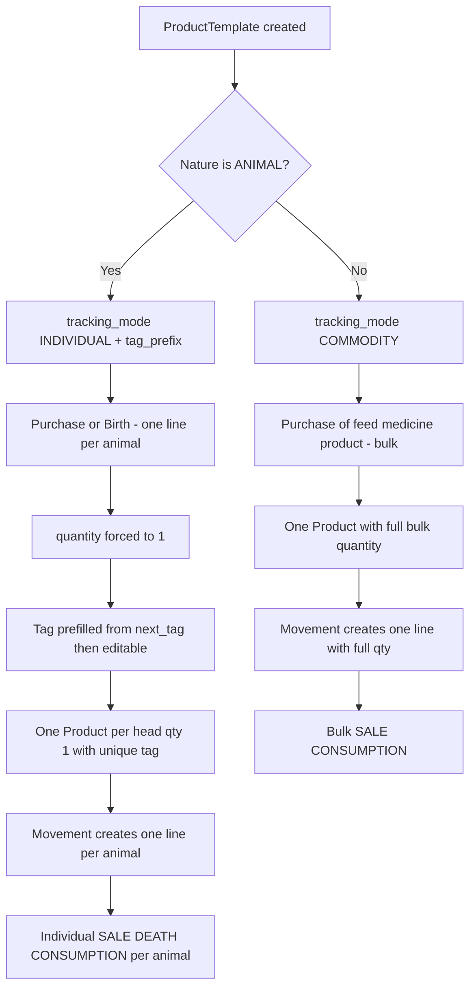

# Plan: Remove BATCH Tracking Mode — Track All Animals Individually

## Goal

Remove `BATCH` from `ProductTemplate.TrackingMode` so only `INDIVIDUAL` and
`COMMODITY` remain.

- Every `ANIMAL` template is forced to `INDIVIDUAL` — one `Product` per head.
- Every non-animal template (`FEED` / `MEDICINE` / `PRODUCT`) is forced to
  `COMMODITY` — bulk quantity.
- Bulk entry is allowed: buying/birthing 10 animals in one line creates **10
  individual `Product` rows** (one per animal), not one row with quantity 10.
- Tags are auto-suggested in the format `{tag_prefix}{number}` where
  `tag_prefix` is template-specific and `number` increments by the highest
  existing tag suffix for that template/entity.  The suggested tag is unique but
  the user can edit it.

The database is **developmental** — existing data is ignored.  No data migration
is performed for existing templates/products; only a schema migration is needed.

## Consequences of Removing BATCH

### 1. Model and schema
- `TrackingMode` enum in
  [`models.py`](apps/app_inventory/models.py:509) loses `BATCH`.  The enum-level
  `default=TrackingMode.BATCH` ([`models.py`](apps/app_inventory/models.py:551))
  must go.  Because a single DB default cannot be nature-aware, enforcement moves
  into `ProductTemplate.clean()` / `save()` (force `INDIVIDUAL` for ANIMAL,
  `COMMODITY` otherwise), the seed command, and the creation view.
- New `tag_prefix` field on `ProductTemplate` (e.g. `CALF`, `COW`, `LAMB`) so
  tags auto-generate with a template-specific prefix.  Editable on the template.
- `unique_together` ([`models.py`](apps/app_inventory/models.py:583)) includes
  `tracking_mode`; it still works but the mode no longer meaningfully
  distinguishes templates (only two values remain).
- Schema migration required (choices + default + `tag_prefix`).

### 2. New product creation
- `InvoiceItem.create_products_for_item()`
  ([`models.py`](apps/app_inventory/models.py:724)) already branches on
  `INDIVIDUAL` → one `Product` of qty=1 per head.  With qty forced to 1 per
  line, each line yields exactly one tagged product.  The `else` branch becomes
  effectively COMMODITY-only for feed/medicine/products.
- Runtime logic for individual tracking already exists; the work is data +
  enforcement + tag generation + removing the option.

### 3. Inventory movement registration
- `register_deferred_movements`
  ([`views.py`](apps/app_inventory/views.py:760)) branches on `INDIVIDUAL` to
  create one `InventoryMovementLine` per product (qty=1).  The `else` branch
  becomes COMMODITY-only.
- The lazy-create in `InventoryMovementLine.save()`
  ([`models.py`](apps/app_inventory/models.py:1327)) calls
  `create_products_for_item(quantity=self.quantity)`; with `INDIVIDUAL` and a
  multi-head quantity it would create N products but only link `products[0]`.
  Once quantity is forced to 1 per line this path is safe for animals (it only
  fires with `product=None`, which becomes COMMODITY-only).  Add a guard/test.

### 4. Forms and UI — one head per line + auto-suggested tags
- `InvoiceItemCreateForm.clean()`
  ([`forms.py`](apps/app_inventory/forms.py:113)) already requires `unique_id`
  for `INDIVIDUAL`.  New behavior:
  - For `INDIVIDUAL`/`ANIMAL` templates, `quantity` must equal `1`.
  - `unique_id` is pre-filled with the next suggested tag
    (`{tag_prefix}{next}`) and remains required + editable.
  - Duplicate-tag check stays (DB `UniqueConstraint` on `entity+unique_id` is
    the hard backstop).
- `PurchaseItemForm`
  ([`app_operation/forms.py`](apps/app_operation/forms.py:158)) currently has
  the tag-required check **commented out** — re-enable for ANIMAL templates,
  force `quantity == 1`, and pre-fill the suggested tag.  Same for the sale
  item form.
- `InvoiceItemSelectForm` label `Animal / Batch`
  ([`forms.py`](apps/app_inventory/forms.py:191)) → `Animal / Product`.
- `create_product_template`
  ([`views.py`](apps/app_inventory/views.py:469)) passes `tracking_modes`
  choices; dropdown shows only INDIVIDUAL + COMMODITY and the view validates
  nature → mode (ANIMAL ⇒ INDIVIDUAL).  Also collects `tag_prefix`.
- Display templates (`product_template_form.html`,
  `product_template_toggle_form.html`, `product_detail.html`,
  `entity_product_templates_list.html`) use `get_tracking_mode_display`; BATCH
  label disappears automatically.  Optionally show `tag_prefix`.

### 5. Operation wizards (purchase / sale / birth / death / capital)
- All flows funnel through `create_products_for_item`, so once templates are
  INDIVIDUAL they automatically produce one tagged product per head.
- The duplicate-tag guards in
  [`purchase_wizard.py`](apps/app_operation/views/create_operation/purchase_wizard.py:391)
  and
  [`sale_wizard.py`](apps/app_operation/views/create_operation/sale_wizard.py:391)
  are keyed on `template.has_tag`, while the inventory form keys on `INDIVIDUAL`.
  Reconcile to `INDIVIDUAL` so poultry/rabbit templates (seeded `has_tag=False`)
  also enforce tag uniqueness.
- `has_tag` becomes redundant for ANIMAL (every individual is tagged) — decide
  whether to force `has_tag=True` for ANIMAL or ignore it in favor of `INDIVIDUAL`.

### 6. Tag auto-generation
- Add `ProductTemplate.next_tag(entity)` helper returning the next suggested tag:
  `f"{tag_prefix}{count + 1}"` where `count` = number of `Product` rows owned by
  *entity* for this template.  Scans the latest numeric suffix so edits that
  raise the number don't collide; the DB uniqueness constraint is the final guard.
- The suggested tag is only a pre-fill — the user can edit it; form validation
  rejects duplicates (soft) and the DB constraint rejects collisions (hard).
- `tag_prefix` should be unique per template where possible (prefix + number is
  only unique within a template's own numbering).

### 7. Seed command
- `apps/app_base/management/commands/seed.py` never sets `tracking_mode`, so
  today everything defaults to BATCH (a latent bug — feed/medicine/products are
  commodities).  Seed must set `tracking_mode` per nature
  (`ANIMAL → INDIVIDUAL`, otherwise `COMMODITY`) and assign a `tag_prefix` to
  each seeded template.

### 8. Existing-data migration
Not required — the database is developmental and data is ignored.  Only schema
migration for `tracking_mode` (choices/default) and the new `tag_prefix` field.

### 9. Tests
- `BATCH` references in test helpers/cases:
  `apps/app_inventory/tests/general.py`,
  `apps/app_inventory/tests/test_product_template.py`,
  5 files in `apps/app_adjustment/tests/`,
  2 files in `apps/app_entity/tests/`,
  `apps/app_operation/tests/operations/{birth,capital,purchase}/`.
- New tests: nature → tracking-mode enforcement; quantity forced to 1 for
  ANIMAL; `next_tag()` sequence and uniqueness; duplicate-tag rejection; COMMODITY
  stays bulk.
- Per repo rule, run tests with `manage.py test --parallel=8`.

### 10. Docs
- Update `specs/features/inventory_ledger.md` and `docs/model_relationships.md`
  if they describe BATCH tracking.

## Flow after the change

## Implementation steps (todo)

1. Model change in [`models.py`](apps/app_inventory/models.py): remove `BATCH`
   from `TrackingMode`; enforce nature-based mode in `ProductTemplate.clean()` /
   `save()`; add `tag_prefix` field; add `ProductTemplate.next_tag(entity)`.
2. Schema migration: alter `tracking_mode` choices/default and add `tag_prefix`
   (no data migration — developmental DB).
3. Update [`forms.py`](apps/app_inventory/forms.py): force `quantity == 1` and
   pre-fill/require `unique_id` for ANIMAL templates in `InvoiceItemCreateForm`;
   change `InvoiceItemSelectForm` label.
4. Update [`app_operation/forms.py`](apps/app_operation/forms.py): re-enable tag
   requirement + force `quantity == 1` + pre-fill suggested tag in
   `PurchaseItemForm` and the sale item form.
5. Update [`seed.py`](apps/app_base/management/commands/seed.py): set
   `tracking_mode` per nature and `tag_prefix` per template.
6. Update [`views.py`](apps/app_inventory/views.py): `create_product_template`
   validation (nature → mode) + `tag_prefix` handling + tracking_modes context;
   `register_deferred_movements` cleanup; "Animal / Batch" label.
7. Update operation wizards to key tag uniqueness on `INDIVIDUAL` not `has_tag`.
8. Update templates for labels/choices and optional `tag_prefix` display.
9. Update existing tests referencing `BATCH`; add nature-mode enforcement,
   one-head-per-line, `next_tag()` sequence, and uniqueness tests.
10. Run `python manage.py check`, targeted tests, then full suite with
    `--parallel=8`.
11. Update docs (inventory ledger spec, model relationships); append outcomes to
    this plan file after execution.

## Open decisions to confirm with the user

- **RESOLVED**: bulk entry allowed — buying/birthing 10 animals in one line
  creates 10 individual `Product` rows, each with its own tag.
- **RESOLVED**: tags auto-generated as `{tag_prefix}{next}` (highest existing
  numeric suffix for the template/entity + 1), unique, user-editable.
- **RESOLVED**: `tag_prefix` is a new editable field on `ProductTemplate`
  (defaulting to a name-derived prefix when blank).
- `has_tag` was left as-is (legacy display flag); tag logic now keys on
  `INDIVIDUAL` tracking mode, not `has_tag`.

## Implementation outcome (executed)

- [`models.py`](apps/app_inventory/models.py): removed `BATCH` from
  `TrackingMode`; `tracking_mode` default → `INDIVIDUAL`; added `tag_prefix`
  field, `tracking_mode_for_nature()`, `clean()`/`save()` forcing nature-based
  mode, `effective_tag_prefix`, and `next_tag(entity)`.
- `create_products_for_item()` auto-generates a unique tag per head for
  INDIVIDUAL when no tag is supplied; `InventoryMovementLine.save()` lazy-create
  forwards the user's tag via a transient `_lazy_unique_id`.
- Migration `0011_producttemplate_tag_prefix_and_more.py` (schema only — no data
  migration; developmental DB).
- Forms auto-suggest the next tag for INDIVIDUAL templates (`InvoiceItemCreateForm`,
  `PurchaseItemForm`, `SaleItemForm`); bulk quantity allowed.
- Purchase & BIRTH create **one movement line per head** so 10 heads → 10 tagged
  products; `register_deferred_movements` also lazy-creates per-head lines when no
  products exist yet.
- Purchase/sale wizards pass `entity` for tag suggestion and key tag uniqueness
  on `INDIVIDUAL` (not `has_tag`).
- [`seed.py`](apps/app_base/management/commands/seed.py) sets `tracking_mode`
  per nature and `tag_prefix` per animal template.
- Templates updated (`product_template_form`, `product_template_detail`); labels
  show only INDIVIDUAL/COMMODITY.
- Tests updated (`BATCH → INDIVIDUAL`) and new tests added for nature-mode
  enforcement, `next_tag()` sequence/uniqueness, and bulk purchase splitting.
- Verification: `python manage.py check` clean; full suite
  `manage.py test --parallel=8` → **1231 tests OK**.
