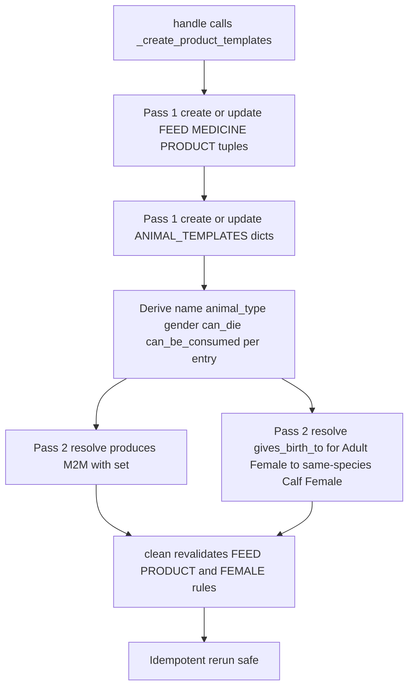

# Plan: Seed Animal Attributes for Product Templates

Status: Draft for review
Owner: Architect (Zoo)
Implementer: Code mode

## 1. Goal

The [`animal_product_templates_plan.md`](ai-plans/animal_product_templates_plan.md) added
animal-specific fields to `ProductTemplate` (`animal_type`, `gender`, `produces`,
`gives_birth_to`, `can_die`, `can_be_consumed`) and a full birth flow. Those model/UI
changes are complete and verified. What is **not** done: the seed command
[`seed.py`](apps/app_base/management/commands/seed.py) still seeds only the legacy fields
and never populates the new animal attributes or the `gives_birth_to`/`produces`
relationships.

This plan replaces the ANIMAL seed with a **species × stage × gender** template set for
**Cow, Buffalo, Sheep and Goat only**, expressed as a list of dicts (per user decision),
and prunes all other animal templates.

## 2. Confirmed design decisions

1. `animal_type` is one of **Cow, Buffalo, Sheep, Goat** (singular, canonical).
2. Template **name** is derived as `"{animal_type} {stage} {gender}"`, e.g.
   `Cow Adult Female`, `Buffalo Calf Male`, `Sheep Calf Female`, `Goat Adult Male`.
3. **Stage** ∈ {`Adult`, `Calf`} (normalize the example's `calv` → `Calf`). The same word
   `Calf` is used for all four species (no Lamb/Kid) per the confirmed example names.
4. **Gender** normalized to uppercase `FEMALE` / `MALE` (from the example's
   `Female`/`male`).
5. **`gives_birth_to`** is the same-species offspring **species name** (e.g. `"Cow"`) or
   `None` (the example's `"Now"` typo → `None`). Resolution rule (see 4.4):
   - Only **Adult Female** templates give birth; `gives_birth_to` resolves to the
     same-species **Calf** template.
   - The single FK target is the **`{animal_type} Calf Female`** template (default newborn
     is a female calf; the birth form still lets the user pick the gender and override the
     newborn template).
   - Calf templates (male and female) do **not** give birth (`None`) — avoids a
     calf→calf cycle. This is a deliberate normalization of the example data, flagged for
     review.
6. **`produces`** = `["Meat (Live Weight)", "Organic Manure"]` for every animal template
   (as in the user's example). Both are existing PRODUCT templates.
7. `can_die`/`can_be_consumed` are derived from nature (ANIMAL → True/False); also forced
   by `ProductTemplate.clean()`.
8. All non-ANIMAL seed data (FEED/MEDICINE/PRODUCT tuples) is unchanged.
9. **Removed** from the seed: every old ANIMAL template — Fattening Cattle, Dairy Cows,
   Breeding Bulls, Replacement Heifers, Calves, Fattening Lambs, Breeding Ewes, Breeding
   Rams, Fattening Kids, Breeding Does, Breeding Bucks, all Camel/Horse/Donkey/Poultry/
   Rabbit entries — replaced by the 16 new templates below.
10. Seed remains idempotent (get-or-create by name; authoritative `produces.set(...)` and
    `gives_birth_to` assignment).
11. `name_ar` for the new animal templates is left blank (English only) — Arabic
    translations can be added later; flagged for review.

## 3. Current state

- [`PRODUCT_TEMPLATES`](apps/app_base/management/commands/seed.py:45) — flat list of
  tuples `(name, name_ar, nature, default_unit, has_tag, sub_category)` covering 30 ANIMAL
  + FEED + MEDICINE + PRODUCT templates.
- [`TAG_PREFIX_OVERRIDES`](apps/app_base/management/commands/seed.py:11) — per-template tag
  prefixes.
- [`_create_product_templates()`](apps/app_base/management/commands/seed.py:385) — derives
  `min_qty`, `tracking_mode`, `tag_prefix`; `get_or_create`; updates changed scalar fields.
  Does **not** set animal attributes nor resolve `gives_birth_to`/`produces`.
- No existing test exercises the seed command.

## 4. Changes

### 4.1 New data structure — `ANIMAL_TEMPLATES` (list of dicts)

```python
ANIMAL_TEMPLATES = [
    # --- Cow ---
    {"animal_type": "Cow",     "gender": "FEMALE", "stage": "Adult", "gives_birth_to": "Cow",     "produces": ["Meat (Live Weight)", "Organic Manure"], "tag_prefix": "CAF"},
    {"animal_type": "Cow",     "gender": "MALE",   "stage": "Adult", "gives_birth_to": None,      "produces": ["Meat (Live Weight)", "Organic Manure"], "tag_prefix": "CAM"},
    {"animal_type": "Cow",     "gender": "MALE",   "stage": "Calf",  "gives_birth_to": None,      "produces": ["Meat (Live Weight)", "Organic Manure"], "tag_prefix": "CCM"},
    {"animal_type": "Cow",     "gender": "FEMALE", "stage": "Calf",  "gives_birth_to": None,      "produces": ["Meat (Live Weight)", "Organic Manure"], "tag_prefix": "CCF"},
    # --- Buffalo ---
    {"animal_type": "Buffalo", "gender": "FEMALE", "stage": "Adult", "gives_birth_to": "Buffalo", "produces": ["Meat (Live Weight)", "Organic Manure"], "tag_prefix": "BAF"},
    {"animal_type": "Buffalo", "gender": "MALE",   "stage": "Adult", "gives_birth_to": None,      "produces": ["Meat (Live Weight)", "Organic Manure"], "tag_prefix": "BAM"},
    {"animal_type": "Buffalo", "gender": "MALE",   "stage": "Calf",  "gives_birth_to": None,      "produces": ["Meat (Live Weight)", "Organic Manure"], "tag_prefix": "BCM"},
    {"animal_type": "Buffalo", "gender": "FEMALE", "stage": "Calf",  "gives_birth_to": None,      "produces": ["Meat (Live Weight)", "Organic Manure"], "tag_prefix": "BCF"},
    # --- Sheep ---
    {"animal_type": "Sheep",   "gender": "FEMALE", "stage": "Adult", "gives_birth_to": "Sheep",   "produces": ["Meat (Live Weight)", "Organic Manure"], "tag_prefix": "SAF"},
    {"animal_type": "Sheep",   "gender": "MALE",   "stage": "Adult", "gives_birth_to": None,      "produces": ["Meat (Live Weight)", "Organic Manure"], "tag_prefix": "SAM"},
    {"animal_type": "Sheep",   "gender": "MALE",   "stage": "Calf",  "gives_birth_to": None,      "produces": ["Meat (Live Weight)", "Organic Manure"], "tag_prefix": "SCM"},
    {"animal_type": "Sheep",   "gender": "FEMALE", "stage": "Calf",  "gives_birth_to": None,      "produces": ["Meat (Live Weight)", "Organic Manure"], "tag_prefix": "SCF"},
    # --- Goat ---
    {"animal_type": "Goat",    "gender": "FEMALE", "stage": "Adult", "gives_birth_to": "Goat",    "produces": ["Meat (Live Weight)", "Organic Manure"], "tag_prefix": "GAF"},
    {"animal_type": "Goat",    "gender": "MALE",   "stage": "Adult", "gives_birth_to": None,      "produces": ["Meat (Live Weight)", "Organic Manure"], "tag_prefix": "GAM"},
    {"animal_type": "Goat",    "gender": "MALE",   "stage": "Calf",  "gives_birth_to": None,      "produces": ["Meat (Live Weight)", "Organic Manure"], "tag_prefix": "GCM"},
    {"animal_type": "Goat",    "gender": "FEMALE", "stage": "Calf",  "gives_birth_to": None,      "produces": ["Meat (Live Weight)", "Organic Manure"], "tag_prefix": "GCF"},
]
```

Derived per row in code (not stored in the dicts):
- `nature = "ANIMAL"`, `default_unit = "Head"`, `has_tag = True`,
  `tracking_mode = INDIVIDUAL`, `sub_category` from species map
  (`Cow → "Cattle"`, `Buffalo → "Buffalo"`, `Sheep → "Sheep"`, `Goat → "Goats"`).
- `name = f"{animal_type} {stage} {gender.title()}"` → e.g. `Cow Calf Female`.
- `animal_type`, `gender`, `gives_birth_to`, `produces`, `tag_prefix` taken from the dict.

### 4.2 Prune `PRODUCT_TEMPLATES` and `TAG_PREFIX_OVERRIDES`

- Remove **all** ANIMAL tuples from [`PRODUCT_TEMPLATES`](apps/app_base/management/commands/seed.py:45)
  (they move to `ANIMAL_TEMPLATES`). Keep FEED / MEDICINE / PRODUCT tuples unchanged.
- Remove `TAG_PREFIX_OVERRIDES` entirely (per-template `tag_prefix` now lives in
  `ANIMAL_TEMPLATES`; non-ANIMAL templates have no prefix).
- Remove the now-unused PRODUCT output templates that were only animal products? No —
  keep all PRODUCT templates (`Raw Milk`, `Meat (Live Weight)`, `Organic Manure`, etc.)
  unchanged; they are referenced by `produces`.

### 4.3 `_create_product_templates()` — create/update (pass 1)

```python
# 1) Non-animal templates from PRODUCT_TEMPLATES (existing tuple loop, unchanged)
# 2) Animal templates from ANIMAL_TEMPLATES
for entry in ANIMAL_TEMPLATES:
    name = f"{entry['animal_type']} {entry['stage']} {entry['gender'].title()}"
    defaults = {
        "nature": "ANIMAL",
        "default_unit": "Head",
        "has_tag": True,
        "sub_category": SPECIES_SUB_CATEGORY[entry["animal_type"]],
        "minimum_quantity": Decimal("1"),
        "tracking_mode": ProductTemplate.TrackingMode.INDIVIDUAL,
        "tag_prefix": entry.get("tag_prefix", ""),
        "animal_type": entry["animal_type"],
        "gender": entry["gender"],
        "can_die": True,
        "can_be_consumed": False,
        "name_ar": "",
    }
    template, is_new = ProductTemplate.objects.get_or_create(name=name, defaults=defaults)
    # update branch: compare/update name_ar, sub_category, minimum_quantity,
    # tracking_mode, tag_prefix, animal_type, gender, can_die, can_be_consumed
```

### 4.4 `_create_product_templates()` — relationships (pass 2, after all templates exist)

```python
for entry in ANIMAL_TEMPLATES:
    name = f"{entry['animal_type']} {entry['stage']} {entry['gender'].title()}"
    try:
        template = ProductTemplate.objects.get(name=name)
    except ProductTemplate.DoesNotExist:
        continue

    # produces (M2M, FEED/PRODUCT only — clean() re-checks)
    template.produces.set(ProductTemplate.objects.filter(name__in=entry["produces"]))

    # gives_birth_to (FK): only Adult Female resolves to the same-species Calf Female
    gbt = entry.get("gives_birth_to")
    target = None
    if gbt and entry["stage"] == "Adult" and entry["gender"] == "FEMALE":
        target_name = f"{entry['animal_type']} Calf Female"
        target = ProductTemplate.objects.get(name=target_name)
    if template.gives_birth_to_id != (target.pk if target else None):
        template.gives_birth_to = target
        template.save()  # full_clean() validates ANIMAL target + FEMALE source
```

Notes:
- `template.save()` triggers `BaseModel.save()` → `full_clean()`, re-validating
  `gives_birth_to` (ANIMAL target, source gender FEMALE/MIXED) and `produces`
  (FEED/PRODUCT). The mapping already respects these rules.
- `produces.set(...)` is authoritative and idempotent. `gives_birth_to` saves only on change.
- `gives_birth_to` referencing the species (`"Cow"`) is interpreted via the Adult Female →
  Calf rule above; this is the documented resolution of the user's species-level values.

### 4.5 Test

Append a `SeedCommandProductTemplatesTest` to [`tests.py`](apps/app_base/tests.py):

- `call_command("seed")`.
- Every `ANIMAL_TEMPLATES` entry exists as a template named
  `"{animal_type} {stage} {gender.title()}"`, with the correct `animal_type`, `gender`,
  `can_die=True`, `can_be_consumed=False`, `sub_category`, and `tag_prefix`.
- `produces` resolves to exactly `["Meat (Live Weight)", "Organic Manure"]` for every
  animal template.
- `gives_birth_to`: `Cow Adult Female` → `Cow Calf Female`; `Buffalo Adult Female` →
  `Buffalo Calf Female`; `Sheep Adult Female` → `Sheep Calf Female`; `Goat Adult Female` →
  `Goat Calf Female`; all male and calf templates → `None`.
- **Removed templates are absent** on a fresh DB: `Fattening Cattle`, `Dairy Cows`,
  `Calves`, `Breeding Bulls`, `Breeding Ewes`, `Fattening Camels (Hashi)`, `Horses`,
  `Broiler Chickens`, `Fattening Rabbits`, etc.
- FEED / MEDICINE / PRODUCT templates still exist and have `can_die=False`,
  `can_be_consumed=True`, `gender=NA`.
- Idempotency: re-running `call_command("seed")` does not change the count and raises no
  errors.
- Name-drift guards: every key referenced by `gives_birth_to`/`produces` exists as a
  template name.

### 4.6 Verification

- `python manage.py check`.
- `.venv/bin/python manage.py seed` against a scratch DB; confirm `Cow Adult Female` →
  gives birth to `Cow Calf Female`, produces Meat + Manure; `Cow Calf Male` has no
  offspring; old names (Fattening Cattle, Calves, Dairy Cows, Camels, Poultry, Rabbits)
  are not created; re-run reports "up to date".
- Run the new seed test + the full suite (`manage.py test --parallel=8`).

## 5. Out of scope / future

- **Deleting existing rows** from already-seeded databases: the seed only creates/updates,
  so pruning affects fresh DBs only (deleting referenced templates is blocked by
  `PROTECT` FKs).
- **Arabic names** for the new animal templates are left blank; translations can be added
  later.
- No FEED / MEDICINE / PRODUCT seed changes.
- Re-introducing other species later = adding entries to `ANIMAL_TEMPLATES`.

## Mermaid: seed flow



---

## Implementation Status (updated by Code mode)

**Status: COMPLETE.** Implemented and verified. `manage.py check` reports no issues and
the full suite passes (`manage.py test --parallel=8` → **1256 tests, OK**).

### What was implemented

- **Data** ([`seed.py`](apps/app_base/management/commands/seed.py)):
  - Replaced `TAG_PREFIX_OVERRIDES` and the old ANIMAL tuples with a new
    `ANIMAL_TEMPLATES` list-of-dicts (16 entries: Cow / Buffalo / Sheep / Goat ×
    Adult / Calf × FEMALE / MALE), each carrying `animal_type`, `gender` (FEMALE/MALE),
    `stage` (Adult/Calf), `gives_birth_to` (same-species name or `None`), `produces`
    (`Meat (Live Weight)` + `Organic Manure`), and `tag_prefix`.
  - `PRODUCT_TEMPLATES` now contains only FEED / MEDICINE / PRODUCT tuples; all old
    ANIMAL templates (Fattening Cattle, Dairy Cows, Camels, Horses, Poultry, Rabbits,
    etc.) were removed.
- **`_create_product_templates()`** ([`seed.py`](apps/app_base/management/commands/seed.py:349)):
  - Non-animal loop now also sets/updates `animal_type`, `gender`, `can_die`,
    `can_be_consumed`.
  - Animal pass (1): derives each template name via
    `_animal_template_name()` (`"{animal_type} {stage} {gender.title()}"`), and
    create/updates with `animal_type`, `gender`, `sub_category` (from
    `SPECIES_SUB_CATEGORY`), `tag_prefix`, `can_die=True`, `can_be_consumed=False`,
    INDIVIDUAL tracking, `Head` unit.
  - Relationship pass (2): resolves `produces` (M2M `set()`) and `gives_birth_to`
    (FK) — only **Adult FEMALE** templates get an offspring, resolved to the
    same-species **`{animal_type} Calf Female`** template.
- **Tests** ([`tests.py`](apps/app_base/tests.py:360)): `SeedCommandProductTemplatesTest`
  (6 tests) verifies creation + attributes, only-four-species invariant, `gives_birth_to`
  resolution, removed-template absence, non-animal flags, and idempotency.

### Verification

- `python manage.py check` → no issues.
- Seed run on a fresh DB creates **55 templates** (16 animal + 39 FEED/MEDICINE/PRODUCT);
  re-run reports "All product templates already exist and are up to date, skipping".
- `manage.py test --parallel=8` → 1256 tests OK (1250 previous + 6 new seed tests).
