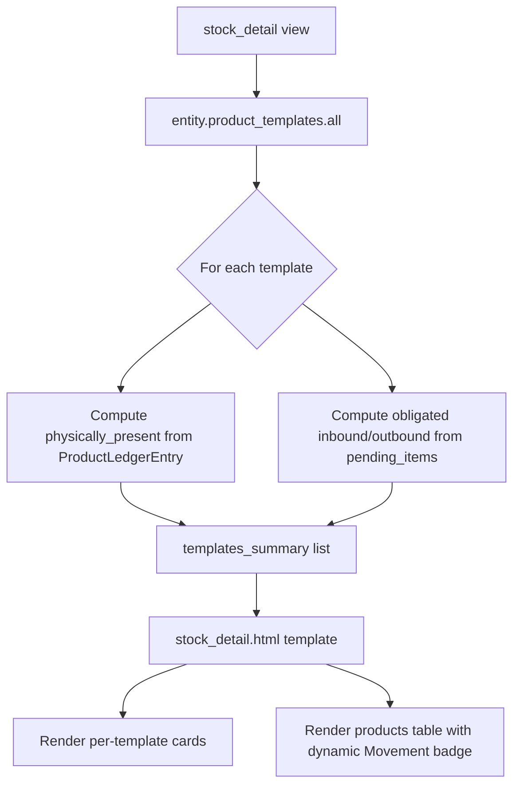

# Stock Detail Page — Improvement Plan

## Problem Summary

The stock detail page's summary bar shows three aggregate metrics:

- **Physically Present (in stock)** — total quantity across all product types
- **Obligated Inbound** — pending receipts across all product types
- **Obligated Outbound** — pending deliveries across all product types

These numbers aggregate across different product templates (e.g., "Fattening Calves", "Broiler Chickens", "Starter Feed") with different units (Head, Kg, Litres, etc.), making them ambiguous and unactionable. Additionally, the "Movement" column in the products table always shows "Moved" regardless of actual movement state.

## Solution: Per-Template Summary Cards

Replace the 3 monolithic summary cards with **one card per `ProductTemplate`** assigned to the entity. Each card displays the 3 metrics (Physically Present, Obligated Inbound, Obligated Outbound) specific to that template, along with the template's unit and nature badge.

Also fix the static "Movement" badge to dynamically reflect `product.is_physically_moved` / `product.movement_state_label`.

---

## Implementation Plan

### Step 1: Update [`apps/app_inventory/views.py`](apps/app_inventory/views.py:25) — `stock_detail()` function

#### 1a. Compute per-template summary data

The entity has `entity.product_templates.all()` (M2M). For each assigned template, compute:

- **physically_present_qty** — Sum of `ProductLedgerEntry.quantity_delta` for products linked to this template, filtered by `MOVEMENT_TYPES` and `date__lte=today`, where `quantity > 0`
- **obligated_inbound_qty** — From `pending_items()` filtered to this template's products, sum positive pending_qty
- **obligated_outbound_qty** — From `pending_items()` filtered to this template's products, sum negative pending_qty (absolute)

**Implementation approach:** 
- Use `entity.product_templates.all().prefetch_related(...)` to get all assigned templates
- For each template, query `ProductLedgerEntry` aggregated by template's products
- Or, more efficiently: compute the aggregates from already-fetched `products_with_qty` queryset and `pending_items`, grouping by `product_template` in Python

**New context variable:**
```python
templates_summary = [
    {
        'template': <ProductTemplate instance>,
        'physically_present_qty': Decimal,
        'obligated_inbound_qty': Decimal,
        'obligated_outbound_qty': Decimal,
        'products': <list of Product instances for this template>,
    },
    ...
]
```

#### 1b. Fix the products list to include movement state

The `Product` model already has `is_physically_moved` and `movement_state_label` as Python properties. No view changes needed — the template can access these directly.

### Step 2: Update [`apps/app_inventory/templates/app_inventory/stock_detail.html`](apps/app_inventory/templates/app_inventory/stock_detail.html:1)

#### 2a. Replace monolithic summary with per-template cards

Remove lines 20-51 (the 3 aggregate cards). Replace with a loop over `templates_summary`:

```html

<div class="card mb-3">
  <div class="card-header d-flex justify-content-between align-items-center">
    <span class="fw-bold">{{ entry.template.name }}</span>
    <span class="badge bg-secondary">{{ entry.template.get_nature_display }}</span>
  </div>
  <div class="card-body">
    <div class="row">
      <div class="col-md-4">
        <div>Physically Present</div>
        <div class="h4">{{ entry.physically_present_qty }} {{ entry.template.default_unit }}</div>
      </div>
      <div class="col-md-4">
        <div>Obligated Inbound</div>
        <div class="h4 text-warning">{{ entry.obligated_inbound_qty }} {{ entry.template.default_unit }}</div>
      </div>
      <div class="col-md-4">
        <div>Obligated Outbound</div>
        <div class="h4 text-info">{{ entry.obligated_outbound_qty }} {{ entry.template.default_unit }}</div>
      </div>
    </div>
  </div>
</div>

```

Each card shows:
- Template name (header)
- Nature badge
- Unit-labeled metrics in 3 columns

#### 2b. Fix "Movement" badge to be dynamic

**Table view** (line 147): Replace static badge:
```html

  <span class="badge bg-success"></span>

  <span class="badge bg-warning text-dark"></span>

```

**Card view** (line 194): Same change.

### Step 3: Optional — Keep aggregate totals

Optionally keep a small summary row at the top showing grand totals across all templates, for quick reference.

---

## Mermaid Diagram: Data Flow



## Mermaid Diagram: Template Layout

```mermaid
graph TD
    subgraph PerTemplateCards
        C1[Card: Fattening Calves<br/>Nature: Livestock Asset<br/>Present: 50 Head | Inbound: 10 | Outbound: 5]
        C2[Card: Broiler Chickens<br/>Nature: Livestock Asset<br/>Present: 200 Head | Inbound: 30 | Outbound: 15]
        C3[Card: Starter Feed<br/>Nature: Consumable<br/>Present: 500 Kg | Inbound: 100 | Outbound: 50]
    end

    subgraph ProductsSection
        T[Live / Dead / Consumed / Sold Tabs]
        P[Products Table with dynamic Moved/Not Moved badges]
    end

    PerTemplateCards --> ProductsSection
```

---

## Files to Modify

| File | Change |
|------|--------|
| [`apps/app_inventory/views.py`](apps/app_inventory/views.py:25) | Compute `templates_summary` in `stock_detail()`; pass to template |
| [`apps/app_inventory/templates/app_inventory/stock_detail.html`](apps/app_inventory/templates/app_inventory/stock_detail.html:1) | Replace summary cards with per-template cards; fix Movement badge |
