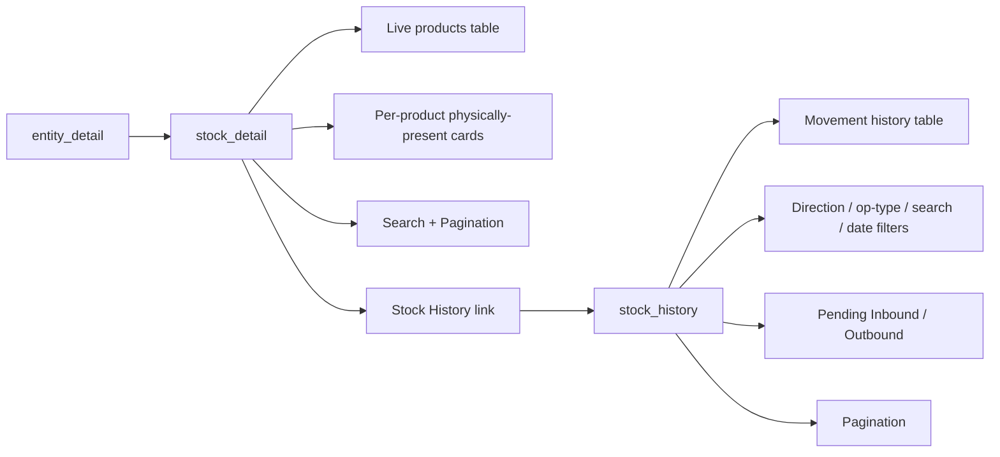
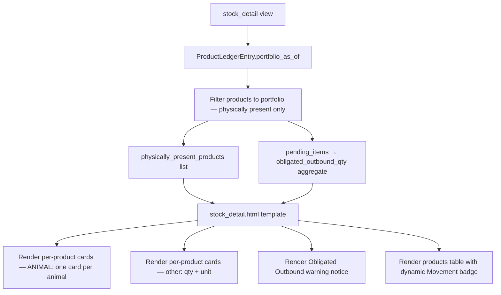
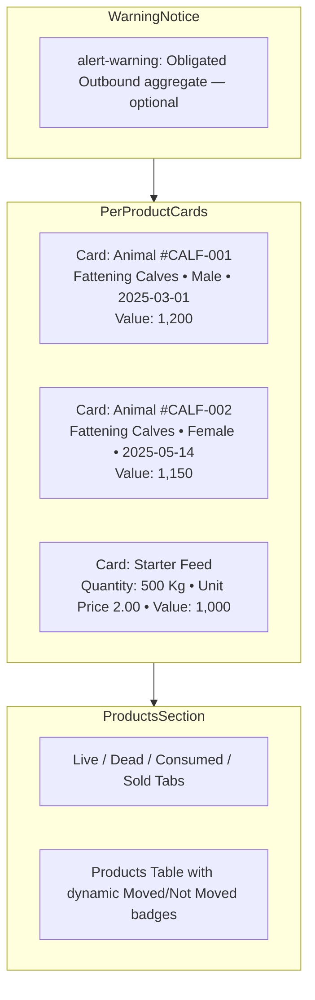

# Stock Detail & Stock History — Unified Improvement Plan

> This plan merges the former `stock-detail-and-history-plan.md` and
> `stock_detail_improvement.md` into a single document. It covers both the
> **per-product physically-present card redesign** of the stock detail page and
> the **split into a dedicated Stock History page**.

---

## Problem Summary

The current [`stock_detail`](apps/app_inventory/views.py:25) page is a **mixed view**: it
bundles current-stock information with history/obligation content on one page, and its summary
uses the wrong granularity. Three issues:

1. **Wrong summary granularity** — the page renders one aggregate card per `ProductTemplate`
   showing three metrics (Physically Present / Obligated Inbound / Obligated Outbound). This
   mixes physically present stock with contractual obligations:
   - **Obligated Inbound** is **not physically present** — it is only a committed purchase that
     has not arrived. Showing it as a headline stock metric is misleading.
   - **Obligated Outbound** is also not physically present; at most it deserves a
     **warning/notice**, not a primary metric.
   - Aggregating to the template level hides the individual products. The page should show
     **per-product cards** so the user sees exactly what is in stock.
2. **Mixed responsibilities** — one page must answer two different questions:
   - **What is currently in the stock?** — a clean list of physically present products with
     search, pagination, and action links.
   - **Where did my product go? / Why am I seeing product I never buy?** — needs a dedicated
     **Stock History** page that traces physical movements (inbound: purchase/birth; outbound:
     sale/death/consumption; plus reversals) and shows pending obligations.
3. **Static "Movement" badge** — the table always shows "Moved" regardless of actual movement
   state.

## Goal

Split the monolithic page into two focused pages and fix the summary granularity:

- **Stock Detail** (`stock_detail`) — what is currently in stock (physically present products),
  shown as **per-product cards**, with search, pagination, and per-product action links.
- **Stock History** (`stock_history`, new) — movement history + pending obligations that answers
  "where did it go?" and "where did it come from?".

---

## Solution

### Per-Product Physically Present Cards

Replace the per-template summary cards with **one card per physically present product**:

- **Animals** (`nature == ANIMAL`, individually tracked) → **one card per animal**. Each animal
  is a single `Product` with its own tag/ID, gender, and birth date, so each animal gets exactly
  one card.
- **Other products** (commodities: `FEED`, `MEDICINE`, `PRODUCT`) → **one card per product**
  showing **quantity & unit**.

Other changes:

- **Obligated Inbound** is removed entirely — it is not physically present.
- **Obligated Outbound** is shown as a single **warning/notice** alert (aggregate across
  templates), not as a per-card metric.
- Keep the "Movement" badge dynamic (`product.is_physically_moved` / `product.movement_state_label`).

### Page Split

- **Stock Detail keeps**: per-product physically-present cards, the live-products table with
  action links (View, Evaluation, Death, Consume), plus new **search** and **pagination**.
- **Stock Detail drops**: Dead / Consumed / Sold tabs and the Pending Inbound / Outbound
  sections — these move to the Stock History page.
- **Stock History (new)** is built on [`InventoryMovementLine`](apps/app_inventory/models.py:1422)
  records filtered to the entity's products. Each row shows direction (IN/OUT), operation type,
  operation link, product (template + tag), quantity, counterparty, reversal marker, officer and
  date. Filters: direction (in/out/all), operation type, free-text search (tag / template name),
  date range. Paginated.
- **Backward compatibility**: `stock_detail` continues to accept `?tab=live` (default) so the
  existing quick-consume test keeps passing; the `products` context key is retained as the live
  (physically present) list. The reversed-birth test is updated to not rely on the tab.

---

## Implementation Plan

### Step 1: Rework [`stock_detail()`](apps/app_inventory/views.py:25)

- Keep entity lookup + ownership semantics.
- Build `products_with_qty` queryset as today (incoming/outgoing/net annotations), with
  `select_related("product_template")`.
- **Search**: apply `Q(product_template__name__icontains=query) | Q(unique_id__icontains=query)`
  when `?q=` is present.
- **Live filter**: keep only `net_qty > 0` (physically present) as the default (and only) tab;
  ignore/drop dead/consumed/sold tab branching.
- **Pagination**: wrap live products in `django.core.paginator.Paginator(products, 25)` and pass
  `page_obj` / `paginator`.

#### 1a. Build the list of physically present products

`ProductLedgerEntry.portfolio_as_of(entity, date.today())` already returns one row per
physically-present product (`product_id`, `quantity`, `value`), counting only `MOVEMENT_TYPES`
entries with a positive net quantity. Use it to derive the physically present products:

- Build `portfolio_by_product = {row["product_id"]: row for row in portfolio}`.
- Filter the annotated `products_with_qty` queryset to only those products whose `pk` is in the
  portfolio (i.e. physically present).
- Attach each product's net `quantity` and `value` from the portfolio row so the card can show
  quantity + unit.

**New context variable:**
```python
physically_present_products = [
    {
        'product': <Product instance>,   # select_related('product_template')
        'quantity': Decimal,             # net physically present qty from ledger
        'value': Decimal,                # net physically present value from ledger
        'is_animal': bool,               # product.product_template.nature == ProductTemplate.Nature.ANIMAL
    },
    ...
]
```

#### 1b. Drop Obligated Inbound, keep Obligated Outbound as a notice

- Remove `obligated_inbound_qty` and `inbound_by_tmpl_name` — Obligated Inbound is **not
  physically present** and must not appear.
- Keep the aggregate `obligated_outbound_qty` (sum of absolute negative `pending_qty`) to render
  the warning notice.
- Remove the per-template `templates_summary` computation (no longer needed).
- Stop passing `pending_inbound_items` / `pending_outbound_items` to this template (they move to
  history).

**New context:**
```python
context = {
    'entity': entity,
    'physically_present_products': [...],
    'obligated_outbound_qty': <Decimal>,   # total across templates, for warning only
    'products': <page slice>,
    'page_obj': ...,
    'paginator': ...,
    'search_query': ...,
    # 'obligated_inbound_qty'  → removed
    # 'templates_summary'      → removed
    # 'pending_inbound_items' / 'pending_outbound_items' → moved to stock_history
}
```

### Step 2: Add new [`stock_history()`](apps/app_inventory/views.py) view

- Resolve `entity` (404 if missing).
- Base queryset:
  `InventoryMovementLine.objects.filter(product__entity=entity)` with
  `select_related("operation", "product", "product__product_template", "invoice_item",
  "officer", "reversal_of")` ordered by `-date`, `-created_at`.
- Filters from `request.GET`:
  - `direction` (`in` → PURCHASE/BIRTH ops; `out` → SALE/DEATH/CONSUMPTION; `all` default).
  - `op_type` (exact `operation__operation_type`).
  - `q` → `Q(product__unique_id__icontains=q) | Q(product__product_template__name__icontains=q)`.
  - `from` / `to` → `date__gte` / `date__lte` via `parse_date`.
- Paginate (25/page) → `page_obj`, `paginator`.
- Context: `entity`, `movements` (page slice), `page_obj`, `paginator`, plus the active filter
  values so the form can echo selections.
- Direction display helper: a line is IN when op is PURCHASE/BIRTH (and not a reversal) or when
  it is a reversal of an OUT op; otherwise OUT. (Compute a `direction` label per row in the view
  or expose via template logic using `operation_type` + `reversal_of_id`.)

### Step 3: URL wiring ([`apps/app_inventory/urls.py`](apps/app_inventory/urls.py))

Add:

```python
path(
    "entity/<int:entity_pk>/stock/history/",
    views.stock_history,
    name="stock_history",
),
```

### Step 4: Rework [`stock_detail.html`](apps/app_inventory/templates/app_inventory/stock_detail.html)

#### 4a. Replace the per-template summary cards (lines 17–64) with per-product cards

Remove the `` block. Loop over `physically_present_products`:

```html

  
  <div class="card shadow-sm mb-3">
    <div class="card-header d-flex justify-content-between align-items-center bg-white">
      <span class="fw-bold">{{ tmpl.name }}</span>
      <span class="badge bg-secondary">{{ tmpl.get_nature_display }}</span>
    </div>
    <div class="card-body">
      
        {# Animal — one card per animal #}
        <div class="row g-3">
          <div class="col-md-3">
            <small class="text-muted d-block"></small>
            <span>{{ p.unique_id|default:'—' }}</span>
          </div>
          <div class="col-md-3">
            <small class="text-muted d-block"></small>
            <span>{{ p.get_gender_display }}</span>
          </div>
          <div class="col-md-3">
            <small class="text-muted d-block"></small>
            <span>{{ p.birth_date|default:'—' }}</span>
          </div>
          <div class="col-md-3">
            <small class="text-muted d-block"></small>
            <span class="fw-bold">{{ entry.value }}</span>
          </div>
        </div>
      
        {# Other — show quantity & unit #}
        <div class="row g-3">
          <div class="col-md-4">
            <small class="text-muted d-block"></small>
            <span class="h4 fw-bold">{{ entry.quantity|floatformat }} {{ tmpl.default_unit }}</span>
          </div>
          <div class="col-md-4">
            <small class="text-muted d-block"></small>
            <span>{{ p.unit_price }}</span>
          </div>
          <div class="col-md-4">
            <small class="text-muted d-block"></small>
            <span class="fw-bold">{{ entry.value }}</span>
          </div>
        </div>
      
    </div>
  </div>
  

  <div class="alert alert-info mb-4">
    
  </div>

```

Card rules:
- **ANIMAL** → each animal is one card (tag/ID, gender, birth date, current value).
- **Other** → one card per product with **quantity & unit** (plus unit price / current value).

#### 4b. Obligated Outbound — warning/notice only

Above the per-product cards, render a single warning alert when there is obligated outbound. No
Obligated Inbound block anywhere:

```html

<div class="alert alert-warning d-flex align-items-center mb-4">
  <i class="bi bi-exclamation-triangle-fill me-2"></i>
  <span>
    Warning: {{ obligated_outbound_qty }} units are committed for outbound delivery but not yet physically delivered.
  </span>
</div>

```

**Obligated Inbound is intentionally absent** — it is not physically present stock.

#### 4c. Fix "Movement" badge to be dynamic

**Table view** (line 171): Replace the badge with:
```html

  <span class="badge bg-success"></span>

  <span class="badge bg-warning text-dark"></span>

```

**Card view** (line 244): Same change.

#### 4d. Search, pagination, and history link

- Keep header with entity breadcrumb; add a **"Stock History"** button
  (``).
- Add a **search form** (`GET`, `q` input, preserves `page`) above the product table.
- Keep the live-products table + card view and all action links (View, Evaluation, Death,
  Consume / Advanced).
- Replace the tabs bar and Pending Inbound / Outbound sections with **pagination controls**
  (reuse the pattern from [`operation_list.html`](apps/app_operation/templates/app_operation/operation_list.html:232)).
- Empty-state message when no products match the search.

### Step 5: New [`stock_history.html`](apps/app_inventory/templates/app_inventory/stock_history.html)

- Extends `base.html`, loads `i18n`.
- Header: back link to `stock_detail`, title "Stock History", entity name.
- Filter bar: direction select, operation-type select, free-text search, from/to date inputs,
  "Apply" + "Reset" buttons.
- Summary line: e.g. "Inbound X movements · Outbound Y movements".
- Table columns: Date, Direction badge (IN/OUT), Operation type + link to
  `operation_detail_view`, Product (template name + tag, link to `product_detail`), Quantity,
  Counterparty (source/destination display), Reversal marker, Officer.
- Pagination controls (reuse operation_list pattern).
- Optional "Pending Inbound / Outbound" section using
  [`ProductLedgerEntry.pending_items()`](apps/app_inventory/models.py:416) (moved from detail)
  to explain obligated-but-unmoved products.

### Step 6: Tests

- Update [`test_views_get_stock_detail_view.py`](apps/app_inventory/tests/test_views_get_stock_detail_view.py):
  - `test_reversed_birth_product_not_in_live_stock`: drop `?tab=live` reliance (or keep it);
    assert live product absent after reversal and `product.status == REMOVED`.
  - Add assertions for `page_obj` / `paginator` presence and search filtering.
  - A physically present animal product renders its own card (assert tag/ID present).
  - A physically present commodity product renders quantity + unit.
  - Obligated Inbound text does **not** appear in the response.
  - Obligated Outbound warning appears only when `obligated_outbound_qty > 0`.
- Update [`test_quick_consume_from_stock.py`](apps/app_inventory/tests/test_quick_consume_from_stock.py)
  only if needed (the `?tab=live` GET should still pass since live is the default).
- New [`test_views_get_stock_history_view.py`](apps/app_inventory/tests/test_views_get_stock_history_view.py):
  - Authorized GET returns 200 and includes `movements` / `page_obj`.
  - Inbound (purchase/birth) lines appear; outbound (sale/death/consumption) lines appear.
  - `direction=in` / `direction=out` filters return the correct subset.
  - Search by product tag narrows results.
  - Non-existent entity → 404; unauthenticated → redirect.

### Step 7: Verify

- `python manage.py check`
- `pytest -q` (or targeted: `pytest apps/app_inventory/tests/test_views_get_stock_detail_view.py
  apps/app_inventory/tests/test_views_get_stock_history_view.py apps/app_inventory/tests/test_quick_consume_from_stock.py`)

---

## Mermaid Diagram: Page Flow



## Mermaid Diagram: Data Flow (cards + warning)



## Mermaid Diagram: Template Layout



---

## Files to Modify

| File | Change |
|------|--------|
| [`apps/app_inventory/views.py`](apps/app_inventory/views.py:25) | Rework `stock_detail` (per-product cards, search, pagination, drop Obligated Inbound); add `stock_history` |
| [`apps/app_inventory/urls.py`](apps/app_inventory/urls.py) | Add `stock_history` route |
| [`apps/app_inventory/templates/app_inventory/stock_detail.html`](apps/app_inventory/templates/app_inventory/stock_detail.html:1) | Replace per-template cards with per-product cards; add Obligated Outbound warning; remove tabs/pending; add search + pagination + history link; fix Movement badge |
| [`apps/app_inventory/templates/app_inventory/stock_history.html`](apps/app_inventory/templates/app_inventory/stock_history.html) | New template |
| [`apps/app_inventory/tests/test_views_get_stock_detail_view.py`](apps/app_inventory/tests/test_views_get_stock_detail_view.py:1) | Update for pagination/search/default-live + card/warning assertions |
| [`apps/app_inventory/tests/test_views_get_stock_history_view.py`](apps/app_inventory/tests/test_views_get_stock_history_view.py) | New test file |

---

## Implementation Log

- Implemented the full plan on 2026-08-12.
- **Step 1** — Reworked `stock_detail()` in
  [`apps/app_inventory/views.py`](apps/app_inventory/views.py:25): kept entity
  lookup + movement-line annotations, added `?q=` search
  (`Q(product_template__name__icontains) | Q(unique_id__icontains)`), dropped
  the dead/consumed/sold tab branching (live is now the only view), built
  `physically_present_products` (one dict per ledger-present product with
  `product`/`quantity`/`value`/`is_animal`), removed Obligated Inbound and the
  per-template `templates_summary`, kept `obligated_outbound_qty` as an
  aggregate warning only, and paginated the live `products` table (25/page).
  Added the `net_qty > 0` guard alongside `portfolio_as_of` so a product whose
  only movement was a now-reversed birth no longer counts as physically
  present.
- **Step 2** — Added `stock_history()` view
  ([`apps/app_inventory/views.py`](apps/app_inventory/views.py:151)) over
  `InventoryMovementLine` filtered to `product__entity=entity`, with
  `select_related` for operation/source/destination/product/template/invoice
  item/officer/reversal. Supports `direction` (in/out/all), `op_type`, `q`
  search, and `from`/`to` date-range filters; computes a per-row IN/OUT label
  (reversal-aware), paginates (25/page), and moves the pending inbound/outbound
  sections here from stock detail.
- **Step 3** — Added the `stock_history` URL route in
  [`apps/app_inventory/urls.py`](apps/app_inventory/urls.py:15).
- **Step 4** — Rewrote
  [`stock_detail.html`](apps/app_inventory/templates/app_inventory/stock_detail.html:1):
  per-product physically-present cards (ANIMAL = one card per animal with
  tag/gender/birth-date/value; other = quantity+unit+price+value), single
  Obligated Outbound warning alert (no Obligated Inbound), search form,
  dynamic Moved/Not-Moved badge (kept), Stock History button, pagination
  controls (preserving `q`), and removed the tabs + pending sections.
- **Step 5** — Created
  [`stock_history.html`](apps/app_inventory/templates/app_inventory/stock_history.html:1):
  filter bar, IN/OUT summary badges, movement table (date, direction, op type +
  operation link, product + tag, quantity, counterparty, reversal marker,
  officer), pagination preserving all filters, and Pending Inbound/Outbound
  tables.
- **Step 6** — Tests:
  - Updated
    [`test_views_get_stock_detail_view.py`](apps/app_inventory/tests/test_views_get_stock_detail_view.py:1):
    reversed-birth test no longer relies on `?tab=live`; added pagination/search
    context, per-product animal card, commodity quantity+unit, search filtering,
    Obligated Inbound absence, and Obligated Outbound warning (present/absent)
    tests. `_make_present_product` uses unique vendor names (Entity.name is
    unique).
  - Created
    [`test_views_get_stock_history_view.py`](apps/app_inventory/tests/test_views_get_stock_history_view.py:1):
    authorized 200, inbound+outbound visibility, direction filter, op-type
    filter, tag search, 404, unauthenticated redirect.
  - Updated
    [`test_quick_consume_from_stock.py`](apps/app_inventory/tests/test_quick_consume_from_stock.py:52):
    the shared FEED template is now assigned to the project entity
    (`template.entities.add(project)`) so ledger-based portfolio queries see
    its products (the `?tab=live` quick-consume form test still passes).
  - Updated
    [`test_consumption_stock_detail.py`](apps/app_operation/tests/operations/inventory/test_consumption_stock_detail.py:100):
    the removed "consumed" tab test now asserts the consumed product's OUT
    movement appears on Stock History, and the live-stock exclusion still holds.
- **Step 7** — Verification: `python manage.py check` clean; full suite
  `manage.py test --parallel=8` → 1429 tests OK.
